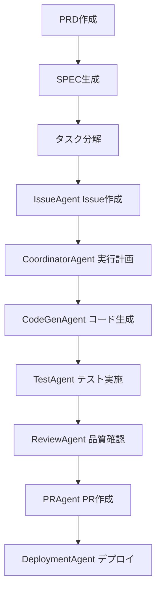

# SpecWorkflowMcp 利用詳細ガイド

## はじめに

このガイドは、SpecWorkflowMcpを使用した仕様駆動開発（SDD）の完全なワークフローを解説します。MiyabiPrivateプロジェクトへの導入を前提に、実践的な利用方法を詳述します。

## SpecWorkflowMcpの基本

### 1. 仕組み

SpecWorkflowMcpは、以下の3つのドキュメントを管理するフレームワークです：

```
.spec-workflow/specs/[仕様名]/
├── requirements.md  # 要件定義書
├── design.md        # 設計書
└── tasks.md         # 実行タスク一覧
```

### 2. インストールと設定

```bash
# MCPのインストール（実行時自動取得）
claude mcp add spec-workflow npx @pimzino/spec-workflow-mcp@latest -- /path/to/your/project

# MiyabiPrivateの場合
claude mcp add spec-workflow npx @pimzino/spec-workflow-mcp@latest -- /home/jinno/MiyabiPrivate
```

### 3. 基本的な使用フロー

1. **PRDからSPEC作成**（推奨）
2. **既存コードからSPEC作成**
3. **SPECからコード実装**

## ワークフロー詳細

### フロー1: PRDから新規SPEC作成（最も推奨）

#### ステップ1: PRDの準備
```markdown
# README.md に高品質なPRDを作成

## プロジェクト概要
- 背景、目的、スコープを明確に記述

## 機能要件
- 具体的な機能を網羅的に記述
- FR-001, FR-002... の形式で整理

## 非機能要件
- 性能、セキュリティ、可用性要件

## 受け入れ基準
- 具体的な測定可能な基準
```

#### ステップ2: SPEC生成の実行
```claude
Create a spec from the PRD in @README.md
```

#### ステップ3: 対話的な生成プロセス
Claudeが対話的にSPECを生成します：

```
Claude: README.mdを解析しました。以下の仕様を作成します：
- requirements.md: 要件定義
- design.md: 設計書
- tasks.md: 実行タスク

よろしいですか？

User: OK、続けてください

Claude: requirements.mdを作成しました。
design.mdを作成しました。
tasks.mdを作成しました。

User: 既存コードを反映したスペックになってますか？

Claude: 既存コードベースと照合しました。整合性が確認されています。
```

### フロー2: 既存コードからのSPEC生成

#### ステップ1: コードベースの指定
```claude
Create a spec from codebase. Please refer in /home/jinno/MiyabiPrivate/packages/miyabi-cli
```

#### ステップ2: コード解析とSPEC生成
Claudeが既存コードを解析し、以下を自動的に行います：

1. **コード構造の解析**
   - ディレクトリ構成の理解
   - 主要コンポーネントの特定
   - 依存関係の把握

2. **機能の抽出**
   - 実装されている機能のリストアップ
   - APIエンドポイントの特定
   - データモデルの理解

3. **SPECの生成**
   - requirements.md: 実装済み要件の整理
   - design.md: アーキテクチャの文書化
   - tasks.md: 拡張・改善タスクの提案

#### ステップ3: 整合性確認
```claude
既存コードを反映したスペックになってますか？
/home/jinno/MiyabiPrivate/packages/miyabi-cli
```

### フロー3: SPECからコード実装

#### ステップ1: タスクの実行指示
```claude
Implement the tasks in .spec-workflow/specs/仕様名/tasks.md
```

#### ステップ2: 自動実行プロセス
Claudeが以下を実行：

1. **タスクの解析**
   - タスク間の依存関係の特定
   - 優先順位の決定
   - 実行計画の策定

2. **コード生成**
   - 各タスクの具体的な実装
   - テストコードの生成
   - ドキュメントの作成

3. **品質確認**
   - コードレビューの実施
   - テストの実行
   - 品質スコアの評価

## Miyabiフレームワークとの連携

### 1. エージェント連携フロー



### 2. 各エージェントの役割

#### IssueAgent
- SPECから実行タスクをGitHub Issuesに変換
- 識学理論65ラベル体系での自動分類
- タスク複雑度の推定

#### CoordinatorAgent
- タスク間の依存関係分析
- Critical Pathの特定
- 並列実行の最適化

#### CodeGenAgent
- design.mdに基づいたコード生成
- TypeScript strict mode対応
- 高品質コードの自動生成

#### TestAgent
- requirements.mdに基づいたテスト生成
- 80%+カバレッジ目標の達成
- 結合テスト・E2Eテストの実施

#### ReviewAgent
- 生成コードの品質評価
- セキュリティスキャン
- 80点以上で合格

#### PRAgent
- Conventional Commits準拠のPR生成
- 自動Draft PR作成
- マージ準備の完了

#### DeploymentAgent
- CI/CDパイプラインの実行
- ヘルスチェック
- 自動Rollback機能

### 3. 連携コマンド

```bash
# 全エージェントの実行
/agent-run

# Issue作成
/create-issue

# 状態確認
/miyabi-status

# システム検証
/verify
```

## 高度な利用方法

### 1. フィードバックループの構築

```claude
# フィードバックに基づいたPRD修正
作業内容をなるべく具体的に明記したい。これを書き換えて。
.module/FEEDBACK.md

# 修正されたPRDからSPEC再生成
Create a spec from the PRD in @.module/FEEDBACK.md
```

### 2. イテレーティブな改善

#### ステップ1: 初期SPEC生成
```claude
Create a spec from the PRD in @README.md
```

#### ステップ2: チームレビュー
- 生成されたSPECをチームでレビュー
- 改善点をフィードバックとして記録

#### ステップ3: SPECの修正
```claude
以下のフィードバックを反映してSPECを修正してください：
- 要件の網羅性を向上
- 設計の具体性を追加
- タスクの粒度を調整
```

#### ステップ4: 再実行
```claude
Implement the tasks in .spec-workflow/specs/仕様名/tasks.md
```

### 3. 複数SPECの管理

#### プロジェクトごとのSPEC
```
.spec-workflow/specs/
├── user-authentication/
├── payment-system/
├── dashboard-analytics/
└── admin-panel/
```

#### SPEC間の依存関係管理
```markdown
# design.md

## Dependencies
- user-authentication SPEC (PREREQUISITE)
- common-components SPEC (SHARED)
```

## 品質保証

### 1. SPEC品質チェックリスト

#### requirements.md
- [ ] 全ての機能要件が網羅されている
- [ ] 非機能要件が具体的に記述されている
- [ ] 受け入れ基準が測定可能である
- [ ] 制約事項が明記されている

#### design.md
- [ ] システムアーキテクチャが明確である
- [ ] 技術スタックが具体的に記述されている
- [ ] API設計が詳細に記述されている
- [ ] データベース設計が含まれている

#### tasks.md
- [ ] 実装タスクが網羅的である
- [ ] タスク間の依存関係が明確である
- [ ] 見積もり工時が現実的である
- [ ] 優先順位が適切に設定されている

### 2. 自動品質検証

```bash
# 品質チェックの実行
python scripts/validate_prd_spec_sync.py --prd README.md --spec .spec-workflow/specs/仕様名 --output validation-results/
```

### 3. 継続的改善

#### メトリクス収集
- SPEC生成時間
- タスク完了率
- 品質スコア
- ユーザー満足度

#### 改善サイクル
1. メトリクスの分析
2. 問題点の特定
3. 改善策の実施
4. 効果の測定

## トラブルシューティング

### 1. よくある問題

#### SPEC生成が完了しない
**原因**: PRDの品質が低い
**対策**:
- PRDテンプレートの使用
- 具体的な記述への改善
- 必要情報の補完

#### タスクが網羅的でない
**原因**: requirements.mdの情報が不足
**対策**:
- 機能要件の詳細化
- 非機能要件の追加
- ユースケースの拡充

#### 実装コードとの乖離
**原因**: design.mdが具体的でない
**対策**:
- アーキテクチャの詳細化
- API仕様の具体化
- 技術選定の明確化

### 2. デバッグ方法

#### ログの確認
```bash
# SpecWorkflowのログ確認
tail -f .spec-workflow/logs/spec-workflow.log

# Claudeの実行ログ
tail -f .claude/logs/claude.log
```

#### 段階的な実行
```claude
# ステップ1: 要件確認
PRDの主要要件をリストアップしてください

# ステップ2: 設計確認
この要件に対する技術設計を提案してください

# ステップ3: タスク確認
実装に必要なタスクを分解してください
```

## ベストプラクティス

### 1. PRD作成のベストプラクティス

- **具体的に記述**: 曖昧な表現を避け、数値目標を明示
- **網羅性の確保**: 機能要件、非機能要件、制約事項を網羅
- **検証可能性**: 受け入れ基準を測定可能に設定
- **優先順位付け**: Must-have, Should-haveの区分を明確化

### 2. SPEC管理のベストプラクティス

- **バージョン管理**: SPECの変更履歴を記録
- **レビュー体制**: チームでのSPECレビューを実施
- **継続的更新**: 要件変更に伴うSPECの更新
- **ドキュメンテーション**: 設計決定の理由を記録

### 3. 自動化のベストプラクティス

- **段階的実行**: 1ステップずつ確認しながら実行
- **品質ゲート**: 各段階での品質チェック
- **ロールバック準備**: 問題発生時の復旧計画
- **監視体制**: 進捗と品質の継続的監視

## 次のステップ

1. **環境準備**: MCPのインストールと設定
2. **PRD作成**: テンプレートに従った高品質PRDの作成
3. **SPEC生成**: 自動化されたSPEC生成の実行
4. **チーム展開**: 開発チームへのSDDプロセスの展開
5. **継続的改善**: メトリクスに基づくプロセス改善

---

このガイドを参考に、MiyabiPrivateプロジェクトで効果的なSDD（仕様駆動開発）を実践してください。