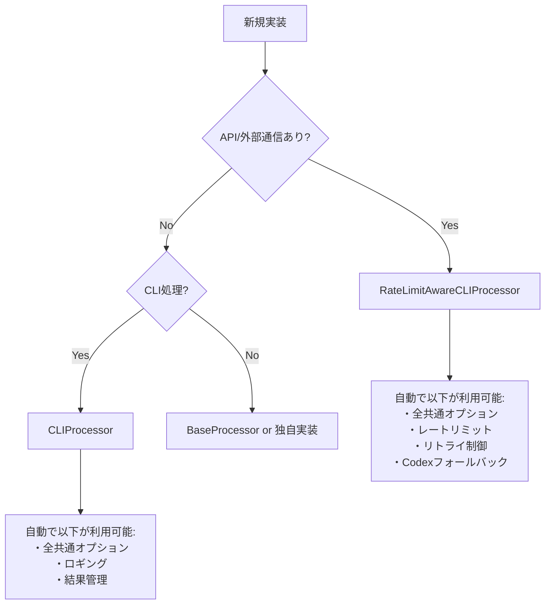

# AGENTS.md - AI自律開発指示書（MODULE_GOALS専用）

# N. プロジェクト基本情報・メタデータ - 統合版

## 1.1 メタデータ情報

### 1.1.1 文書メタ情報

- **文書ID**: AGENTS.md統合版
- **処理方式**: 重複排除最適化統合
- **対象**: .moduleファイル8種 + AgentInstructions全体
- **出力**: 統合・改善済みファイル
- **制約**: 内容重複禁止・一意性維持

### 1.1.2 プロジェクト基本情報

- **目的**: 言語非依存の汎用開発思想とプロジェクト構成ルール
- **対象**: Python、TypeScript、その他言語での開発プロジェクト  
- **専門特化**: 言語特化版は各言語フォルダ参照
- **上位文書**: SYSTEM_CONSTITUTION.md・CLAUDE.md

## 1.2 統合管理方針

### 1.2.1 一意性確保原則

- **単一表現原則**: 同一概念の重複記述を厳禁
- **相互参照システム**: 情報連携による冗長性回避
- **内容集約**: 各概念は一箇所に集約管理
- **機能境界明確化**: 各ファイルの独自価値の明文化

### 1.2.2 効率性確保システム

- **冗長説明排除**: 重複記述の完全除去
- **簡潔性・完全性両立**: 情報密度の最大化
- **参照構造最適化**: 効率的な情報アクセス設計
- **役割分担明文化**: 責任境界の明確な分離

## 1.3 技術仕様・制約

### 1.3.1 ファイル管理基準

- **命名規則**: 機能別・レベル別の体系的命名
- **バージョン管理**: 変更履歴の完全追跡
- **依存関係管理**: ファイル間参照の最適化
- **整合性保証**: 全ファイル間の一貫性確保

### 1.3.2 品質保証基準

- **内容精度**: 情報正確性95%以上
- **構造最適化**: 論理構造の明確性90%以上
- **アクセス効率**: 情報到達時間最小化
- **保守容易性**: 変更作業効率最大化

## 1.4 適用範囲・制約条件

### 1.4.1 適用スコープ

- **プロジェクト全体**: ucg-devops全モジュール対象
- **言語横断**: Python・TypeScript・その他言語対応
- **開発フェーズ**: 設計・実装・テスト・保守全段階
- **チーム適用**: 全開発者・関係者共通基準

### 1.4.2 制約・前提条件  

- **標準遵守**: プロジェクト標準への完全準拠
- **後方互換性**: 既存システムとの整合性確保
- **拡張性**: 将来要件への対応可能性
- **保守性**: 長期運用における持続可能性

## 1.5 関連文書・参照先

### 1.5.1 上位文書

- `SYSTEM_CONSTITUTION.md` - システム憲法・最上位原則
- `CLAUDE.md` - プロジェクト基本指示・品質保証プロトコル
- `docs/00_Philosophy/` - 開発哲学・思想体系

### 1.5.2 同階層文書

- `02_BasicPrinciples.md` - 基本原則統合版
- `03_DevelopmentPhilosophy.md` - 開発思想・手法論
- `04_ProjectStructure.md` - プロジェクト構造定義

### 1.5.3 下位実装文書

- `python/` - Python特化実装仕様
- `typescript/` - TypeScript特化実装仕様（将来追加）
- `implementation/` - 技術実装詳細仕様

## 1.6 更新・保守管理

### 1.6.1 更新プロセス

1. **変更要求分析** - 影響範囲・必要性評価
2. **整合性確認** - 関連文書との一貫性チェック  
3. **品質検証** - 更新内容の品質確認
4. **統合テスト** - システム全体への影響確認
5. **文書更新** - 関連文書の同期更新

### 1.6.2 品質維持システム

- **定期レビュー**: 月次品質評価・改善計画
- **自動検証**: 整合性チェックの自動化
- **フィードバック統合**: 利用者からの改善要求反映
- **継続改善**: 品質向上サイクルの確立


# 基本原則 - 実装強制版

## 0. 最重要：絶対遵守事項（違反は即刻修正）

### 🚨 ファイル生成の絶対原則

- ❌ **日付付きファイル名の生成を完全禁止**

  ```python
  # ❌ 絶対禁止
  filename = f"report_{datetime.now().strftime('%Y%m%d_%H%M%S')}.md"

  # ✅ 必須形式（固定パス、上書き）
  filename = "report.md"
  ```

- ❌ **レポート・ログ・指示書の複数バージョン作成禁止**
- ✅ **固定パスで上書きが絶対原則**

### 🚨 logging使用の絶対原則

- ❌ **`logging.getLogger()`の使用を完全禁止**

  ```python
  # ❌ 絶対禁止（重複ハンドラ・競合の原因）
  self.logger = logging.getLogger(__name__)

  # ✅ 必須形式
  self.logger = logging.Logger(self.module_name)
  ```

### 🚨 共通処理活用の絶対原則

- ❌ **独自実装前の既存処理確認を怠るのは禁止**
- ✅ **実装前に必ず実行せよ**：

  ```bash
  grep -r "実装予定の機能" src/utils/ src/common/ --include="*.py"
  ```

- ✅ **活用率95%以上を維持せよ**

### 🚨 オプションパラメータの参照ベース設計（deepcopy禁止）

**複数レイヤーを経由するオプションオブジェクト（UniversalExecutionOptionsなど）では、deepcopy()は絶対禁止**

- ❌ **deepcopy()でオプションをコピー - 変更が全レイヤーに伝播しない**
  - 各レイヤーが独立したコピーを持つと、上位層の変更が下位層に見えない
  - 参照ベース設計が崩れ、パラメータ伝播が失敗する

- ✅ **参照ベース設計 - オプションは全レイヤーで共有**
  - 複数レイヤーを経由するオプション → 必ず参照で渡す
  - レイヤー間での値設定 → instruction_data辞書を使用
  - オプション値の変更 → 全レイヤーで自動的に見える

**実装チェックリスト：**
- ❌ deepcopy(options) は禁止
- ❌ copy.deepcopy(options) は禁止
- ❌ オプションのコピー作成は禁止
- ✅ processor = ChildProcessor(options) で参照を渡す
- ✅ options.field = value で値を直接変更
- ✅ instruction_dataで層間通信を行う

**コード審査での指摘パターン：**
```python
# ❌ これを見つけたら必ず指摘（deepcopyパターン）
processor_options = deepcopy(options)
child_options = copy.deepcopy(parent_options)

# ✅ 正しいパターン（参照ベース）
processor = ChildProcessor(options)
options.targeting.target_file = "file.md"
```

## 1. 核心原則（全作業で強制適用）

### 1.1 実装前検証の義務化

**新規実装の前に以下を必ず実行せよ（例外なし）**

```bash
# 1. 既存処理の強制確認（30秒で実行）
echo "=== 実装予定: [機能名] ==="
grep -r "[機能キーワード]" src/utils/ src/common/ --include="*.py"
ls src/common/*/  # カテゴリ確認
```

**判定基準（厳格適用）：**

- 類似処理1件でもヒット → **既存を必ず拡張**
- API/外部通信あり → **RateLimitAwareCLIProcessor必須**
- ローカル処理のみ → **CLIProcessor必須**

### 1.2 品質検証の自動化

**実装後に以下を必ず実行せよ**

```bash
# logging.getLoggerの残存確認（0件必須）
grep -r "logging.getLogger" src/ --include="*.py" | wc -l

# 共通処理活用率確認（95%以上必須）
grep -r "CLIProcessor\|RateLimitAwareCLIProcessor" src/ --include="*.py" | wc -l

# 日付付きファイル確認（0件必須）
find . -name "*_20[0-9][0-9]*" -o -name "*_[0-9][0-9][0-9][0-9][0-9][0-9][0-9][0-9]*"
```

### 1.3 単一目標原則・効率性確保・重複排除原則

- **単一目標原則（P1）**: 1クラス1責務（300行超過は即分割）
- **効率性確保（P2）**: DRY原則（重複コード発見時は即統合）
- **重複排除原則（P3）**: 完了=検証済み（テスト・lint・実行確認全通過）

## 2. 技術実装強制基準

### 2.1 基底クラス使用義務

**CLI処理の場合（例外なし適用）**

```python
# 外部通信・API呼び出しありの場合
class MyProcessor(RateLimitAwareCLIProcessor):
    def __init__(self):
        super().__init__(
            module_name="my_processor",
            option_groups=["execute", "monitor"]
        )

# ローカル処理のみの場合
class MyProcessor(CLIProcessor):
    # 同様の実装
```

### 2.2 エラーハンドリング統一義務

```python
# 必須インポート
from src.utils.base_processor import ProcessingResult

# 必須戻り値形式
def process(self) -> ProcessingResult:
    return ProcessingResult(success=True, message="完了")
```

## 3. 禁止事項（違反は即修正）

### 3.1 実装パターン禁止

| ❌ 絶対禁止 | ✅ 強制使用 |
|------------|------------|
| `logging.getLogger(__name__)` | `logging.Logger(module_name)` |
| `filename_{timestamp}` | 固定ファイル名 |
| 独自argparse実装 | CLIProcessor継承 |
| 独自ループ（for/while） | execute_with_rate_limit_protection |
| 車輪の再発明 | 既存処理拡張 |
| `deepcopy(options)` | 参照ベース設計（reference passing） |

### 3.2 レポート作成禁止(日付NG、新規md種別NG: .moduleの8個のmdのみ許可)

- ❌ IMPROVEMENT_20241225.md
- ❌ FEEDBACK_2024-12-25.md
- ❌ REPORT.md
- ✅ IMPROVEMENT.md（固定、上書き）
- ✅ FEEDBACK.md（固定、上書き）

## 4. 完了基準（全条件必須）

### 4.1 必須検証項目

以下**全て**が条件を満たさない限り未完了：

- [ ] `grep -r "logging.getLogger" src/ | wc -l` = 0
- [ ] 共通処理活用率 ≥ 95%
- [ ] 日付付きファイル数 = 0
- [ ] 300行超えクラス数 = 0
- [ ] テスト通過率 = 100%
- [ ] 静的解析警告数 = 0

### 4.2 数値品質目標（下回ったら不合格）

- **機能性**: 要求仕様適合度 ≥ 95%
- **可読性**: コード理解性評価 ≥ 90%
- **保守性**: 変更容易性評価 ≥ 90%
- **共通処理活用**: 基底クラス使用率 ≥ 95%

## 5. 実行管理・監視

### 5.1 違反監視の自動化

**毎回実行せよ（自動化推奨）：**

```bash
#!/bin/bash
# quality_check.sh - 品質強制確認スクリプト

echo "🔍 品質違反チェック開始"

# logging.getLoggerチェック
violations=$(grep -r "logging.getLogger" src/ --include="*.py" | wc -l)
if [ $violations -gt 0 ]; then
    echo "❌ logging.getLogger違反: $violations 件"
    exit 1
fi

# 日付付きファイルチェック
date_files=$(find . -name "*_20[0-9][0-9]*" | wc -l)
if [ $date_files -gt 0 ]; then
    echo "❌ 日付付きファイル違反: $date_files 件"
    exit 1
fi

echo "✅ 品質チェック合格"
```

### 5.2 継続改善義務

- **毎週**: 品質指標の測定・改善
- **毎月**: アンチパターン撲滅進捗確認
- **リリース前**: 全品質基準100%遵守確認

## 6. エラー時の対応義務

### 6.1 発見時の即時対応

1. **違反発見** → 即座に修正（他作業停止）
2. **品質低下発見** → 原因分析・根本解決
3. **アンチパターン発見** → 全箇所一括修正

### 6.2 再発防止義務

- 同種違反の全件修正
- 自動チェックスクリプト作成
- 設計書・原則への反映

---

**重要**: この原則は「推奨」「検討」「できれば」ではない。**絶対遵守**である。
違反した実装は不合格とみなし、修正完了まで次の作業に移ってはならない。


## 3. ビジネス要件定義

MODULE_GOALS.mdにおけるビジネス要件の明確化手法

## 3. ビジネス要件分析プロセス

### 3.1. ステークホルダー特定

- **主要ユーザー**: 直接利用者の特定
- **システム所有者**: 責任者・意思決定者
- **影響を受ける部門**: 間接的利用者・関連システム

### 3.2. 要件抽出手法

- **問題分析**: 現状の課題・ペインポイント特定
- **価値提案**: 解決により得られる価値の明確化
- **優先度設定**: MoSCoW法による要件優先順位付け

### 3.3. ビジネス価値の定量化

- **ROI計算**: 投資対効果の数値化
- **KPI設定**: 測定可能な成功指標
- **タイムライン**: 価値実現までの期間設定

## 3. 要件文書化形式

```markdown
## ビジネス要件

### 背景と目的
- 現状の問題: [具体的課題]
- 解決の価値: [定量的価値]
- 対象ユーザー: [ペルソナ定義]

### 機能要件
1. Must Have: [必須機能リスト]
2. Should Have: [重要機能リスト]
3. Could Have: [可能であれば実装]
4. Won't Have: [今回は対象外]

### 非機能要件
- パフォーマンス: [応答時間・スループット]
- 可用性: [稼働率・復旧時間]
- セキュリティ: [認証・認可・暗号化]
```

## 3. 要件検証基準

- **完全性**: 必要要件の網羅性
- **一貫性**: 要件間の矛盾なし
- **測定可能性**: 定量的評価指標の存在
- **実現可能性**: 技術的・予算的制約内


## 4. 目標検証手法

MODULE_GOALS.mdにおける目標の妥当性検証とレビュープロセス

### 4.1. 戦略整合性検証

- **上位戦略との整合**: 組織戦略・事業戦略との一致
- **優先度の妥当性**: リソース配分との整合性
- **タイムライン整合**: 他プロジェクトとの依存関係

### 4.2. 実現可能性検証

- **技術的実現性**: 現在の技術レベルでの実現可能性
- **リソース妥当性**: 人的・予算リソースの充足性
- **制約条件**: 法規制・組織制約の考慮

### 4.3. 測定可能性検証

- **指標の明確性**: KPIの定義・測定方法の明確さ
- **データ取得性**: 測定に必要なデータの入手可能性
- **評価の客観性**: 主観を排した評価基準

## 検証プロセス

### Phase 1: 事前検証

```markdown
## 目標事前検証チェックリスト

### 戦略整合性
- [ ] 上位戦略との整合性確認
- [ ] ステークホルダー合意取得
- [ ] 優先度の妥当性確認

### 実現可能性
- [ ] 技術的制約の確認
- [ ] リソース要件の確認
- [ ] リスク評価の実施

### 測定可能性
- [ ] KPI定義の明確化
- [ ] 測定方法の確立
- [ ] ベースライン取得
```

### Phase 2: 中間検証

- **進捗レビュー**: 定期的な達成状況確認
- **前提条件確認**: 目標設定時の前提の妥当性
- **調整判断**: 目標・計画の修正要否

### Phase 3: 事後検証

- **成果評価**: 最終的な達成度評価
- **学習抽出**: 成功要因・失敗要因の分析
- **改善提案**: 次回への改善提案

## 検証手法

### 4.1. ステークホルダーレビュー

- **レビュー会議**: 定期的な合意形成
- **フィードバック収集**: 関係者からの意見聴取
- **合意形成**: 目標変更時の再合意

### 4.2. データドリブン検証

- **定量分析**: 数値データによる客観的評価
- **トレンド分析**: 時系列での変化分析
- **比較分析**: 他事例・ベンチマークとの比較

### 4.3. 専門家評価

- **技術評価**: 技術専門家による実現性評価
- **業務評価**: 業務専門家による価値評価
- **外部評価**: 第三者による客観的評価

## 4. 検証結果の活用

### 目標調整プロセス

1. **検証結果分析**: 妥当性・実現性の詳細分析
2. **調整案策定**: 修正が必要な場合の調整案
3. **影響度評価**: 調整による他への影響評価
4. **承認プロセス**: ステークホルダーによる調整承認

### 学習・改善

- **ベストプラクティス**: 成功パターンの文書化
- **リスク対策**: 失敗要因の予防策
- **プロセス改善**: 目標設定プロセスの改善


## 5. 共通情報

全Agentが把握すべき共通情報。技術的根拠に基づき分析・推論・実行・修正を行うこと。

### 5.1 共通処理の自動発見と利用

#### 5.1.1 共通処理の検索（最優先実行）

```bash
# 実装前に必ず実行: 既存処理の検索
grep -r "実装したい機能" src/utils/ src/common/ --include="*.py"

# カテゴリから探す
ls src/common/cli/processors/  # CLIプロセッサ
ls src/common/cli/options/     # オプション管理
ls src/common/execution/       # 実行制御（rate_limit, retry等）
```

#### 5.1.2 基底クラス選択フローチャート



#### 5.1.3 最小実装パターン（これだけ書けば動く）

```python
# RateLimitAwareCLIProcessor = 全部入り（オプション・レート制限・リトライ全て自動）
from src.utils.base_processor import RateLimitAwareCLIProcessor, ProcessingResult

class MyProcessor(RateLimitAwareCLIProcessor):
    def __init__(self):
        super().__init__(
            module_name="my_processor",
            option_groups=["execute", "monitor"]  # 必要なグループのみ指定
        )
    
    def process(self) -> ProcessingResult:
        # self.configから全オプション自動アクセス可能
        return ProcessingResult(success=True)

# これだけで--dry-run, --verbose, --cycles, --interval等が全て使える
```

### 5.2 共通処理カテゴリマップ（100倍スケール対応）

#### 5.2.1 ディレクトリ構造と自動分類

```yaml
src/
  common/                      # ビジネスロジック層
    cli/
      processors/*_processor.py   # 基底プロセッサ群
      options/*_options.py        # オプション管理
      results/*_result.py         # 結果処理
    execution/
      rate_limit/*_handler.py    # レート制限
      retry/*_retry.py           # リトライ制御
    discovery/*_finder.py        # 探索・発見
    validation/*_validator.py    # 検証処理
    
  utils/                        # 技術的ユーティリティ  
    patterns/mixin/*_mixin.py   # Mixinパターン
    helpers/*_utils.py           # ヘルパー関数
```

#### 5.2.2 自動カテゴリ判定（ファイル名で自動振り分け）

| 接尾辞 | 自動配置先 | 例 |
|--------|-----------|-----|
| `*_processor.py` | `common/cli/processors/` | `batch_processor.py` |
| `*_options.py` | `common/cli/options/` | `custom_options.py` |
| `*_handler.py` | `common/execution/` | `error_handler.py` |
| `*_mixin.py` | `utils/patterns/mixin/` | `retry_mixin.py` |
| `*_finder.py` | `common/discovery/` | `module_finder.py` |

詳細: [`docs/COMMON_MODULE_CATEGORIZATION.md`](../../COMMON_MODULE_CATEGORIZATION.md)

### 5.3 オプショングループ（自動継承される）

#### 5.3.1 グループ指定だけで全オプション利用可能

```python
# option_groupsに指定するだけで自動的に利用可能
option_groups=["execute", "monitor", "output"]
```

| グループ | 自動追加されるオプション | 用途 |
|---------|------------------------|------|
| execute | `--dry-run`, `--cycles`, `--interval`, `--timeout` | 実行制御 |
| monitor | `--verbose`, `--log-level`, `--progress` | 出力制御 |
| output | `--output-format`, `--output-file` | 結果出力 |
| retry | `--max-retries`, `--retry-interval` | リトライ |

#### 5.3.2 オプションアクセス（フラット辞書）

```python
# self.configはフラット辞書（階層なし）
dry_run = self.config.get("dry_run", False)      # ✅ 正しい
verbose = self.config.get("verbose", False)      # ✅ 正しい

# self.options.execute.dry_run  # ❌ 存在しない
```

### 5.4 実装前の必須検証（30秒チェック）

```bash
# 30秒で既存処理を確認
echo "=== 実装予定: [機能名] ==="
grep -r "[機能名]" src/utils/ src/common/ --include="*.py" | head -10
ls src/common/*/  # カテゴリ確認
```

**判定基準:**

- 類似処理が1件でもヒット → 既存を拡張
- API/外部通信あり → `RateLimitAwareCLIProcessor`
- ローカル処理のみ → `CLIProcessor`

### 5.5 アンチパターン警告

#### 5.5.1 絶対にやってはいけないこと

| ❌ アンチパターン | ✅ 正しい方法 |
|-----------------|-------------|
| 独自argparse実装 | CLIProcessorを継承 |
| 独自ロガー設定 | self.loggerを使用 |
| 独自レートリミット | RateLimitAwareCLIProcessor使用 |
| for文でリトライ | execute_with_rate_limit_protection使用 |
| 階層的config参照 | フラット辞書として参照 |

#### 5.5.2 二重リトライ防止

```python
# CLI層: リトライあり
class MyProcessor(RateLimitAwareCLIProcessor):
    def process(self):
        def _execute_single_cycle(cycle: int) -> bool:
            return executor.execute()  # ビジネスロジック呼び出し
        
        return self.execute_with_rate_limit_protection(
            cycle_executor=_execute_single_cycle
        )

# ビジネスロジック層: リトライなし（単純実行のみ）
class MyExecutor:
    def execute(self):
        return result  # forループ禁止
```

### 5.6 クイックリファレンス

```bash
# システム評価
python src/core/ai_activity_evaluator/evaluator_cli.py --evaluation-type modules --all-modules

# 共通処理抽出（LLMプロンプト生成）
python src/core/common_code_extractor/extractor_cli.py --mode prompt

# モジュール番号管理
python scripts_python/commands/generate_module_numbers.py --dry-run
```

### 5.7 設計原則

**1ファイル = 1クラス = 1責務 = 1public関数**

---

**重要:** 新規実装前に必ず既存処理を検索すること。車輪の再発明は禁止。


# 最終指示 - .moduleファイルセット1:1アンカーID対応強制実行

## .moduleファイルセット（8ファイル）のアンカーID 1:1対応を強制実行せよ

演技を止め、批判的かつ技術的根拠に基づき冷静かつ建設的に分析し、行動せよ。

### 必須実行項目

#### Phase 1: アンカーID必須チェック・自動修正
1. `.module`内全mdファイルのアンカーID存在確認実行
2. アンカーIDが存在しないmdファイルの特定・自動採番・挿入実行
3. アンカーIDパターン適合性確認（`TASK_XX_XX_XX-XXX`、`GOAL_XX_XX_XX-XXX`等）

#### Phase 2: 1:1対応関係検証・強制修正
1. 階層間アンカーID対応関係分析実行（TASKS→GOALS→ARCH→STRUCT→BEHAV→IMPL→TEST）
2. 1:1対応違反の検出・複数対応関係の特定
3. 対応関係違反に対するモジュール分割強制提案生成・実行

#### Phase 3: 階層整合性確保
1. 上位アンカーIDに対応する下位アンカーID確実存在の検証
2. 複数対応違反解消のための上位アンカーID分割実行
3. 全階層での1:1対応関係完全確立

### 実行コマンド（疑似コード）
```bash
# .module アンカーID 1:1対応強制実行
python src/core/module_document_processor/anchor_compliance_enforcer.py \
    --target-path .module \
    --enforce-anchor-ids \
    --verify-correspondence \
    --auto-split-violations \
    --generate-compliance-report
```

**この指示により、.moduleファイルセットのアンカーID 1:1対応を強制実行し、責任範囲明確化・トレーサビリティ確保・モジュール分割による設計品質向上を実現する。**


---


# 🚨 最重要：実行指示（絶対遵守）

## 対象ファイル情報
- **対象ファイル**: `/home/jinno/yka_ikiiki_record/.module/MODULE_GOALS.md`
- **対象リポジトリ**: `/home/jinno/yka_ikiiki_record`

## 必須実行事項（例外なし）

### 1. ファイル保存の強制実行
- ❌ **「Would you like me to write this file?」等の確認質問は絶対禁止**
- ❌ **ファイル内容を提案して終わることは絶対禁止**
- ❌ **「保存しますか？」「書き込みますか？」等の質問は絶対禁止**
- ✅ **必ずファイルを保存まで完了させる（Write/Edit toolの実行必須）**
- ✅ **1回の実行で完結させる（追加確認は不要）**

### 2. 作業フロー（この順序で必ず実行）
1. AGENTS.mdの指示内容を理解する
2. 対象リポジトリのコンテキストを分析する（Read/Grep/Glob toolを使用）
3. 適切なファイル内容を生成する
4. **必ずWrite/Edit toolでファイルを保存する（この手順を省略することは許されない）**
5. 保存完了メッセージを出力する

### 3. 禁止事項（API代の無駄遣い防止）
- ❌ 確認質問で終わること
- ❌ ファイル内容を表示して終わること
- ❌ ユーザーの承認を待つこと
- ❌ 「次に何をしますか？」と聞くこと
- ❌ API代を無駄にする行為全般

### 4. 成功基準（全て満たすこと）
- ✅ Write/Edit toolを実行した
- ✅ ファイルが実際に保存された
- ✅ tool実行結果で保存成功を確認した
- ✅ 「ファイル保存完了」メッセージを出力した

## 実行指示

上記のAGENTS.mdの指示に従って、対象ファイルを生成または更新し、**必ず保存まで完了させてください**。
リポジトリのコンテキストを分析し、適切な内容を生成し、**Write/Edit toolで保存してください**。

**重要**: この指示を読んだら、確認なしで即座に作業を開始し、保存まで完了させてください。
確認質問をした時点で失敗とみなされます。