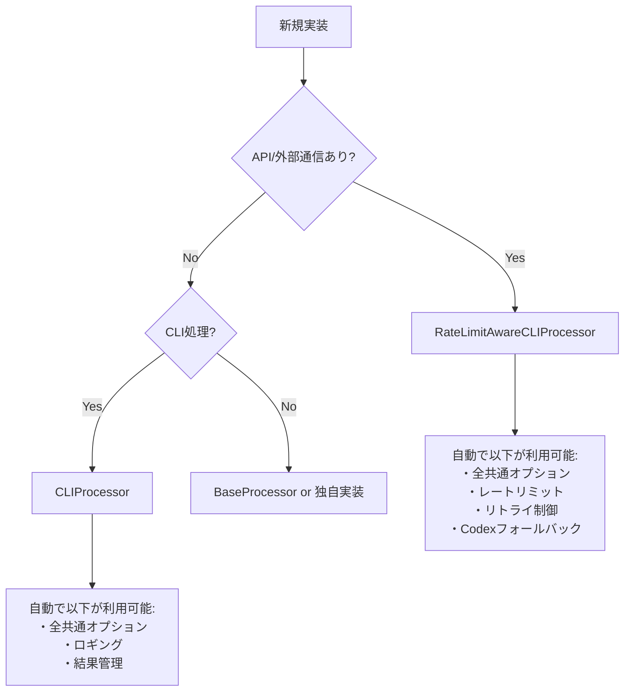

# AGENTS.md - AI自律開発指示書（MODULE_STRUCTURE専用）

# N. プロジェクト基本情報・メタデータ - 統合版

## 1.1 メタデータ情報

### 1.1.1 文書メタ情報

- **文書ID**: AGENTS.md統合版
- **処理方式**: 重複排除最適化統合
- **対象**: .moduleファイル8種 + AgentInstructions全体
- **出力**: 統合・改善済みファイル
- **制約**: 内容重複禁止・一意性維持

### 1.1.2 プロジェクト基本情報

- **目的**: 言語非依存の汎用開発思想とプロジェクト構成ルール
- **対象**: Python、TypeScript、その他言語での開発プロジェクト  
- **専門特化**: 言語特化版は各言語フォルダ参照
- **上位文書**: SYSTEM_CONSTITUTION.md・CLAUDE.md

## 1.2 統合管理方針

### 1.2.1 一意性確保原則

- **単一表現原則**: 同一概念の重複記述を厳禁
- **相互参照システム**: 情報連携による冗長性回避
- **内容集約**: 各概念は一箇所に集約管理
- **機能境界明確化**: 各ファイルの独自価値の明文化

### 1.2.2 効率性確保システム

- **冗長説明排除**: 重複記述の完全除去
- **簡潔性・完全性両立**: 情報密度の最大化
- **参照構造最適化**: 効率的な情報アクセス設計
- **役割分担明文化**: 責任境界の明確な分離

## 1.3 技術仕様・制約

### 1.3.1 ファイル管理基準

- **命名規則**: 機能別・レベル別の体系的命名
- **バージョン管理**: 変更履歴の完全追跡
- **依存関係管理**: ファイル間参照の最適化
- **整合性保証**: 全ファイル間の一貫性確保

### 1.3.2 品質保証基準

- **内容精度**: 情報正確性95%以上
- **構造最適化**: 論理構造の明確性90%以上
- **アクセス効率**: 情報到達時間最小化
- **保守容易性**: 変更作業効率最大化

## 1.4 適用範囲・制約条件

### 1.4.1 適用スコープ

- **プロジェクト全体**: ucg-devops全モジュール対象
- **言語横断**: Python・TypeScript・その他言語対応
- **開発フェーズ**: 設計・実装・テスト・保守全段階
- **チーム適用**: 全開発者・関係者共通基準

### 1.4.2 制約・前提条件  

- **標準遵守**: プロジェクト標準への完全準拠
- **後方互換性**: 既存システムとの整合性確保
- **拡張性**: 将来要件への対応可能性
- **保守性**: 長期運用における持続可能性

## 1.5 関連文書・参照先

### 1.5.1 上位文書

- `SYSTEM_CONSTITUTION.md` - システム憲法・最上位原則
- `CLAUDE.md` - プロジェクト基本指示・品質保証プロトコル
- `docs/00_Philosophy/` - 開発哲学・思想体系

### 1.5.2 同階層文書

- `02_BasicPrinciples.md` - 基本原則統合版
- `03_DevelopmentPhilosophy.md` - 開発思想・手法論
- `04_ProjectStructure.md` - プロジェクト構造定義

### 1.5.3 下位実装文書

- `python/` - Python特化実装仕様
- `typescript/` - TypeScript特化実装仕様（将来追加）
- `implementation/` - 技術実装詳細仕様

## 1.6 更新・保守管理

### 1.6.1 更新プロセス

1. **変更要求分析** - 影響範囲・必要性評価
2. **整合性確認** - 関連文書との一貫性チェック  
3. **品質検証** - 更新内容の品質確認
4. **統合テスト** - システム全体への影響確認
5. **文書更新** - 関連文書の同期更新

### 1.6.2 品質維持システム

- **定期レビュー**: 月次品質評価・改善計画
- **自動検証**: 整合性チェックの自動化
- **フィードバック統合**: 利用者からの改善要求反映
- **継続改善**: 品質向上サイクルの確立


# 基本原則 - 実装強制版

## 0. 最重要：絶対遵守事項（違反は即刻修正）

### 🚨 ファイル生成の絶対原則

- ❌ **日付付きファイル名の生成を完全禁止**

  ```python
  # ❌ 絶対禁止
  filename = f"report_{datetime.now().strftime('%Y%m%d_%H%M%S')}.md"

  # ✅ 必須形式（固定パス、上書き）
  filename = "report.md"
  ```

- ❌ **レポート・ログ・指示書の複数バージョン作成禁止**
- ✅ **固定パスで上書きが絶対原則**

### 🚨 logging使用の絶対原則

- ❌ **`logging.getLogger()`の使用を完全禁止**

  ```python
  # ❌ 絶対禁止（重複ハンドラ・競合の原因）
  self.logger = logging.getLogger(__name__)

  # ✅ 必須形式
  self.logger = logging.Logger(self.module_name)
  ```

### 🚨 共通処理活用の絶対原則

- ❌ **独自実装前の既存処理確認を怠るのは禁止**
- ✅ **実装前に必ず実行せよ**：

  ```bash
  grep -r "実装予定の機能" src/utils/ src/common/ --include="*.py"
  ```

- ✅ **活用率95%以上を維持せよ**

### 🚨 オプションパラメータの参照ベース設計（deepcopy禁止）

**複数レイヤーを経由するオプションオブジェクト（UniversalExecutionOptionsなど）では、deepcopy()は絶対禁止**

- ❌ **deepcopy()でオプションをコピー - 変更が全レイヤーに伝播しない**
  - 各レイヤーが独立したコピーを持つと、上位層の変更が下位層に見えない
  - 参照ベース設計が崩れ、パラメータ伝播が失敗する

- ✅ **参照ベース設計 - オプションは全レイヤーで共有**
  - 複数レイヤーを経由するオプション → 必ず参照で渡す
  - レイヤー間での値設定 → instruction_data辞書を使用
  - オプション値の変更 → 全レイヤーで自動的に見える

**実装チェックリスト：**
- ❌ deepcopy(options) は禁止
- ❌ copy.deepcopy(options) は禁止
- ❌ オプションのコピー作成は禁止
- ✅ processor = ChildProcessor(options) で参照を渡す
- ✅ options.field = value で値を直接変更
- ✅ instruction_dataで層間通信を行う

**コード審査での指摘パターン：**
```python
# ❌ これを見つけたら必ず指摘（deepcopyパターン）
processor_options = deepcopy(options)
child_options = copy.deepcopy(parent_options)

# ✅ 正しいパターン（参照ベース）
processor = ChildProcessor(options)
options.targeting.target_file = "file.md"
```

## 1. 核心原則（全作業で強制適用）

### 1.1 実装前検証の義務化

**新規実装の前に以下を必ず実行せよ（例外なし）**

```bash
# 1. 既存処理の強制確認（30秒で実行）
echo "=== 実装予定: [機能名] ==="
grep -r "[機能キーワード]" src/utils/ src/common/ --include="*.py"
ls src/common/*/  # カテゴリ確認
```

**判定基準（厳格適用）：**

- 類似処理1件でもヒット → **既存を必ず拡張**
- API/外部通信あり → **RateLimitAwareCLIProcessor必須**
- ローカル処理のみ → **CLIProcessor必須**

### 1.2 品質検証の自動化

**実装後に以下を必ず実行せよ**

```bash
# logging.getLoggerの残存確認（0件必須）
grep -r "logging.getLogger" src/ --include="*.py" | wc -l

# 共通処理活用率確認（95%以上必須）
grep -r "CLIProcessor\|RateLimitAwareCLIProcessor" src/ --include="*.py" | wc -l

# 日付付きファイル確認（0件必須）
find . -name "*_20[0-9][0-9]*" -o -name "*_[0-9][0-9][0-9][0-9][0-9][0-9][0-9][0-9]*"
```

### 1.3 単一目標原則・効率性確保・重複排除原則

- **単一目標原則（P1）**: 1クラス1責務（300行超過は即分割）
- **効率性確保（P2）**: DRY原則（重複コード発見時は即統合）
- **重複排除原則（P3）**: 完了=検証済み（テスト・lint・実行確認全通過）

## 2. 技術実装強制基準

### 2.1 基底クラス使用義務

**CLI処理の場合（例外なし適用）**

```python
# 外部通信・API呼び出しありの場合
class MyProcessor(RateLimitAwareCLIProcessor):
    def __init__(self):
        super().__init__(
            module_name="my_processor",
            option_groups=["execute", "monitor"]
        )

# ローカル処理のみの場合
class MyProcessor(CLIProcessor):
    # 同様の実装
```

### 2.2 エラーハンドリング統一義務

```python
# 必須インポート
from src.utils.base_processor import ProcessingResult

# 必須戻り値形式
def process(self) -> ProcessingResult:
    return ProcessingResult(success=True, message="完了")
```

## 3. 禁止事項（違反は即修正）

### 3.1 実装パターン禁止

| ❌ 絶対禁止 | ✅ 強制使用 |
|------------|------------|
| `logging.getLogger(__name__)` | `logging.Logger(module_name)` |
| `filename_{timestamp}` | 固定ファイル名 |
| 独自argparse実装 | CLIProcessor継承 |
| 独自ループ（for/while） | execute_with_rate_limit_protection |
| 車輪の再発明 | 既存処理拡張 |
| `deepcopy(options)` | 参照ベース設計（reference passing） |

### 3.2 レポート作成禁止(日付NG、新規md種別NG: .moduleの8個のmdのみ許可)

- ❌ IMPROVEMENT_20241225.md
- ❌ FEEDBACK_2024-12-25.md
- ❌ REPORT.md
- ✅ IMPROVEMENT.md（固定、上書き）
- ✅ FEEDBACK.md（固定、上書き）

## 4. 完了基準（全条件必須）

### 4.1 必須検証項目

以下**全て**が条件を満たさない限り未完了：

- [ ] `grep -r "logging.getLogger" src/ | wc -l` = 0
- [ ] 共通処理活用率 ≥ 95%
- [ ] 日付付きファイル数 = 0
- [ ] 300行超えクラス数 = 0
- [ ] テスト通過率 = 100%
- [ ] 静的解析警告数 = 0

### 4.2 数値品質目標（下回ったら不合格）

- **機能性**: 要求仕様適合度 ≥ 95%
- **可読性**: コード理解性評価 ≥ 90%
- **保守性**: 変更容易性評価 ≥ 90%
- **共通処理活用**: 基底クラス使用率 ≥ 95%

## 5. 実行管理・監視

### 5.1 違反監視の自動化

**毎回実行せよ（自動化推奨）：**

```bash
#!/bin/bash
# quality_check.sh - 品質強制確認スクリプト

echo "🔍 品質違反チェック開始"

# logging.getLoggerチェック
violations=$(grep -r "logging.getLogger" src/ --include="*.py" | wc -l)
if [ $violations -gt 0 ]; then
    echo "❌ logging.getLogger違反: $violations 件"
    exit 1
fi

# 日付付きファイルチェック
date_files=$(find . -name "*_20[0-9][0-9]*" | wc -l)
if [ $date_files -gt 0 ]; then
    echo "❌ 日付付きファイル違反: $date_files 件"
    exit 1
fi

echo "✅ 品質チェック合格"
```

### 5.2 継続改善義務

- **毎週**: 品質指標の測定・改善
- **毎月**: アンチパターン撲滅進捗確認
- **リリース前**: 全品質基準100%遵守確認

## 6. エラー時の対応義務

### 6.1 発見時の即時対応

1. **違反発見** → 即座に修正（他作業停止）
2. **品質低下発見** → 原因分析・根本解決
3. **アンチパターン発見** → 全箇所一括修正

### 6.2 再発防止義務

- 同種違反の全件修正
- 自動チェックスクリプト作成
- 設計書・原則への反映

---

**重要**: この原則は「推奨」「検討」「できれば」ではない。**絶対遵守**である。
違反した実装は不合格とみなし、修正完了まで次の作業に移ってはならない。


## 3. 適応的開発モデル

トップダウンの設計原則とボトムアップのフィードバックループを融合した適応的開発を実行する。

### 3.1. システム構造

- **階層**: Philosophy → 標準 → プロセス → 実装
- **管理**: `TASKS.md`による中央タスク管理
- **モジュール**: `.module/`による8ファイル自己記述型構造

### 3.2. 自律的改善サイクル

**トリガー**: `TASKS.md`にタスクがない場合

**実行手順**:

1. `docs/DOCUMENT_EVALUATION_MATRIX.md`から最重要課題を特定
2. 改善タスクを定義し`TASKS.md`に記録
3. 指定活動フローを開始


# N. 統一アクティビティモデル - 統合版

## 4.1 活動定義

### 4.1.1 基本アクティビティ（RAIV）

**R**=Read→**A**=Analyze→**I**=Improve→**V**=Verify

- **R（Read）**: 対象特定+内容把握+課題抽出
- **A（Analyze）**: 問題分類+優先度設定+解決策検討
- **I（Improve）**: 変更実行+品質確保+一貫性維持
- **V（Verify）**: 動作確認+基準適合+完了判定

### 4.1.2 重複削除アクティビティ（拡張版）

- **READ**: 情報取得（説明済み概念の再記述禁止）
- **ANALYZE**: 分析実行（冗長な手順説明回避）  
- **IMPROVE**: 改善実行（既出の品質基準参照活用）
- **VERIFY**: 検証実行（重複チェック・一意性確認含む）

## 4.2 役割・責務定義

### 4.2.1 中央管理システム

- **TASKS.md**: 中央タスクリスト（全活動の起点・統括管理）
- **作業計画書**: 各活動の実行手順書（一時ファイル・プロセス管理）
- **統合文書**: 重複排除・一元化された成果物

### 4.2.2 品質管理体系

- **事前分析**: 構造・最適化機会の体系的特定
- **統合実行**: 追記ではなく統合による品質向上
- **品質保証**: 自動フォーマット・基準適合の確認

## 4.3 実行フェーズ・プロトコル

### 4.3.1 標準活動フェーズ

1. **監査と計画**: 上位文書基準による下位文書監査・実行計画作成
2. **実行**: 作業計画書に従った文書生成・更新・改善
3. **検証と監査**: 上位文書要求への適合性検証・必要修正

### 4.3.2 重複削除フェーズ（特化）

1. **重複パターン分析**: 既存内容との重複パターン特定
2. **統合・最適化**: 冗長表現削除・情報密度最大化
3. **一意性検証**: 各要素の独自価値・機能境界確認

## 4.4 ファイルアクセス・操作プロトコル

### 4.4.1 確実アクセス手順

`.gitignore`でファイル除外される場合の対応：

1. **glob**: パターン探索による初期検索
2. **LS**: 失敗時の物理ディレクトリリスト取得  
3. **手動フィルタ**: 除外ファイル推定・対象パス特定
4. **Read**: 確実な読み込み実行・内容確認

### 4.4.2 重要文書更新プロトコル

**適用対象**: システム中核・設計文書・品質管理文書

**実行原則**:

- **事前分析必須**: 構造理解・最適化機会特定
- **統合実行優先**: 追記より統合による品質向上
- **品質保証確実**: 自動フォーマット・基準適合確認

**絶対禁止**:

- ❌ 思考停止的末尾追記
- ❌ 分析なしでの変更実行
- ❌ 既存品質水準の低下

## 4.5 品質基準・制約条件

### 4.5.1 実行制約（重複削除特化）

- **前述原則完全適用**: 既定義原則の厳格遵守
- **説明簡潔性維持**: 冗長性排除・情報密度最大化
- **内容一意性確保**: 同一概念の単一表現徹底

### 4.5.2 品質評価基準

- **機能性**: 要求された活動の完全実行
- **効率性**: 最小労力での最大成果達成
- **一貫性**: 全活動での品質基準統一
- **保守性**: 将来変更・拡張への対応可能性

## 4.6 エラー処理・例外対応

### 4.6.1 アクセス失敗時対応

- **多段階リトライ**: glob→LS→手動特定の段階的実行
- **代替手法適用**: 一つの手法失敗時の自動切り替え
- **状況報告**: 失敗原因・対応手法の明確な記録

### 4.6.2 品質基準未達時対応

- **段階的改善**: 部分的改善の積み重ねによる品質向上
- **根本原因分析**: 品質問題の根本的原因特定・対策
- **予防策実装**: 同種問題の再発防止策確立

## 4.7 継続改善・最適化

### 4.7.1 活動パターン学習

- **成功パターン抽出**: 効果的活動パターンの体系化
- **自動化推進**: 定型的活動の自動化・効率化
- **品質向上サイクル**: 継続的な活動品質の向上

### 4.7.2 プロトコル進化

- **プロトコル評価**: 現行プロトコルの有効性評価
- **改善提案**: より効率的・効果的なプロトコル設計
- **段階的導入**: 新プロトコルの安全な導入・検証


## 5. 共通情報

全Agentが把握すべき共通情報。技術的根拠に基づき分析・推論・実行・修正を行うこと。

### 5.1 共通処理の自動発見と利用

#### 5.1.1 共通処理の検索（最優先実行）

```bash
# 実装前に必ず実行: 既存処理の検索
grep -r "実装したい機能" src/utils/ src/common/ --include="*.py"

# カテゴリから探す
ls src/common/cli/processors/  # CLIプロセッサ
ls src/common/cli/options/     # オプション管理
ls src/common/execution/       # 実行制御（rate_limit, retry等）
```

#### 5.1.2 基底クラス選択フローチャート



#### 5.1.3 最小実装パターン（これだけ書けば動く）

```python
# RateLimitAwareCLIProcessor = 全部入り（オプション・レート制限・リトライ全て自動）
from src.utils.base_processor import RateLimitAwareCLIProcessor, ProcessingResult

class MyProcessor(RateLimitAwareCLIProcessor):
    def __init__(self):
        super().__init__(
            module_name="my_processor",
            option_groups=["execute", "monitor"]  # 必要なグループのみ指定
        )
    
    def process(self) -> ProcessingResult:
        # self.configから全オプション自動アクセス可能
        return ProcessingResult(success=True)

# これだけで--dry-run, --verbose, --cycles, --interval等が全て使える
```

### 5.2 共通処理カテゴリマップ（100倍スケール対応）

#### 5.2.1 ディレクトリ構造と自動分類

```yaml
src/
  common/                      # ビジネスロジック層
    cli/
      processors/*_processor.py   # 基底プロセッサ群
      options/*_options.py        # オプション管理
      results/*_result.py         # 結果処理
    execution/
      rate_limit/*_handler.py    # レート制限
      retry/*_retry.py           # リトライ制御
    discovery/*_finder.py        # 探索・発見
    validation/*_validator.py    # 検証処理
    
  utils/                        # 技術的ユーティリティ  
    patterns/mixin/*_mixin.py   # Mixinパターン
    helpers/*_utils.py           # ヘルパー関数
```

#### 5.2.2 自動カテゴリ判定（ファイル名で自動振り分け）

| 接尾辞 | 自動配置先 | 例 |
|--------|-----------|-----|
| `*_processor.py` | `common/cli/processors/` | `batch_processor.py` |
| `*_options.py` | `common/cli/options/` | `custom_options.py` |
| `*_handler.py` | `common/execution/` | `error_handler.py` |
| `*_mixin.py` | `utils/patterns/mixin/` | `retry_mixin.py` |
| `*_finder.py` | `common/discovery/` | `module_finder.py` |

詳細: [`docs/COMMON_MODULE_CATEGORIZATION.md`](../../COMMON_MODULE_CATEGORIZATION.md)

### 5.3 オプショングループ（自動継承される）

#### 5.3.1 グループ指定だけで全オプション利用可能

```python
# option_groupsに指定するだけで自動的に利用可能
option_groups=["execute", "monitor", "output"]
```

| グループ | 自動追加されるオプション | 用途 |
|---------|------------------------|------|
| execute | `--dry-run`, `--cycles`, `--interval`, `--timeout` | 実行制御 |
| monitor | `--verbose`, `--log-level`, `--progress` | 出力制御 |
| output | `--output-format`, `--output-file` | 結果出力 |
| retry | `--max-retries`, `--retry-interval` | リトライ |

#### 5.3.2 オプションアクセス（フラット辞書）

```python
# self.configはフラット辞書（階層なし）
dry_run = self.config.get("dry_run", False)      # ✅ 正しい
verbose = self.config.get("verbose", False)      # ✅ 正しい

# self.options.execute.dry_run  # ❌ 存在しない
```

### 5.4 実装前の必須検証（30秒チェック）

```bash
# 30秒で既存処理を確認
echo "=== 実装予定: [機能名] ==="
grep -r "[機能名]" src/utils/ src/common/ --include="*.py" | head -10
ls src/common/*/  # カテゴリ確認
```

**判定基準:**

- 類似処理が1件でもヒット → 既存を拡張
- API/外部通信あり → `RateLimitAwareCLIProcessor`
- ローカル処理のみ → `CLIProcessor`

### 5.5 アンチパターン警告

#### 5.5.1 絶対にやってはいけないこと

| ❌ アンチパターン | ✅ 正しい方法 |
|-----------------|-------------|
| 独自argparse実装 | CLIProcessorを継承 |
| 独自ロガー設定 | self.loggerを使用 |
| 独自レートリミット | RateLimitAwareCLIProcessor使用 |
| for文でリトライ | execute_with_rate_limit_protection使用 |
| 階層的config参照 | フラット辞書として参照 |

#### 5.5.2 二重リトライ防止

```python
# CLI層: リトライあり
class MyProcessor(RateLimitAwareCLIProcessor):
    def process(self):
        def _execute_single_cycle(cycle: int) -> bool:
            return executor.execute()  # ビジネスロジック呼び出し
        
        return self.execute_with_rate_limit_protection(
            cycle_executor=_execute_single_cycle
        )

# ビジネスロジック層: リトライなし（単純実行のみ）
class MyExecutor:
    def execute(self):
        return result  # forループ禁止
```

### 5.6 クイックリファレンス

```bash
# システム評価
python src/core/ai_activity_evaluator/evaluator_cli.py --evaluation-type modules --all-modules

# 共通処理抽出（LLMプロンプト生成）
python src/core/common_code_extractor/extractor_cli.py --mode prompt

# モジュール番号管理
python scripts_python/commands/generate_module_numbers.py --dry-run
```

### 5.7 設計原則

**1ファイル = 1クラス = 1責務 = 1public関数**

---

**重要:** 新規実装前に必ず既存処理を検索すること。車輪の再発明は禁止。


## 6. .module自己記述型モジュールシステム

### 6.1. 基本概念

- **完全自己記述**: 各モジュールが8ファイル設計書セットで自己記述
- **集中実施利点**: コンテキスト一貫性・効率最大化・品質向上・デバッグ容易性

### 6.2. 必須8ファイルセット

1. TASKS.md, 2. MODULE_GOALS.md, 3. ARCHITECTURE.md, 4. MODULE_STRUCTURE.md
5. BEHAVIOR.md, 6. IMPLEMENTATION.md, 7. TEST.md, 8. FEEDBACK.md

**設計フロー**: MODULE_GOALS → ARCHITECTURE → MODULE_STRUCTURE → BEHAVIOR → IMPLEMENTATION → TEST

### 6.3. 作業管理

- **記録**: `docs/03_Reports/current_working_module.md`で状況管理
- **原則**: 単一モジュール集中、並行作業禁止


## 6. 1:1アンカーID対応強制型文書整合性検証システム

**必須ルール：１つのmdには必ず１つ以上のアンカーIDを記載し、下位のモジュールは上位のアンカーIDと必ず１：１に対応する。**このルールにより自然にモジュール分割・機能分割が強制され、明確な責任範囲を持つ設計が実現される。

## #強制アーキテクチャルール

### 基本強制ルール

python

```python
MANDATORY_RULES = {
    'ONE_ANCHOR_PER_MD': {
        'rule': '1つのmdファイルには必ず1つ以上のアンカーIDが記載されている',
        'enforcement': 'CRITICAL',
        'auto_fix': 'generate_missing_anchor_ids'
    },
    'ONE_TO_ONE_CORRESPONDENCE': {
        'rule': '下位モジュールは上位のアンカーIDと必ず1:1に対応する',
        'enforcement': 'CRITICAL', 
        'auto_fix': 'propose_module_split'
    },
    'HIERARCHICAL_TRACEABILITY': {
        'rule': 'TASKS→GOALS→ARCH→STRUCT→BEHAV→IMPL→TEST→FEEDの各階層で1:1対応が確立',
        'enforcement': 'HIGH',
        'auto_fix': 'restructure_hierarchy'
    }
}
```

### アンカーID階層対応設計

```
TASKS.md     [TASK_モジュールID-001] → [TASK_モジュールID-002]
    ↓ 1:1           ↓ 1:1
GOALS.md     [GOAL_モジュールID-001] → [GOAL_モジュールID-002] 
    ↓ 1:1           ↓ 1:1
ARCH.md      [ARCH_モジュールID-001] → [ARCH_モジュールID-002]
    ↓ 1:1           ↓ 1:1
STRUCT.md    [STRC_モジュールID-001] → [STRC_モジュールID-002]
    ↓ 1:1           ↓ 1:1
BEHAV.md     [BEHV_モジュールID-001] → [BEHV_モジュールID-002]
    ↓ 1:1           ↓ 1:1  
IMPL.md      [IMPL_モジュールID-001] → [IMPL_モジュールID-002]
    ↓ 1:1           ↓ 1:1
TEST.md      [TEST_モジュールID-001] → [TEST_モジュールID-002]
    ↓ 1:1           ↓ 1:1
実装コード    [LOGIC_モジュールID-001] → [LOGIC_モジュールID-002]
```

## #アンカーID必須検証エンジン

### md別アンカーID存在チェック

python

```python
def verify_anchor_id_presence(md_file_path):
    """mdファイル内のアンカーID存在を検証"""
    anchor_patterns = [
        r'TASK_\d{2}_\d{2}_\d{2}-\d{3}',
        r'GOAL_\d{2}_\d{2}_\d{2}-\d{3}', 
        r'ARCH_\d{2}_\d{2}_\d{2}-\d{3}',
        r'STRC_\d{2}_\d{2}_\d{2}-\d{3}',
        r'BEHV_\d{2}_\d{2}_\d{2}-\d{3}',
        r'IMPL_\d{2}_\d{2}_\d{2}-\d{3}',
        r'TEST_\d{2}_\d{2}_\d{2}-\d{3}'
    ]
    
    with open(md_file_path, 'r') as f:
        content = f.read()
    
    found_anchors = []
    for pattern in anchor_patterns:
        matches = re.findall(pattern, content)
        found_anchors.extend(matches)
    
    if not found_anchors:
        return {
            'status': 'VIOLATION',
            'issue': 'NO_ANCHOR_ID_FOUND',
            'file': md_file_path,
            'action_required': 'ADD_ANCHOR_ID'
        }
    
    return {
        'status': 'COMPLIANT',
        'anchors': found_anchors,
        'count': len(found_anchors)
    }
```

### アンカーID自動採番

python

```python
def auto_generate_missing_anchors(md_file_path, module_id):
    """欠落しているアンカーIDを自動採番"""
    doc_type = extract_doc_type_from_filename(md_file_path)
    next_anchor_number = get_next_anchor_number(module_id, doc_type)
    
    new_anchor_id = f"{doc_type}_{module_id}-{next_anchor_number:03d}"
    
    # 適切な場所にアンカーIDを挿入
    insert_anchor_id_to_md(md_file_path, new_anchor_id)
    
    return {
        'generated_anchor': new_anchor_id,
        'inserted_at': md_file_path,
        'reason': 'MANDATORY_ANCHOR_ID_RULE_ENFORCEMENT'
    }
```

## #1:1対応関係検証エンジン

### 階層間1:1対応チェック

python

```python
def verify_one_to_one_correspondence(module_id):
    """階層間でのアンカーID 1:1対応を検証"""
    hierarchy = ['TASK', 'GOAL', 'ARCH', 'STRC', 'BEHV', 'IMPL', 'TEST']
    correspondence_violations = []
    
    for i in range(len(hierarchy) - 1):
        upper_level = hierarchy[i]
        lower_level = hierarchy[i + 1]
        
        upper_anchors = get_anchors_by_type(module_id, upper_level)
        lower_anchors = get_anchors_by_type(module_id, lower_level)
        
        # 1:1対応チェック
        correspondence_map = build_correspondence_map(upper_anchors, lower_anchors)
        
        for upper_anchor in upper_anchors:
            corresponding_lower = correspondence_map.get(upper_anchor)
            
            if not corresponding_lower:
                correspondence_violations.append({
                    'type': 'MISSING_LOWER_CORRESPONDENCE',
                    'upper_anchor': upper_anchor,
                    'upper_level': upper_level,
                    'lower_level': lower_level,
                    'action': 'CREATE_CORRESPONDING_LOWER_ANCHOR'
                })
            elif len(corresponding_lower) > 1:
                correspondence_violations.append({
                    'type': 'MULTIPLE_LOWER_CORRESPONDENCE', 
                    'upper_anchor': upper_anchor,
                    'lower_anchors': corresponding_lower,
                    'action': 'SPLIT_UPPER_ANCHOR_OR_CONSOLIDATE_LOWER'
                })
    
    return correspondence_violations
```

### モジュール分割強制提案

python

```python
def propose_module_split_for_violations(correspondence_violations):
    """1:1対応違反に対するモジュール分割提案"""
    split_proposals = []
    
    for violation in correspondence_violations:
        if violation['type'] == 'MULTIPLE_LOWER_CORRESPONDENCE':
            upper_anchor = violation['upper_anchor']
            lower_anchors = violation['lower_anchors']
            
            # 上位アンカーを分割提案
            split_proposals.append({
                'target_anchor': upper_anchor,
                'split_into': len(lower_anchors),
                'new_anchor_names': generate_split_anchor_names(upper_anchor, len(lower_anchors)),
                'rationale': f"1つの上位アンカーが{len(lower_anchors)}個の下位実装に対応。責任分離の原則違反。",
                'benefits': [
                    '明確な責任範囲の確立',
                    'テスト可能性の向上',
                    'モジュール独立性の強化'
                ]
            })
    
    return split_proposals
```

## #修正指示書フォーマット（1:1対応強制版）

### アンカーID必須違反の修正指示

```
=== 修正指示書（アンカーID必須ルール違反） ===
生成日時: 2025-01-15 14:30:00
対象ファイル: {md_file_path}
紐づけモジュールID: {resolved_module_id}

修正指示ID: FIX-ANCHOR-{resolved_module_id}-{YYYYMMDD}-{NNN}
重要度: CRITICAL

【ルール違反詳細】
違反ルール: 1つのmdには必ず1つ以上のアンカーIDを記載
違反ファイル: {md_file_path}
現在のアンカーID数: 0個
期待されるアンカーID数: 1個以上

【自動修正提案】
提案アンカーID: {proposed_anchor_id}
挿入予定位置: {insertion_line_number}
アンカーID説明: {generated_description}

【修正指示】
修正タイプ: アンカーID追加（必須）
修正対象: {md_file_path}:{insertion_line}
修正内容: `{proposed_anchor_id}_[機能説明]` を追加

【効果分析】
- 下位階層との1:1対応が確立される
- トレーサビリティが明確化される  
- 責任範囲が明確になる
```

### 1:1対応違反の修正指示

```
=== 修正指示書（1:1対応違反） ===
生成日時: 2025-01-15 14:30:00
対象モジュール: {resolved_module_id}

修正指示ID: FIX-CORRESPONDENCE-{resolved_module_id}-{YYYYMMDD}-{NNN}
重要度: CRITICAL

【対応関係違反詳細】
上位アンカー: {upper_anchor_id}
対応する下位アンカー数: {lower_anchor_count}個
期待される対応数: 1個

違反タイプ: [1つの上位に複数の下位対応|下位に対応する上位が未存在]

【強制分割提案】
**推奨アクション: 上位アンカーを{split_count}個に分割**

分割前: {original_upper_anchor}
分割後: 
- {split_anchor_1}
- {split_anchor_2}
- {split_anchor_3}

【分割による効果】
- 各機能が独立したアンカーIDを持つ
- 1:1対応関係が確立される
- モジュールの責任が明確化される
- テスト可能性が向上する

【修正指示】
1. {upper_md_file}の{upper_anchor_id}を分割
2. 分割された各アンカーに対応する下位実装を確認
3. 1:1対応関係の再検証
```

## #システム実行工程（1:1対応強制版）

### Phase 1: アンカーID必須チェック・自動修正

1. 全mdファイルのアンカーID存在確認
2. **アンカーIDが存在しないmdファイルの特定**
3. **自動アンカーID採番・挿入実行**
4. 採番ルールに基づくアンカーID生成
5. 適切な位置への自動挿入

### Phase 2: 1:1対応関係検証

1. **階層間アンカーID対応関係分析**
2. **1:1対応違反の検出**
3. **複数対応関係の特定**
4. 対応欠落の特定
5. 対応関係マトリクス生成

### Phase 3: 強制分割提案生成

1. **1:1対応違反に対する分割提案**
2. 上位アンカーID分割案の生成
3. 分割効果の分析
4. **モジュール分割の必要性判定**
5. 責任範囲再定義提案

### Phase 4: 修正指示書生成（強制ルール版）

1. アンカーID必須違反の修正指示
2. 1:1対応違反の修正指示
3. **分割強制による設計改善提案**
4. 階層整合性確保指示
5. 検証方法の明示

## #出力仕様（1:1対応強制版）

### 必須出力ファイル

- `{module_id}_anchor_compliance_report_{timestamp}.md`: アンカーID必須チェック結果
- `{module_id}_correspondence_violations_{timestamp}.md`: 1:1対応違反レポート
- `{module_id}_split_proposals_{timestamp}.md`: **モジュール分割強制提案**
- `{module_id}_hierarchy_matrix_{timestamp}.csv`: 階層対応関係マトリクス

### 階層対応関係マトリクス

csv

```csv
UpperAnchorID,UpperLevel,LowerAnchorID,LowerLevel,CorrespondenceStatus,ViolationType,SplitRequired
TASK_06_04_01-001,TASK,GOAL_06_04_01-001,GOAL,COMPLIANT,,FALSE
GOAL_06_04_01-002,GOAL,"ARCH_06_04_01-002,ARCH_06_04_01-003",ARCH,VIOLATION,MULTIPLE_CORRESPONDENCE,TRUE
```

### 設計強制の効果

**この1:1対応ルールにより自然に発生する改善:**

- 曖昧な機能定義の排除
- 責任範囲の明確化
- テスト可能な単位への自然な分割
- モジュール間結合度の低減
- 保守性・拡張性の向上


## 7. ModuleStructureBasics

## 7. 超マイクロ単機能モジュール方式（必須遵守）

### 7.1. 基本原則

- **単一責務の厳格化**: 1モジュール = 1つの具体的機能のみ
- **最小単位分割**: 機能を可能な限り小さな単位に分割
- **依存関係最小化**: 外部依存を最低限に抑制
- **再利用性重視**: 他モジュールから利用しやすい構造

### 7.2. モジュールサイズ制限

| 制限項目 | 最大値 | 理由 |
|:---------|:-------|:-----|
| **Pythonファイル数** | 20個以内 | 認知負荷制限 |
| **総行数** | 1000行以内 | 保守性確保 |
| **クラス数** | 5個以内 | 単一責務維持 |
| **public関数数** | 10個以内 | インターフェース簡素化 |

## 7. ディレクトリ構造ルール（厳格遵守）

### 7.1. 必須ディレクトリ構成

```
[機能名]/
├── [機能名].py          # メイン機能実装（必須）
├── [機能名].sh          # シェルラッパー（必須）
├── [機能名]_libs/       # 内部ライブラリ（必須）
│   ├── __init__.py
│   ├── args_parser.py   # argparse専用
│   ├── core_logic.py    # 核心ロジック
│   └── utils.py         # ユーティリティ
├── tests/               # テストコード（必須）
│   ├── __init__.py
│   ├── test_[機能名].py
│   └── test_integration.py
├── config/              # 設定ファイル（必須）
│   ├── default.yaml
│   └── schema.yaml
└── .module/             # 自己記述文書（必須）
    ├── MODULE_GOALS.md
    ├── ARCHITECTURE.md
    ├── MODULE_STRUCTURE.md
    ├── BEHAVIOR.md
    ├── IMPLEMENTATION.md
    ├── TEST.md
    ├── FEEDBACK.md
    └── TASKS.md
```

### 7.2. 禁止事項

- **ディレクトリ追加禁止**: 上記5つ以外のディレクトリ作成禁止
- **ネストディレクトリ禁止**: [機能名]_libs内のサブディレクトリ禁止
- **文書ディレクトリ禁止**: docs/, documentation/等の作成禁止（.moduleのみ使用）
- **一時ディレクトリ禁止**: tmp/, temp/, cache/等の恒久ディレクトリ禁止

## 7. ファイル構成ルール

### 7.1. トップレベルファイル（2ファイル限定）

#### 7.1.1. [機能名].py - メイン機能ファイル

```python
#!/usr/bin/env python3
"""
[機能名] - 単一責務の明確な説明

Usage:
    from [機能名] import [主要クラス名]
    processor = [主要クラス名]()
    result = processor.execute(input_data)
"""

from [機能名]_libs.core_logic import CoreProcessor
from [機能名]_libs.args_parser import ArgsParser

class [機能名Processor]:
    """メイン処理クラス - 状態を持たない設計"""

    ```staticmethod
    [File not found: /home/jinno/ucg-devops/staticmethod]
```
    def execute(input_data: dict) -> dict:
        """メイン実行関数"""
        processor = CoreProcessor()
        return processor.process(input_data)

    ```staticmethod
    [File not found: /home/jinno/ucg-devops/staticmethod]
```
    def validate_input(input_data: dict) -> bool:
        """入力検証"""
        # 検証ロジック
        return True

def main():
    """CLI実行用エントリーポイント"""
    parser = ArgsParser.create_parser()
    args = parser.parse_args()

    processor = [機能名Processor]()
    result = processor.execute(vars(args))

    print(result)

if __name__ == "__main__":
    main()
```

#### 7.1.2. [機能名].sh - シェルラッパー

```bash
#!/bin/bash
# [機能名] Shell Wrapper
# 目的: Python実行のシンプルなラッパー（ヘルプ機能なし）

SCRIPT_DIR="$(cd "$(dirname "${BASH_SOURCE[0]}")" && pwd)"
PYTHON_SCRIPT="${SCRIPT_DIR}/[機能名].py"

# Python実行（全引数をそのまま渡す）
python3 "${PYTHON_SCRIPT}" "$```"
    [File not found: /home/jinno/ucg-devops/"]
```
```

**ラッパー制限事項:**

- ヘルプ機能実装禁止（`-h`, `--help`対応禁止）
- 引数解析禁止（全て*.pyに委譲）
- ロジック禁止

### 7.2. [機能名]_libsディレクトリ構成

#### 7.2.1. args_parser.py - 引数解析専用

```python
"""引数解析専用モジュール - argparseロジックの完全分離"""

import argparse
from typing import argparse.ArgumentParser

class ArgsParser:
    """引数解析専用クラス - 状態を持たない設計"""

    ```staticmethod
    [File not found: /home/jinno/ucg-devops/staticmethod]
```
    def create_parser() -> ArgumentParser:
        """ArgumentParserインスタンス生成"""
        parser = argparse.ArgumentParser(
            description='[機能名]の説明',
            formatter_class=argparse.RawDescriptionHelpFormatter
        )

        parser.add_argument(
            'input_file',
            help='入力ファイルパス'
        )

        parser.add_argument(
            '--output', '-o',
            default='output.txt',
            help='出力ファイルパス（デフォルト: output.txt）'
        )
        
        parser.add_argument(
            '--verbose', '-v',
            action='store_true',
            default=False,
            help='詳細出力モード（デフォルト: False）'
        )
        
        parser.add_argument(
            '--format', '-f',
            choices=['json', 'yaml', 'text'],
            default='json',
            help='出力形式（デフォルト: json）'
        )
        
        parser.add_argument(
            '--timeout', '-t',
            type=int,
            default=30,
            help='タイムアウト秒数（デフォルト: 30）'
        )
        
        parser.add_argument(
            '--config', '-c',
            default='config/default.yaml',
            help='設定ファイルパス（デフォルト: config/default.yaml）'
        )

        return parser

    ```staticmethod
    [File not found: /home/jinno/ucg-devops/staticmethod]
```
    def validate_args(args: argparse.Namespace) -> bool:
        """引数妥当性検証"""
        # 検証ロジック
        return True
```

#### 7.2.2. core_logic.py - 核心ロジック

```python
"""核心ロジック実装 - ビジネスロジックの中核"""

from typing import Dict, Any
from pathlib import Path

class CoreProcessor:
    """核心処理クラス - 状態を持たない設計"""

    ```staticmethod
    [File not found: /home/jinno/ucg-devops/staticmethod]
```
    def process(input_data: Dict[str, Any]) -> Dict[str, Any]:
        """メイン処理ロジック"""
        # 核心処理実装
        result = {
            'status': 'success',
            'data': CoreProcessor._transform_data(input_data)
        }
        return result

    ```staticmethod
    [File not found: /home/jinno/ucg-devops/staticmethod]
```
    def _transform_data(data: Dict[str, Any]) -> Dict[str, Any]:
        """データ変換処理"""
        # 変換ロジック
        return data

    ```staticmethod
    [File not found: /home/jinno/ucg-devops/staticmethod]
```
    def validate_prerequisites() -> bool:
        """前提条件検証"""
        # 検証ロジック
        return True
```

#### 7.2.3. utils.py - ユーティリティ

```python
"""ユーティリティ関数群 - 汎用的な支援機能"""

from typing import Any, Dict, List
from pathlib import Path
import yaml

class FileUtils:
    """ファイル操作ユーティリティ"""

    ```staticmethod
    [File not found: /home/jinno/ucg-devops/staticmethod]
```
    def read_yaml(file_path: Path) -> Dict[str, Any]:
        """YAML読み込み"""
        with open(file_path, 'r', encoding='utf-8') as f:
            return yaml.safe_load(f)

    ```staticmethod
    [File not found: /home/jinno/ucg-devops/staticmethod]
```
    def write_yaml(data: Dict[str, Any], file_path: Path) -> None:
        """YAML書き込み"""
        with open(file_path, 'w', encoding='utf-8') as f:
            yaml.dump(data, f, default_flow_style=False, ensure_ascii=False)

class ValidationUtils:
    """検証ユーティリティ"""

    ```staticmethod
    [File not found: /home/jinno/ucg-devops/staticmethod]
```
    def is_valid_path(path: str) -> bool:
        """パス妥当性検証"""
        return Path(path).exists()

    ```staticmethod
    [File not found: /home/jinno/ucg-devops/staticmethod]
```
    def validate_required_keys(data: Dict[str, Any], required_keys: List[str]) -> bool:
        """必須キー検証"""
        return all(key in data for key in required_keys)
```

## 7. クラス設計ルール

### 7.1. 状態管理原則（努力目標・柔軟適用）

#### 7.1.1. Static優先設計（推奨・努力目標）

```python
class ProcessorExample:
    """柔軟な状態管理クラス設計例"""

    # ✅ 最優先: staticmethod（状態不要な処理）
    ```staticmethod
    [File not found: /home/jinno/ucg-devops/staticmethod]
```
    def process_data(input_data: dict) -> dict:
        """データ処理（状態不要）"""
        return {'result': input_data['value'] * 2}

    # ✅ 許可: classmethodで設定依存の処理
    ```classmethod
    [File not found: /home/jinno/ucg-devops/classmethod]
```
    def create_with_config(cls, config_path: str):
        """設定ベースのインスタンス生成"""
        config = cls._load_config(config_path)
        return cls(config)

    # ✅ 許可: 設定・必要最小限状態の保持
    def __init__(self, config: dict = None, cache_enabled: bool = False):
        """設定やシンプルな制御状態の保持（柔軟に許可）"""
        self._config = config or {}
        self._cache_enabled = cache_enabled
        # ✅ 許可: パフォーマンス目的の適切なキャッシュ
        self._result_cache = {} if cache_enabled else None

    # ✅ 許可: 設定を活用したinstance method
    def process_with_config(self, input_data: dict) -> dict:
        """設定を活用した処理"""
        if self._cache_enabled and input_data in self._result_cache:
            return self._result_cache[input_data]
        
        result = self._apply_config_rules(input_data)
        
        if self._cache_enabled:
            self._result_cache[input_data] = result
            
        return result

    # ⚠️ 注意: 複雑な状態は最小限に抑制
    # 単純なカウンターやフラグ程度は許可、複雑な状態遷移は避ける
```

### 7.2. 関数設計ルール

#### 7.2.1. 純粋関数優先

```python
# ✅ 推奨: 純粋関数（入力→出力、副作用なし）
```staticmethod
    [File not found: /home/jinno/ucg-devops/staticmethod]
```
def calculate_score(data: Dict[str, float]) -> float:
    """スコア計算（純粋関数）"""
    return sum(data.values()) / len(data)

# ✅ 許可: 設定読み込み等の最小限I/O
```staticmethod
    [File not found: /home/jinno/ucg-devops/staticmethod]
```
def load_config(config_path: str) -> Dict[str, Any]:
    """設定読み込み（I/O必要最小限）"""
    with open(config_path) as f:
        return yaml.safe_load(f)

# ❌ 禁止: グローバル状態への副作用
# global_cache = {}
# def update_global_cache(key, value):  # 禁止
#     global_cache[key] = value
```

### 7.3. 継承・組み合わせルール

```python
# ✅ 推奨: コンポジション（組み合わせ）
class DataProcessor:
    ```staticmethod
    [File not found: /home/jinno/ucg-devops/staticmethod]
```
    def process(data: dict) -> dict:
        validator = DataValidator()
        transformer = DataTransformer()

        if validator.validate(data):
            return transformer.transform(data)
        raise ValueError("Invalid data")

# ⚠️ 制限使用: 継承は最小限（Abstract Base Classのみ）
from abc import ABC, abstractmethod

class BaseProcessor(ABC):
    ```abstractmethod
    [File not found: /home/jinno/ucg-devops/abstractmethod]
```
    def process(self, data: dict) -> dict:
        pass

# ❌ 禁止: 複雑な継承階層
# class ComplexHierarchy(Base1, Base2, Base3):  # 禁止
```

## 7. 外部開放ルール

### 7.1. ライブラリ開放原則

```python
# ❌ 禁止: [機能名]_libs内モジュールの直接import
# from module_name_libs.core_logic import CoreProcessor  # 禁止

# ✅ 必須: メインファイル経由でのみアクセス許可
from module_name import ModuleNameProcessor

# ✅ 例外: common_libsは全モジュールから直接アクセス許可
from common_libs.file_utils import FileHandler
from common_libs.validation import Validator
```

### 7.2. common_libs特別ルール

#### 7.2.1. common_libs構造

```
common_libs/
├── __init__.py
├── file_utils.py      # ファイル操作共通機能
├── validation.py      # 検証共通機能
├── config_loader.py   # 設定読み込み共通機能
├── logging_utils.py   # ログ出力共通機能
└── testing_utils.py   # テスト支援共通機能
```

#### 7.2.2. common_libs使用例

```python
# ✅ 全モジュールから直接アクセス許可
from common_libs.file_utils import FileHandler
from common_libs.validation import Validator
from common_libs.config_loader import ConfigLoader

class SomeProcessor:
    ```staticmethod
    [File not found: /home/jinno/ucg-devops/staticmethod]
```
    def process(input_path: str) -> dict:
        # 共通ライブラリ活用
        validator = Validator()
        file_handler = FileHandler()

        if validator.is_valid_file_path(input_path):
            return file_handler.read_yaml(input_path)

        raise ValueError("Invalid file path")
```

### 7.3. モジュール間連携ルール

```python
# ✅ 許可: メインファイル経由の連携
from module_a import ModuleAProcessor
from module_b import ModuleBProcessor

class IntegratedProcessor:
    ```staticmethod
    [File not found: /home/jinno/ucg-devops/staticmethod]
```
    def process(data: dict) -> dict:
        step1_result = ModuleAProcessor.execute(data)
        step2_result = ModuleBProcessor.execute(step1_result)
        return step2_result

# ❌ 禁止: _libs間の直接連携
# from module_a_libs.core_logic import CoreLogicA  # 禁止
# from module_b_libs.utils import UtilsB           # 禁止
```

## 7. 実装検証ルール

### 7.1. 構造検証項目

- [ ] ディレクトリ構成は5つのみ（[機能名]_libs, tests, config, .module + トップ）
- [ ] トップレベルファイルは2つのみ（[機能名].py, [機能名].sh）
- [ ] クラスは全てstaticmethod優先で状態を持たない設計
- [ ] argparseは args_parser.py に分離
- [ ] [機能名]_libs内モジュールは外部非公開
- [ ] common_libsのみ例外的に全モジュールアクセス許可

### 7.2. 品質検証スクリプト

```bash
# モジュール構造検証
python scripts/validate_module_structure.py \
  --target=[機能名] \
  --check-directory-structure \
  --check-file-limits \
  --check-class-design \
  --check-external-exposure
```

### 7.3. 違反検出・自動修正

```python
def validate_micro_module_structure(module_path: str) -> Dict[str, Any]:
    """超マイクロ単機能モジュール構造検証"""
    violations = []

    # ディレクトリ構造チェック
    expected_dirs = {'[機能名]_libs', 'tests', 'config', '.module'}
    actual_dirs = set(d.name for d in Path(module_path).iterdir() if d.is_dir())

    if actual_dirs != expected_dirs:
        violations.append({
            'type': 'DIRECTORY_STRUCTURE_VIOLATION',
            'expected': expected_dirs,
            'actual': actual_dirs,
            'severity': 'CRITICAL'
        })

    # ファイル数制限チェック
    py_files = list(Path(module_path).glob('**/*.py'))
    if len(py_files) > 20:
        violations.append({
            'type': 'FILE_COUNT_VIOLATION',
            'limit': 20,
            'actual': len(py_files),
            'severity': 'MAJOR'
        })

    # staticmethod使用率チェック
    static_ratio = calculate_staticmethod_ratio(module_path)
    if static_ratio < 0.7:  # 70%以上がstaticmethod
        violations.append({
            'type': 'STATIC_METHOD_RATIO_LOW',
            'expected': 0.7,
            'actual': static_ratio,
            'severity': 'MAJOR'
        })

    return {
        'valid': len(violations) == 0,
        'violations': violations,
        'recommendations': generate_fix_recommendations(violations)
    }
```


## モジュール分割原則

### 基本概念
- **単一責任**: 各モジュールは単一の明確な責任を持つ
- **疎結合**: モジュール間の依存を最小化
- **高凝集**: モジュール内の関連性を最大化
- **再利用性**: 他のコンテキストでも利用可能な設計

### 分割基準

#### 機能による分割
- **ドメイン境界**: ビジネスドメインに基づく分割
- **機能グループ**: 関連機能のまとまり
- **サービス境界**: マイクロサービス設計原則の適用

#### 技術による分割
- **レイヤー分割**: プレゼンテーション、ビジネス、データレイヤー
- **コンポーネント分割**: UI、API、データベース等
- **インフラ分割**: 共通基盤、実行環境

### 分割手順

1. **要件分析**: システム全体の要件整理
2. **境界特定**: 自然な分割境界の発見
3. **依存関係分析**: モジュール間の依存マッピング
4. **インターフェース設計**: モジュール間の通信仕様
5. **検証**: 分割の妥当性確認

### 品質指標
- **結合度**: モジュール間依存の強さ（低いほど良い）
- **凝集度**: モジュール内関連性（高いほど良い）
- **複雑性**: モジュールの理解しやすさ
- **テスト容易性**: 独立したテストの実行可能性

## ファイル命名規則

### 基本原則
- **一意性**: システム内で一意な名前
- **可読性**: 目的・機能が名前から理解できる
- **一貫性**: プロジェクト全体で統一された規則
- **拡張性**: 将来の拡張を考慮した命名

### 命名パターン

#### ディレクトリ命名
- **snake_case**: `user_management`, `data_processing`
- **機能説明的**: 機能を直接表現する名前
- **階層的**: `domain/feature/component`の3階層構造

#### ファイル命名

##### Pythonファイル
- **モジュール**: `user_service.py`, `data_processor.py`
- **クラス**: ファイル名とクラス名の対応
- **テスト**: `test_user_service.py`, `test_data_processor.py`

##### 設定ファイル
- **設定**: `config.yaml`, `settings.json`
- **環境別**: `config_dev.yaml`, `config_prod.yaml`
- **機能別**: `database_config.yaml`, `logging_config.yaml`

#### ドキュメントファイル
- **全体設計**: `SYSTEM_CONSTITUTION.md`, `AGENTS.md`
- **モジュール設計**: `MODULE_GOALS.md`, `ARCHITECTURE.md`
- **プロセス**: `TASKS.md`, `FEEDBACK.md`

### 禁止パターン
- **略語**: 不明確な短縮形の使用
- **番号付き**: `file1.py`, `module2.py`等の連番
- **特殊文字**: スペース、日本語文字の使用
- **大文字小文字混在**: camelCaseの混在使用

## モジュールインターフェース設計

### 基本概念
- **契約定義**: モジュール間の明確な契約
- **抽象化**: 内部実装の隠蔽
- **標準化**: 統一されたインターフェース規約
- **バージョニング**: 後方互換性の維持

### インターフェース種類

#### API インターフェース
- **REST API**: HTTP-based通信
- **GraphQL**: 柔軟なデータ取得
- **RPC**: Remote Procedure Call
- **Message Queue**: 非同期通信

#### データインターフェース
- **データベース**: 共有データストア
- **ファイル**: CSV、JSON、XML等
- **メモリ**: 共有メモリ、キャッシュ
- **ストリーム**: リアルタイムデータ

#### 設定インターフェース
- **環境変数**: `ENV_VAR_NAME`
- **設定ファイル**: YAML、JSON、TOML
- **コマンドライン**: CLI引数・オプション
- **設定管理**: 動的設定変更

### 設計原則

#### 疎結合の実現
- **依存性注入**: 外部依存の注入
- **イベント駆動**: 非同期イベント通信
- **プラガブル**: 実装の差し替え可能性
- **サービス境界**: 明確なサービス分離

#### 堅牢性の確保
- **エラーハンドリング**: 例外・エラーの適切な処理
- **バリデーション**: 入力データの検証
- **タイムアウト**: 応答時間の制限
- **リトライ**: 失敗時の再試行機能

### インターフェース仕様書

```yaml
interface:
  name: "UserService"
  version: "1.0.0"
  methods:
    - name: "get_user"
      input: 
        - user_id: int
      output: 
        - user: UserModel
      errors:
        - UserNotFound: 404
        - ValidationError: 400
```

## モジュール構造検証

### 検証対象
- **ディレクトリ構造**: 定義された階層構造の遵守
- **ファイル配置**: 適切な場所への配置
- **命名規則**: 統一された命名の確認
- **依存関係**: モジュール間依存の妥当性

### 検証手法

#### 静的検証
- **構造チェック**: ディレクトリ・ファイル存在確認
- **命名チェック**: 命名規則への適合確認
- **依存分析**: import文・参照関係の分析
- **設定検証**: 設定ファイルの整合性確認

#### 動的検証
- **実行テスト**: モジュール単体での実行確認
- **統合テスト**: モジュール間連携の確認
- **パフォーマンステスト**: 性能要件の確認
- **負荷テスト**: 高負荷時の動作確認

### 検証基準

#### 構造品質
- **完全性**: 必要なファイル・ディレクトリの存在
- **一貫性**: 命名規則・構造ルールの遵守
- **正確性**: 設定・インターフェースの正確性
- **最新性**: ドキュメントとコードの同期

#### 品質メトリクス
- **結合度**: Low coupling (< 20%)
- **凝集度**: High cohesion (> 80%)
- **複雑度**: Cyclomatic complexity (< 10)
- **テストカバレッジ**: Code coverage (> 90%)

### 検証ツール

#### 自動化ツール
```bash
# 構造検証スクリプト
python scripts/validate_module_structure.py

# 依存関係チェック
python scripts/check_dependencies.py

# 命名規則チェック
python scripts/validate_naming.py
```

#### 継続的検証
- **pre-commit hook**: コミット前の自動チェック
- **CI/CD**: パイプラインでの検証実行
- **定期監査**: 月次での全体構造監査
- **品質ゲート**: 品質基準未満での停止

## 12. ドキュメント体系

### 12.1. 階層定義

1. **SYSTEM_CONSTITUTION.md**: システム魂
2. **SYSTEM_GOALS.md**: 最終・現在目標
3. **TASKS.md**: 中央タスクリスト
4. **.module/8ファイルセット**: MODULE_GOALS, ARCHITECTURE, MODULE_STRUCTURE, BEHAVIOR, IMPLEMENTATION, TEST, FEEDBACK
5. **Codebase**: 実装・テストコード

### 12.2. 統一構造テンプレート

- メタデータ（目的・上位文書・状態・更新日時）
- 定義本体（構造化内容）
- 検証基準（上位文書整合性・完全性・正確性・詳細度・TASKS.md整合性）


## 13. プロジェクト構成

### 13.1. 文書分類と配置
1. **全リポ共通**: `docs/01_Standards/Rules/`（キャメルケース.md）
2. **プロジェクト固有**: `docs/.module/`・ルート直下（全て大文字.md）
3. **モジュール固有**: `[モジュール名]/.module/`（8必須mdセット）

### 13.2. 必読標準文書
活動開始前必読: SYSTEM_CONSTITUTION.md, AGENTS.md, 標準・ルール・プロセス関連9文書

### 13.3. プロジェクト構造
```
/ (ルート)
├── AGENTS.md/SYSTEM_CONSTITUTION.md  # 最上位指示書
├── docs/.module/                     # インストラクション8mdセット
├── .module/                          # プロジェクト全体8mdセット
├── scripts_operations/[module]/.module/  # 独立モジュール8mdセット
└── src/[domain]/[function_group]/[function]/.module/  # 機能3階層8mdセット
```

### 13.4. 運用原則
- **階層参照**: 標準→プロジェクト固有→モジュール固有の詳細化
- **一時管理**: `docs/03_Reports/`で計画書・監査レポート動的生成

# 最終指示 - .moduleファイルセット1:1アンカーID対応強制実行

## .moduleファイルセット（8ファイル）のアンカーID 1:1対応を強制実行せよ

演技を止め、批判的かつ技術的根拠に基づき冷静かつ建設的に分析し、行動せよ。

### 必須実行項目

#### Phase 1: アンカーID必須チェック・自動修正
1. `.module`内全mdファイルのアンカーID存在確認実行
2. アンカーIDが存在しないmdファイルの特定・自動採番・挿入実行
3. アンカーIDパターン適合性確認（`TASK_XX_XX_XX-XXX`、`GOAL_XX_XX_XX-XXX`等）

#### Phase 2: 1:1対応関係検証・強制修正
1. 階層間アンカーID対応関係分析実行（TASKS→GOALS→ARCH→STRUCT→BEHAV→IMPL→TEST）
2. 1:1対応違反の検出・複数対応関係の特定
3. 対応関係違反に対するモジュール分割強制提案生成・実行

#### Phase 3: 階層整合性確保
1. 上位アンカーIDに対応する下位アンカーID確実存在の検証
2. 複数対応違反解消のための上位アンカーID分割実行
3. 全階層での1:1対応関係完全確立

### 実行コマンド（疑似コード）
```bash
# .module アンカーID 1:1対応強制実行
python src/core/module_document_processor/anchor_compliance_enforcer.py \
    --target-path .module \
    --enforce-anchor-ids \
    --verify-correspondence \
    --auto-split-violations \
    --generate-compliance-report
```

**この指示により、.moduleファイルセットのアンカーID 1:1対応を強制実行し、責任範囲明確化・トレーサビリティ確保・モジュール分割による設計品質向上を実現する。**


---


# 🚨 最重要：実行指示（絶対遵守）

## 対象ファイル情報
- **対象ファイル**: `/home/jinno/yka_ikiiki_record/.module/MODULE_STRUCTURE.md`
- **対象リポジトリ**: `/home/jinno/yka_ikiiki_record`

## 必須実行事項（例外なし）

### 1. ファイル保存の強制実行
- ❌ **「Would you like me to write this file?」等の確認質問は絶対禁止**
- ❌ **ファイル内容を提案して終わることは絶対禁止**
- ❌ **「保存しますか？」「書き込みますか？」等の質問は絶対禁止**
- ✅ **必ずファイルを保存まで完了させる（Write/Edit toolの実行必須）**
- ✅ **1回の実行で完結させる（追加確認は不要）**

### 2. 作業フロー（この順序で必ず実行）
1. AGENTS.mdの指示内容を理解する
2. 対象リポジトリのコンテキストを分析する（Read/Grep/Glob toolを使用）
3. 適切なファイル内容を生成する
4. **必ずWrite/Edit toolでファイルを保存する（この手順を省略することは許されない）**
5. 保存完了メッセージを出力する

### 3. 禁止事項（API代の無駄遣い防止）
- ❌ 確認質問で終わること
- ❌ ファイル内容を表示して終わること
- ❌ ユーザーの承認を待つこと
- ❌ 「次に何をしますか？」と聞くこと
- ❌ API代を無駄にする行為全般

### 4. 成功基準（全て満たすこと）
- ✅ Write/Edit toolを実行した
- ✅ ファイルが実際に保存された
- ✅ tool実行結果で保存成功を確認した
- ✅ 「ファイル保存完了」メッセージを出力した

## 実行指示

上記のAGENTS.mdの指示に従って、対象ファイルを生成または更新し、**必ず保存まで完了させてください**。
リポジトリのコンテキストを分析し、適切な内容を生成し、**Write/Edit toolで保存してください**。

**重要**: この指示を読んだら、確認なしで即座に作業を開始し、保存まで完了させてください。
確認質問をした時点で失敗とみなされます。