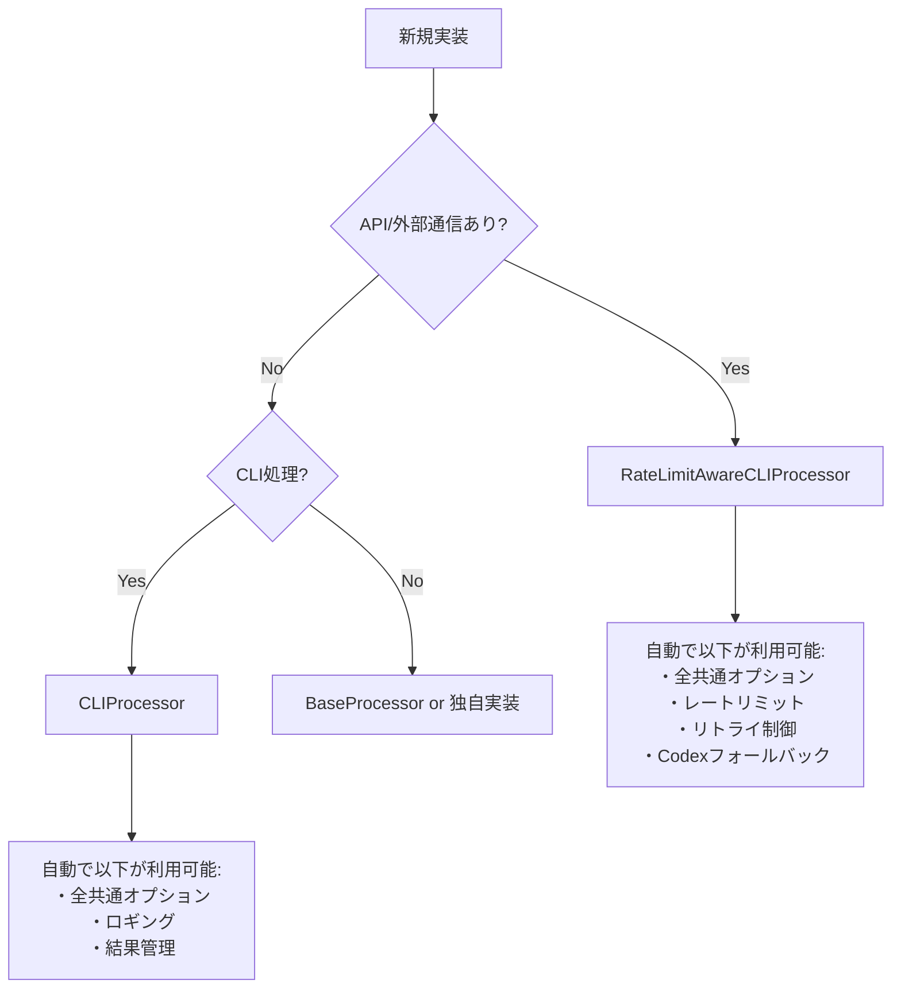

# AGENTS.md - AI自律開発指示書（IMPLEMENTATION専用）

# エラー予防プロトコル - SDEC×2SCV×ACR統合版

## 1. SDEC×2SCV×ACR コアロジック

### 1.1 SDEC（Spec-Data-Eval-Change）サイクル

**すべての作業はこのループで実行する**

```txt
1. Spec（仕様理解）: 要求を原子的な主張（Claims）に分解
2. Data（証拠収集）: 各主張を裏付ける証拠を能動的に取得
3. Eval（双方向検証）: 2SCVで証拠と主張を相互検証
4. Change（変更実施）: 検証済みの変更のみ実行
```

### 1.2 2SCV（双方向コーパス検証）

**E→S（証拠から仕様）とS→E（仕様から証拠）の両方向で検証**

- 証拠が主張を支持するか
- 主張に対応する証拠が存在するか
- 矛盾する証拠がないか

### 1.3 ACR（自律的コンテキスト再構築）

**不足情報は質問せず、証拠に基づく仮説で補完**

- 既存コードから推測
- 使用パターンから推論
- 共通処理から類推

## 2. 実践指示（すべてSDEC×2SCV×ACRに従って実行）

### 2.1 コード修正時の必須プロセス

**SDEC×2SCV×ACRに従って検討して、以下を実行：**

1. **Spec**: 修正要求を具体的な主張に分解
   - 「AutonomousImprovementSystemを分割」→「各メソッドの責務を特定」

2. **Data**: 証拠を収集

   ```bash
   grep -r "AutonomousImprovementSystem" .  # 使用箇所
   grep -r "BaseProcessor" .  # 共通処理の存在
   ```

3. **Eval**: 2SCVで検証
   - 使用箇所の証拠は分割案を支持するか？
   - 共通処理の存在は車輪の再発明を否定するか？

4. **Change**: 検証済みの変更のみ実行

### 2.2 クラス分割の判断基準

**SDEC×2SCV×ACRに従って検討して、以下を判断：**

- **Spec**: クラスが論理的に単一機能か？
- **Data**: メソッド一覧と責務を証拠として収集
- **Eval**: 複数の独立した責務の証拠があるか？
- **Change**: 証拠がある場合のみ分割実行

**論理的な機能が1つでない証拠があれば即分割**（行数は無関係）

### 2.3 共通処理の活用（実装前の必須検証）

**SDEC×2SCV×ACRに従って検討して、共通処理を活用：**

1. **Spec**: 実装しようとしている機能を明確化
   - 機能名、入力、出力、処理内容を言語化

2. **Data**: 既存の共通処理を調査（必須コマンド実行）

   ```bash
   # 必ず実行してログに残すこと
   echo "=== 実装前検証: [機能名] ==="
   
   # 類似機能の検索
   grep -r "機能キーワード" src/utils/ src/common/ --include="*.py"
   
   # 既存プロセッサの確認
   grep -r "class.*Processor" src/ --include="*.py" | grep -E "キーワード"
   
   # 実行可能スクリプトの確認
   find scripts_python* -name "*.py" | xargs grep -l "キーワード"
   
   # 共通処理の一覧
   ls -la src/utils/*.py src/common/*.py | grep -v __pycache__
   ```

3. **Eval**: 既存処理で代替可能か検証
   - 検索結果が1件でもあれば、その処理を必ず確認
   - 類似度が50%以上なら拡張を検討
   - 完全に新規の場合のみ新規実装を許可

4. **Change**: 検証結果に基づいて実装
   - 既存処理がある → 必ず再利用または拡張
   - 既存処理がない → 検証ログをコメントに記載して新規実装
   - 基底クラス（CLIProcessor/RateLimitAwareCLIProcessor）を必ず使用

### 2.4 レイヤー分離の実施

**SDEC×2SCV×ACRに従って検討して、レイヤーを分離：**

- **Spec**: CLI層とビジネスロジック層の責務を定義
- **Data**: 現在の実装がどのレイヤーに属するか証拠収集
- **Eval**: 混在している証拠があるか検証
- **Change**: 混在の証拠があれば分離

### 2.5 エラー発生時の対処

**SDEC×2SCV×ACRに従って検討して、エラーを解決：**

1. **Spec**: エラーの本質的な原因を主張として定義
2. **Data**: スタックトレース、関連コード、使用例を収集
3. **Eval**: 収集した証拠が原因仮説を支持するか検証
4. **Change**: 検証済みの修正のみ適用

## 3. 重要な行動原則

### 3.1 証拠なしに行動しない

**すべての判断にSDEC×2SCV×ACRを適用：**

- 推測や憶測での実装禁止
- grep/ls/findで証拠を収集してから行動
- 証拠が矛盾する場合は追加調査

### 3.2 ACRによる自律的補完

**不明な情報はSDEC×2SCV×ACRで補完：**

- ユーザーに質問する前に既存コードから推論
- 類似パターンから仮説を立てる
- 仮説も証拠で検証してから使用

### 3.3 継続的な検証

**作業中もSDEC×2SCV×ACRを繰り返し適用：**

- 変更の影響を継続的に検証
- 新たな証拠が見つかったら再評価
- 矛盾が発生したら即座に停止・再検討

## 4. チェックリスト

**各項目をSDEC×2SCV×ACRで確認：**

- [ ] **Spec**: 要求を明確な主張に分解したか？
- [ ] **Data**: 十分な証拠を収集したか？
- [ ] **Eval**: 2SCVで双方向検証したか？
- [ ] **Change**: 検証済みの変更のみ実行したか？
- [ ] **ACR**: 不足情報を証拠ベースで補完したか？

## まとめ

**すべての行動をSDEC×2SCV×ACRフレームワークで実行する。**

証拠なしの推測禁止。検証なしの実装禁止。質問前の自律補完必須。


## 2. 共通情報

全Agentが把握すべき共通情報。技術的根拠に基づき分析・推論・実行・修正を行うこと。

### 2.1 共通処理の自動発見と利用

#### 2.1.1 共通処理の検索（最優先実行）

```bash
# 実装前に必ず実行: 既存処理の検索
grep -r "実装したい機能" src/utils/ src/common/ --include="*.py"

# カテゴリから探す
ls src/common/cli/processors/  # CLIプロセッサ
ls src/common/cli/options/     # オプション管理
ls src/common/execution/       # 実行制御（rate_limit, retry等）
```

#### 2.1.2 基底クラス選択フローチャート



#### 2.1.3 最小実装パターン（これだけ書けば動く）

```python
# RateLimitAwareCLIProcessor = 全部入り（オプション・レート制限・リトライ全て自動）
from src.utils.base_processor import RateLimitAwareCLIProcessor, ProcessingResult

class MyProcessor(RateLimitAwareCLIProcessor):
    def __init__(self):
        super().__init__(
            module_name="my_processor",
            option_groups=["execute", "monitor"]  # 必要なグループのみ指定
        )
    
    def process(self) -> ProcessingResult:
        # self.configから全オプション自動アクセス可能
        return ProcessingResult(success=True)

# これだけで--dry-run, --verbose, --cycles, --interval等が全て使える
```

### 2.2 共通処理カテゴリマップ（100倍スケール対応）

#### 2.2.1 ディレクトリ構造と自動分類

```yaml
src/
  common/                      # ビジネスロジック層
    cli/
      processors/*_processor.py   # 基底プロセッサ群
      options/*_options.py        # オプション管理
      results/*_result.py         # 結果処理
    execution/
      rate_limit/*_handler.py    # レート制限
      retry/*_retry.py           # リトライ制御
    discovery/*_finder.py        # 探索・発見
    validation/*_validator.py    # 検証処理
    
  utils/                        # 技術的ユーティリティ  
    patterns/mixin/*_mixin.py   # Mixinパターン
    helpers/*_utils.py           # ヘルパー関数
```

#### 2.2.2 自動カテゴリ判定（ファイル名で自動振り分け）

| 接尾辞 | 自動配置先 | 例 |
|--------|-----------|-----|
| `*_processor.py` | `common/cli/processors/` | `batch_processor.py` |
| `*_options.py` | `common/cli/options/` | `custom_options.py` |
| `*_handler.py` | `common/execution/` | `error_handler.py` |
| `*_mixin.py` | `utils/patterns/mixin/` | `retry_mixin.py` |
| `*_finder.py` | `common/discovery/` | `module_finder.py` |

詳細: [`docs/COMMON_MODULE_CATEGORIZATION.md`](../../COMMON_MODULE_CATEGORIZATION.md)

### 2.3 オプショングループ（自動継承される）

#### 2.3.1 グループ指定だけで全オプション利用可能

```python
# option_groupsに指定するだけで自動的に利用可能
option_groups=["execute", "monitor", "output"]
```

| グループ | 自動追加されるオプション | 用途 |
|---------|------------------------|------|
| execute | `--dry-run`, `--cycles`, `--interval`, `--timeout` | 実行制御 |
| monitor | `--verbose`, `--log-level`, `--progress` | 出力制御 |
| output | `--output-format`, `--output-file` | 結果出力 |
| retry | `--max-retries`, `--retry-interval` | リトライ |

#### 2.3.2 オプションアクセス（フラット辞書）

```python
# self.configはフラット辞書（階層なし）
dry_run = self.config.get("dry_run", False)      # ✅ 正しい
verbose = self.config.get("verbose", False)      # ✅ 正しい

# self.options.execute.dry_run  # ❌ 存在しない
```

### 2.4 実装前の必須検証（30秒チェック）

```bash
# 30秒で既存処理を確認
echo "=== 実装予定: [機能名] ==="
grep -r "[機能名]" src/utils/ src/common/ --include="*.py" | head -10
ls src/common/*/  # カテゴリ確認
```

**判定基準:**

- 類似処理が1件でもヒット → 既存を拡張
- API/外部通信あり → `RateLimitAwareCLIProcessor`
- ローカル処理のみ → `CLIProcessor`

### 2.5 アンチパターン警告

#### 2.5.1 絶対にやってはいけないこと

| ❌ アンチパターン | ✅ 正しい方法 |
|-----------------|-------------|
| 独自argparse実装 | CLIProcessorを継承 |
| 独自ロガー設定 | self.loggerを使用 |
| 独自レートリミット | RateLimitAwareCLIProcessor使用 |
| for文でリトライ | execute_with_rate_limit_protection使用 |
| 階層的config参照 | フラット辞書として参照 |

#### 2.5.2 二重リトライ防止

```python
# CLI層: リトライあり
class MyProcessor(RateLimitAwareCLIProcessor):
    def process(self):
        def _execute_single_cycle(cycle: int) -> bool:
            return executor.execute()  # ビジネスロジック呼び出し
        
        return self.execute_with_rate_limit_protection(
            cycle_executor=_execute_single_cycle
        )

# ビジネスロジック層: リトライなし（単純実行のみ）
class MyExecutor:
    def execute(self):
        return result  # forループ禁止
```

### 2.6 クイックリファレンス

```bash
# システム評価
python src/core/ai_activity_evaluator/evaluator_cli.py --evaluation-type modules --all-modules

# 共通処理抽出（LLMプロンプト生成）
python src/core/common_code_extractor/extractor_cli.py --mode prompt

# モジュール番号管理
python scripts_python/commands/generate_module_numbers.py --dry-run
```

### 2.7 設計原則

**1ファイル = 1クラス = 1責務 = 1public関数**

---

**重要:** 新規実装前に必ず既存処理を検索すること。車輪の再発明は禁止。


## 3. .module自己記述型モジュールシステム

### 3.1. 基本概念

- **完全自己記述**: 各モジュールが8ファイル設計書セットで自己記述
- **集中実施利点**: コンテキスト一貫性・効率最大化・品質向上・デバッグ容易性

### 3.2. 必須8ファイルセット

1. TASKS.md, 2. MODULE_GOALS.md, 3. ARCHITECTURE.md, 4. MODULE_STRUCTURE.md
5. BEHAVIOR.md, 6. IMPLEMENTATION.md, 7. TEST.md, 8. FEEDBACK.md

**設計フロー**: MODULE_GOALS → ARCHITECTURE → MODULE_STRUCTURE → BEHAVIOR → IMPLEMENTATION → TEST

### 3.3. 作業管理

- **記録**: `docs/03_Reports/current_working_module.md`で状況管理
- **原則**: 単一モジュール集中、並行作業禁止


## 3. 1:1アンカーID対応強制型文書整合性検証システム

**必須ルール：１つのmdには必ず１つ以上のアンカーIDを記載し、下位のモジュールは上位のアンカーIDと必ず１：１に対応する。**このルールにより自然にモジュール分割・機能分割が強制され、明確な責任範囲を持つ設計が実現される。

## #強制アーキテクチャルール

### 基本強制ルール

python

```python
MANDATORY_RULES = {
    'ONE_ANCHOR_PER_MD': {
        'rule': '1つのmdファイルには必ず1つ以上のアンカーIDが記載されている',
        'enforcement': 'CRITICAL',
        'auto_fix': 'generate_missing_anchor_ids'
    },
    'ONE_TO_ONE_CORRESPONDENCE': {
        'rule': '下位モジュールは上位のアンカーIDと必ず1:1に対応する',
        'enforcement': 'CRITICAL', 
        'auto_fix': 'propose_module_split'
    },
    'HIERARCHICAL_TRACEABILITY': {
        'rule': 'TASKS→GOALS→ARCH→STRUCT→BEHAV→IMPL→TEST→FEEDの各階層で1:1対応が確立',
        'enforcement': 'HIGH',
        'auto_fix': 'restructure_hierarchy'
    }
}
```

### アンカーID階層対応設計

```
TASKS.md     [TASK_モジュールID-001] → [TASK_モジュールID-002]
    ↓ 1:1           ↓ 1:1
GOALS.md     [GOAL_モジュールID-001] → [GOAL_モジュールID-002] 
    ↓ 1:1           ↓ 1:1
ARCH.md      [ARCH_モジュールID-001] → [ARCH_モジュールID-002]
    ↓ 1:1           ↓ 1:1
STRUCT.md    [STRC_モジュールID-001] → [STRC_モジュールID-002]
    ↓ 1:1           ↓ 1:1
BEHAV.md     [BEHV_モジュールID-001] → [BEHV_モジュールID-002]
    ↓ 1:1           ↓ 1:1  
IMPL.md      [IMPL_モジュールID-001] → [IMPL_モジュールID-002]
    ↓ 1:1           ↓ 1:1
TEST.md      [TEST_モジュールID-001] → [TEST_モジュールID-002]
    ↓ 1:1           ↓ 1:1
実装コード    [LOGIC_モジュールID-001] → [LOGIC_モジュールID-002]
```

## #アンカーID必須検証エンジン

### md別アンカーID存在チェック

python

```python
def verify_anchor_id_presence(md_file_path):
    """mdファイル内のアンカーID存在を検証"""
    anchor_patterns = [
        r'TASK_\d{2}_\d{2}_\d{2}-\d{3}',
        r'GOAL_\d{2}_\d{2}_\d{2}-\d{3}', 
        r'ARCH_\d{2}_\d{2}_\d{2}-\d{3}',
        r'STRC_\d{2}_\d{2}_\d{2}-\d{3}',
        r'BEHV_\d{2}_\d{2}_\d{2}-\d{3}',
        r'IMPL_\d{2}_\d{2}_\d{2}-\d{3}',
        r'TEST_\d{2}_\d{2}_\d{2}-\d{3}'
    ]
    
    with open(md_file_path, 'r') as f:
        content = f.read()
    
    found_anchors = []
    for pattern in anchor_patterns:
        matches = re.findall(pattern, content)
        found_anchors.extend(matches)
    
    if not found_anchors:
        return {
            'status': 'VIOLATION',
            'issue': 'NO_ANCHOR_ID_FOUND',
            'file': md_file_path,
            'action_required': 'ADD_ANCHOR_ID'
        }
    
    return {
        'status': 'COMPLIANT',
        'anchors': found_anchors,
        'count': len(found_anchors)
    }
```

### アンカーID自動採番

python

```python
def auto_generate_missing_anchors(md_file_path, module_id):
    """欠落しているアンカーIDを自動採番"""
    doc_type = extract_doc_type_from_filename(md_file_path)
    next_anchor_number = get_next_anchor_number(module_id, doc_type)
    
    new_anchor_id = f"{doc_type}_{module_id}-{next_anchor_number:03d}"
    
    # 適切な場所にアンカーIDを挿入
    insert_anchor_id_to_md(md_file_path, new_anchor_id)
    
    return {
        'generated_anchor': new_anchor_id,
        'inserted_at': md_file_path,
        'reason': 'MANDATORY_ANCHOR_ID_RULE_ENFORCEMENT'
    }
```

## #1:1対応関係検証エンジン

### 階層間1:1対応チェック

python

```python
def verify_one_to_one_correspondence(module_id):
    """階層間でのアンカーID 1:1対応を検証"""
    hierarchy = ['TASK', 'GOAL', 'ARCH', 'STRC', 'BEHV', 'IMPL', 'TEST']
    correspondence_violations = []
    
    for i in range(len(hierarchy) - 1):
        upper_level = hierarchy[i]
        lower_level = hierarchy[i + 1]
        
        upper_anchors = get_anchors_by_type(module_id, upper_level)
        lower_anchors = get_anchors_by_type(module_id, lower_level)
        
        # 1:1対応チェック
        correspondence_map = build_correspondence_map(upper_anchors, lower_anchors)
        
        for upper_anchor in upper_anchors:
            corresponding_lower = correspondence_map.get(upper_anchor)
            
            if not corresponding_lower:
                correspondence_violations.append({
                    'type': 'MISSING_LOWER_CORRESPONDENCE',
                    'upper_anchor': upper_anchor,
                    'upper_level': upper_level,
                    'lower_level': lower_level,
                    'action': 'CREATE_CORRESPONDING_LOWER_ANCHOR'
                })
            elif len(corresponding_lower) > 1:
                correspondence_violations.append({
                    'type': 'MULTIPLE_LOWER_CORRESPONDENCE', 
                    'upper_anchor': upper_anchor,
                    'lower_anchors': corresponding_lower,
                    'action': 'SPLIT_UPPER_ANCHOR_OR_CONSOLIDATE_LOWER'
                })
    
    return correspondence_violations
```

### モジュール分割強制提案

python

```python
def propose_module_split_for_violations(correspondence_violations):
    """1:1対応違反に対するモジュール分割提案"""
    split_proposals = []
    
    for violation in correspondence_violations:
        if violation['type'] == 'MULTIPLE_LOWER_CORRESPONDENCE':
            upper_anchor = violation['upper_anchor']
            lower_anchors = violation['lower_anchors']
            
            # 上位アンカーを分割提案
            split_proposals.append({
                'target_anchor': upper_anchor,
                'split_into': len(lower_anchors),
                'new_anchor_names': generate_split_anchor_names(upper_anchor, len(lower_anchors)),
                'rationale': f"1つの上位アンカーが{len(lower_anchors)}個の下位実装に対応。責任分離の原則違反。",
                'benefits': [
                    '明確な責任範囲の確立',
                    'テスト可能性の向上',
                    'モジュール独立性の強化'
                ]
            })
    
    return split_proposals
```

## #修正指示書フォーマット（1:1対応強制版）

### アンカーID必須違反の修正指示

```
=== 修正指示書（アンカーID必須ルール違反） ===
生成日時: 2025-01-15 14:30:00
対象ファイル: {md_file_path}
紐づけモジュールID: {resolved_module_id}

修正指示ID: FIX-ANCHOR-{resolved_module_id}-{YYYYMMDD}-{NNN}
重要度: CRITICAL

【ルール違反詳細】
違反ルール: 1つのmdには必ず1つ以上のアンカーIDを記載
違反ファイル: {md_file_path}
現在のアンカーID数: 0個
期待されるアンカーID数: 1個以上

【自動修正提案】
提案アンカーID: {proposed_anchor_id}
挿入予定位置: {insertion_line_number}
アンカーID説明: {generated_description}

【修正指示】
修正タイプ: アンカーID追加（必須）
修正対象: {md_file_path}:{insertion_line}
修正内容: `{proposed_anchor_id}_[機能説明]` を追加

【効果分析】
- 下位階層との1:1対応が確立される
- トレーサビリティが明確化される  
- 責任範囲が明確になる
```

### 1:1対応違反の修正指示

```
=== 修正指示書（1:1対応違反） ===
生成日時: 2025-01-15 14:30:00
対象モジュール: {resolved_module_id}

修正指示ID: FIX-CORRESPONDENCE-{resolved_module_id}-{YYYYMMDD}-{NNN}
重要度: CRITICAL

【対応関係違反詳細】
上位アンカー: {upper_anchor_id}
対応する下位アンカー数: {lower_anchor_count}個
期待される対応数: 1個

違反タイプ: [1つの上位に複数の下位対応|下位に対応する上位が未存在]

【強制分割提案】
**推奨アクション: 上位アンカーを{split_count}個に分割**

分割前: {original_upper_anchor}
分割後: 
- {split_anchor_1}
- {split_anchor_2}
- {split_anchor_3}

【分割による効果】
- 各機能が独立したアンカーIDを持つ
- 1:1対応関係が確立される
- モジュールの責任が明確化される
- テスト可能性が向上する

【修正指示】
1. {upper_md_file}の{upper_anchor_id}を分割
2. 分割された各アンカーに対応する下位実装を確認
3. 1:1対応関係の再検証
```

## #システム実行工程（1:1対応強制版）

### Phase 1: アンカーID必須チェック・自動修正

1. 全mdファイルのアンカーID存在確認
2. **アンカーIDが存在しないmdファイルの特定**
3. **自動アンカーID採番・挿入実行**
4. 採番ルールに基づくアンカーID生成
5. 適切な位置への自動挿入

### Phase 2: 1:1対応関係検証

1. **階層間アンカーID対応関係分析**
2. **1:1対応違反の検出**
3. **複数対応関係の特定**
4. 対応欠落の特定
5. 対応関係マトリクス生成

### Phase 3: 強制分割提案生成

1. **1:1対応違反に対する分割提案**
2. 上位アンカーID分割案の生成
3. 分割効果の分析
4. **モジュール分割の必要性判定**
5. 責任範囲再定義提案

### Phase 4: 修正指示書生成（強制ルール版）

1. アンカーID必須違反の修正指示
2. 1:1対応違反の修正指示
3. **分割強制による設計改善提案**
4. 階層整合性確保指示
5. 検証方法の明示

## #出力仕様（1:1対応強制版）

### 必須出力ファイル

- `{module_id}_anchor_compliance_report_{timestamp}.md`: アンカーID必須チェック結果
- `{module_id}_correspondence_violations_{timestamp}.md`: 1:1対応違反レポート
- `{module_id}_split_proposals_{timestamp}.md`: **モジュール分割強制提案**
- `{module_id}_hierarchy_matrix_{timestamp}.csv`: 階層対応関係マトリクス

### 階層対応関係マトリクス

csv

```csv
UpperAnchorID,UpperLevel,LowerAnchorID,LowerLevel,CorrespondenceStatus,ViolationType,SplitRequired
TASK_06_04_01-001,TASK,GOAL_06_04_01-001,GOAL,COMPLIANT,,FALSE
GOAL_06_04_01-002,GOAL,"ARCH_06_04_01-002,ARCH_06_04_01-003",ARCH,VIOLATION,MULTIPLE_CORRESPONDENCE,TRUE
```

### 設計強制の効果

**この1:1対応ルールにより自然に発生する改善:**

- 曖昧な機能定義の排除
- 責任範囲の明確化
- テスト可能な単位への自然な分割
- モジュール間結合度の低減
- 保守性・拡張性の向上


# 実装の実運用ルール（必達）

## 1. インポート規則

### 1.1. 絶対パス必須
```python
# ✅ 正しい書き方
from src.common.cli_options import CLIOptions, UniversalExecutionOptions
from src.modules.core_system_module.common_libs.config.manager import ConfigManager
from src.common.module_loader import get_class_safe

# ❌ 禁止（相対パス）
from ..common.cli_options import CLIOptions
from .config import ConfigManager
```

### 1.2. インポート順序
1. 標準ライブラリ
2. サードパーティライブラリ
3. プロジェクト内モジュール（src.common 優先）
4. プロジェクト内モジュール（src.modules）

## 2. UniversalExecutionOptions統一規則（重要）

### 2.1. **必須使用原則（例外なし）**
**すべてのpublicメソッドはUniversalExecutionOptionsオブジェクトを受け取る**

**作業ステップ（必須実行）:**
1. 既存の全publicメソッドのシグネチャを確認する
2. 個別引数（model, dry_run, register_only等）とUniversalExecutionOptionsの対応を確認する
3. 既存引数がUniversalExecutionOptionsで代用可能かを判断する
4. 代用可能な引数は削除し、UniversalExecutionOptionsに統一する
5. CLIOptionsではなくUniversalExecutionOptionsを使用していることを確認する

```python
# ✅ 正しい使用法（UniversalExecutionOptions必須）
from src.common.cli_options import CLIOptions, UniversalExecutionOptions

def process_file(options: UniversalExecutionOptions) -> str:
    """すべてのpublicメソッドはUniversalExecutionOptionsを受け取る"""
    model = options.execute.model
    dry_run = options.execute.dry_run
    register_only = options.execute.register_only
    return self._internal_process(model, dry_run, register_only)

# ❌ 禁止（個別引数の使用）
def process_file(model: str, dry_run: bool, register_only: bool) -> str:
    """個別引数は禁止、UniversalExecutionOptionsに統一必須"""
    pass

# ❌ 禁止（CLIOptionsの直接使用）
def process_file(cli_options: CLIOptions) -> str:
    """CLIOptionsではなくUniversalExecutionOptionsを使用すること"""
    pass
```

### 2.2. **引数最適化の必須手順**
**各メソッド修正時に以下を例外なく実行:**

1. **既存引数確認ステップ:**
   - 現在のメソッドシグネチャを記録する
   - 各引数の型と用途を特定する
   - UniversalExecutionOptionsのどのフィールドに対応するかを確認する

2. **代用可能性判断ステップ:**
   - `model` → `options.execute.model` で代用可能か確認
   - `dry_run` → `options.execute.dry_run` で代用可能か確認
   - `register_only` → `options.execute.register_only` で代用可能か確認
   - その他引数も同様にUniversalExecutionOptionsで代用可能か確認

3. **引数削減実行ステップ:**
   - 代用可能な引数をメソッドシグネチャから削除
   - メソッド内でUniversalExecutionOptionsから値を取得するコードに変更
   - 呼び出し元も同様にUniversalExecutionOptionsを渡すように修正

```python
# 修正前（禁止パターン）
def process_module(module_path: str, model: str, dry_run: bool, register_only: bool) -> int:
    pass

# 修正後（必須パターン）
def process_module(module_path: str, options: UniversalExecutionOptions) -> int:
    model = options.execute.model
    dry_run = options.execute.dry_run
    register_only = options.execute.register_only
    # 処理実行
```

### 2.3. **CLIOptions設定の必要最小限原則**
CLIOptionsは設定のみ、実処理にはUniversalExecutionOptionsを使用

```python
# ✅ 正しい使用パターン
def main():
    # 設定段階でCLIOptionsを使用
    cli_options = CLIOptions("処理名", ["execute", "module"])
    unified_config = cli_options.parse()
    
    # 実処理段階でUniversalExecutionOptionsを作成・使用
    execution_options = UniversalExecutionOptions.from_cli_and_env(unified_config.config_dict)
    
    # すべての処理関数にUniversalExecutionOptionsを渡す
    result = process_data(execution_options)

# ❌ 禁止（CLIOptionsの直接引き回し）
def main():
    cli_options = CLIOptions("処理名")
    config = cli_options.parse()
    result = process_data(config)  # CLIOptionsを直接渡すのは禁止
```

## 3. ファイル・クラス設計規則

### 3.1. １ファイル＝１機能の厳守
各ファイルは単一の責任を持つ

```python
# ✅ 正しいファイル構成
# processor.py - データ処理専用
class DataProcessor:
    def process(self, data): pass

# validator.py - バリデーション専用  
class DataValidator:
    def validate(self, data): pass

# ❌ 禁止（複数機能混在）
# utils.py
class DataProcessor: pass
class DataValidator: pass
class FileManager: pass
```

### 3.2. **１クラス＝１パブリックメソッド（UniversalExecutionOptions必須）**
**各クラスは単一のパブリックメソッドのみ持ち、必ずUniversalExecutionOptionsを受け取る**

**作業ステップ（必須実行）:**
1. クラス内のパブリックメソッドをすべて特定する
2. 複数ある場合は単一責任原則に基づいて分割を検討する
3. パブリックメソッドがUniversalExecutionOptionsを受け取っているか確認する
4. 受け取っていない場合は、既存引数をUniversalExecutionOptionsで代用可能か判断する
5. 型アノテーションを必ず記述する

```python
# ✅ 正しいクラス設計（UniversalExecutionOptions必須）
class DocumentProcessor:
    def process(self, options: UniversalExecutionOptions) -> str:
        """パブリックメソッドは1つのみ、UniversalExecutionOptions必須"""
        document_path = options.execute.target_file
        dry_run = options.execute.dry_run
        return self._validate_and_process(document_path, dry_run)
    
    def _validate_and_process(self, document: str, dry_run: bool) -> str:
        """プライベートメソッド"""
        if dry_run:
            return f"[DRY-RUN] Would process {document}"
        # 実際の処理
        pass
    
    def _cleanup(self) -> None:
        """プライベートメソッド"""
        pass

# ❌ 禁止（複数パブリックメソッド）
class DocumentProcessor:
    def process(self, document): pass
    def validate(self, document): pass  # 禁止：単一パブリックメソッド原則違反
    def save(self, document): pass      # 禁止：単一パブリックメソッド原則違反

# ❌ 禁止（UniversalExecutionOptions未使用）
class DocumentProcessor:
    def process(self, document: str, dry_run: bool) -> str:
        """個別引数禁止、UniversalExecutionOptions必須"""
        pass
```

### 3.3. プライベートメソッドの最小化
プライベートメソッドは必要最小限に抑制

```python
# ✅ 適切なプライベートメソッド数（2-3個）
class Processor:
    def process(self, data):
        validated_data = self._validate(data)
        return self._transform(validated_data)
    
    def _validate(self, data): pass
    def _transform(self, data): pass

# ❌ 過剰なプライベートメソッド
class Processor:
    def process(self, data): pass
    def _validate(self, data): pass
    def _transform(self, data): pass
    def _check_format(self, data): pass
    def _normalize(self, data): pass
    def _cleanup(self, data): pass
    # → 共通処理として別クラスに分離すべき
```

## 4. 共通処理管理規則

### 4.1. 必須切り出し原則
同じコードは絶対に２度書かない

```python
# ✅ 正しい共通処理切り出し
# src/common/file_utils.py
class FileManager:
    def read_file(self, path: str) -> str:
        """ファイル読み込み共通処理"""
        pass

# 各モジュールで使用
from src.common.file_utils import FileManager

class DocumentProcessor:
    def __init__(self):
        self.file_manager = FileManager()
    
    def process(self, file_path: str):
        content = self.file_manager.read_file(file_path)

# ❌ 禁止（重複コード）
# module_a.py
def read_file(path):
    with open(path, 'r') as f:
        return f.read()

# module_b.py  
def read_file(path):  # 同じコードの重複
    with open(path, 'r') as f:
        return f.read()
```

### 4.2. 共通処理配置ルール
```
src/common/          # プロジェクト全体共通
  ├── cli_options.py      # CLI統一管理
  ├── file_utils.py       # ファイル操作
  ├── logger.py           # ログ管理
  └── validators.py       # バリデーション

src/modules/*/common/    # モジュール内共通
  └── utils.py            # モジュール固有共通処理
```

## 5. **実装チェックリスト（UniversalExecutionOptions重点）**

### 5.1. **コード作成時チェック（必須確認項目）**
**UniversalExecutionOptions関連（最重要）:**
- [ ] 全パブリックメソッドがUniversalExecutionOptionsを受け取っている
- [ ] 個別引数（model, dry_run, register_only等）を使用していない
- [ ] CLIOptionsを直接メソッドに渡していない
- [ ] UniversalExecutionOptionsから必要な値を適切に取得している
- [ ] メソッドシグネチャに型アノテーションが記述されている

**作業ステップ確認:**
- [ ] 既存引数とUniversalExecutionOptionsの対応を確認済み
- [ ] 代用可能性を判断済み
- [ ] 引数最適化を実行済み
- [ ] 呼び出し元も同様に修正済み

**従来チェック項目:**
- [ ] インポートが絶対パスで記述されている
- [ ] １ファイル＝１機能が守られている
- [ ] １クラス＝１パブリックメソッドが守られている
- [ ] プライベートメソッドが最小限（3個以下推奨）
- [ ] 重複コードが存在しない
- [ ] 共通処理が適切に切り出されている

### 5.2. **レビュー時チェック（UniversalExecutionOptions重点）**
**UniversalExecutionOptions関連確認:**
- [ ] publicメソッドがUniversalExecutionOptionsを受け取っているか
- [ ] 不要な個別引数が残っていないか
- [ ] options.execute.XXXで値を取得しているか
- [ ] 型アノテーションが正しく記述されているか

**従来確認項目:**
- [ ] 同様の処理が他ファイルに存在しないか
- [ ] クラス責任が単一か
- [ ] メソッド数が適切か
- [ ] 共通化可能な処理がないか

### 5.3. **UniversalExecutionOptions移行チェック手順**
**既存コード修正時の必須手順:**
1. **シグネチャ確認:** 現在のメソッド引数をリストアップ
2. **対応確認:** 各引数がUniversalExecutionOptionsのどのフィールドに対応するか確認
3. **判断実行:** 代用可能な引数を特定
4. **修正実行:** メソッドシグネチャとメソッド内処理を修正
5. **呼び出し元修正:** 呼び出し箇所も同様に修正
6. **動作確認:** 修正後の動作を確認

## 6. **違反への対処（UniversalExecutionOptions重点）**

### 6.1. **自動検知（UniversalExecutionOptions違反検出）**
```bash
# UniversalExecutionOptions未使用検知（最重要）
grep -r "def.*(" src/ --include="*.py" | grep -v "def _" | grep -v "UniversalExecutionOptions"

# 個別引数使用検知
grep -r "model.*str.*dry_run.*bool" src/ --include="*.py"
grep -r "register_only.*bool" src/ --include="*.py"

# CLIOptions直接使用検知
grep -r "CLIOptions" src/ --include="*.py" | grep -v "from.*import" | grep -v "UniversalExecutionOptions"

# 従来の検知
# 相対パスインポート検知
grep -r "from \.\." src/ --include="*.py"

# argparse直接使用検知
grep -r "ArgumentParser" src/ --include="*.py" | grep -v cli_options.py
```

### 6.2. **修正優先度（UniversalExecutionOptions最優先）**
1. **Critical**: UniversalExecutionOptions未使用 → 即座に修正必須
2. **Critical**: 個別引数使用（model, dry_run等） → 即座に修正必須
3. **High**: CLIOptions直接使用 → 1日以内修正
4. **High**: 相対パスインポート → 1週間以内修正
5. **Medium**: 独自CLIパーサー → リファクタリング時修正
6. **Low**: クラス責任違反 → 次回実装時検討
7. **Low**: プライベートメソッド過多 → 次回実装時検討

### 6.3. **UniversalExecutionOptions違反の緊急修正手順**
**発見時の即座実行ステップ:**
1. **違反特定:** どのメソッドがUniversalExecutionOptionsを使用していないか特定
2. **影響範囲確認:** そのメソッドを呼び出している箇所をすべて特定
3. **対応確認:** 現在の引数がUniversalExecutionOptionsで代用可能か確認
4. **修正実行:** メソッドシグネチャと呼び出し元を一括修正
5. **動作確認:** 修正後の動作を確認
6. **テスト実行:** 関連するテストを実行して問題ないことを確認

## 7. **実装例（UniversalExecutionOptions必須パターン）**

### 7.1. **標準的な実装パターン（UniversalExecutionOptions適用）**
```python
#!/usr/bin/env python3
"""
単一機能モジュールの標準実装例（UniversalExecutionOptions必須）
"""

# 標準ライブラリ
import sys
from pathlib import Path
from typing import Optional

# プロジェクト内インポート（絶対パス）
from src.common.cli_options import CLIOptions, UniversalExecutionOptions
from src.common.file_utils import FileManager
from src.common.logger import setup_logger

class DocumentProcessor:
    """文書処理専用クラス（単一責任）"""
    
    def __init__(self):
        self.file_manager = FileManager()
        self.logger = setup_logger(__name__)
    
    def process(self, options: UniversalExecutionOptions) -> str:
        """パブリックメソッド（1つのみ、UniversalExecutionOptions必須）"""
        # UniversalExecutionOptionsから値を取得
        input_path = options.execute.target_file
        dry_run = options.execute.dry_run
        
        if dry_run:
            return f"[DRY-RUN] Would process {input_path}"
        
        content = self._load_document(input_path)
        return self._transform_content(content)
    
    def _load_document(self, path: str) -> str:
        """プライベートメソッド（必要最小限）"""
        return self.file_manager.read_file(path)
    
    def _transform_content(self, content: str) -> str:
        """プライベートメソッド（必要最小限）"""
        # 変換処理
        return content.upper()

def main():
    """エントリーポイント（UniversalExecutionOptions使用）"""
    # CLIOptionsで設定解析
    cli_options = CLIOptions("文書処理", ["execute", "output"])
    unified_config = cli_options.parse()
    
    # UniversalExecutionOptionsを作成
    execution_options = UniversalExecutionOptions.from_cli_and_env(unified_config.config_dict)
    
    # UniversalExecutionOptionsを渡して処理実行
    processor = DocumentProcessor()
    result = processor.process(execution_options)
    
    print(result)

if __name__ == "__main__":
    main()
```

### 7.2. **修正前後の比較例**
```python
# ❌ 修正前（禁止パターン）
def process_file(file_path: str, model: str, dry_run: bool, register_only: bool) -> str:
    """個別引数使用：禁止パターン"""
    if dry_run:
        return f"[DRY-RUN] Would process {file_path}"
    # 処理実行
    return process_with_model(file_path, model)

# ✅ 修正後（必須パターン）
def process_file(file_path: str, options: UniversalExecutionOptions) -> str:
    """UniversalExecutionOptions使用：必須パターン"""
    model = options.execute.model
    dry_run = options.execute.dry_run
    register_only = options.execute.register_only
    
    if dry_run:
        return f"[DRY-RUN] Would process {file_path}"
    # 処理実行
    return process_with_model(file_path, model)
```

### 7.3. **必須確認ポイント**
**実装時に必ず確認する項目:**
1. パブリックメソッドがUniversalExecutionOptionsを受け取っているか
2. 個別引数（model, dry_run, register_only等）を使用していないか
3. options.execute.XXXで値を取得しているか
4. 型アノテーションが記述されているか
5. CLIOptionsを直接メソッドに渡していないか

---

**これらのルールは必達事項であり、例外は認められない。特にUniversalExecutionOptionsの使用は最優先で厳守すること。**

# スクリプトオプション標準一覧（自動生成）

- 本ファイルは `-h` 出力に基づき自動生成・更新されます。
- 仕様の解説や設計意図は `docs/SCRIPT_OPTIONS_STANDARD.md` を参照してください。

`python3 scripts_python/commands/update_script_options_docs.py` を実行すると更新されます。

<!-- AUTO-GENERATED: SCRIPT_OPTIONS_HELP START -->

> This section is auto-generated from `-h` output. Do not edit manually.

### Base Options

```text
usage: update_script_options_docs.py [-h] [--version] [--config FILE]

UCG DevOps CLI - Base Options Only

options:
  -h, --help     show this help message and exit
  --version      show program's version number and exit
  --config FILE  設定ファイルパス（YAML/JSON）
```

### Group: document

```text
usage: update_script_options_docs.py [-h] [--version] [--config FILE]
                                     [--target-document {MODULE_GOALS.md,ARCHITECTURE.md,MODULE_STRUCTURE.md,BEHAVIOR.md,IMPLEMENTATION.md,TEST.md,FEEDBACK.md,TASKS.md}]

UCG DevOps CLI - document options

options:
  -h, --help            show this help message and exit
  --version             show program's version number and exit
  --config FILE         設定ファイルパス（YAML/JSON）

ドキュメント処理:
  --target-document {MODULE_GOALS.md,ARCHITECTURE.md,MODULE_STRUCTURE.md,BEHAVIOR.md,IMPLEMENTATION.md,TEST.md,FEEDBACK.md,TASKS.md}, -td {MODULE_GOALS.md,ARCHITECTURE.md,MODULE_STRUCTURE.md,BEHAVIOR.md,IMPLEMENTATION.md,TEST.md,FEEDBACK.md,TASKS.md}
                        対象ドキュメント (default: MODULE_GOALS.md)
```

### Group: execute

```text
usage: update_script_options_docs.py [-h] [--version] [--config FILE]
                                     [--execution-type {single,continuous,scheduled,conditional,parallel}]
                                     [--dry-run] [--register-only] [--force]
                                     [--cycles CYCLES] [--interval INTERVAL]
                                     [--delay DELAY] [--stop-on-error]
                                     [--continue-on-error] [--parallel N]
                                     [--max-workers MAX_WORKERS]
                                     [--async-mode]
                                     [--target-module TARGET_MODULE]
                                     [--target-function TARGET_FUNCTION]
                                     [--function-kwargs FUNCTION_KWARGS]
                                     [--timeout TIMEOUT] [--executor EXECUTOR]
                                     [--function-args [FUNCTION_ARGS ...]]
                                     [--enhancement-vector {vertical,horizontal,integration,quality,performance,minimal}]
                                     [--debug] [--rate-limit-retry]
                                     [--rate-limit-max-wait RATE_LIMIT_MAX_WAIT]
                                     [--rate-limit-backoff RATE_LIMIT_BACKOFF]
                                     [--enable-codex-fallback]
                                     [--disable-codex-fallback]
                                     [--codex-fallback-mode {auto,manual,disabled}]
                                     [--max-codex-attempts MAX_CODEX_ATTEMPTS]
                                     [--codex-model CODEX_MODEL]
                                     [--codex-sandbox {read-only,workspace-write,danger-full-access}]

UCG DevOps CLI - execute options

options:
  -h, --help            show this help message and exit
  --version             show program's version number and exit
  --config FILE         設定ファイルパス（YAML/JSON）

実行制御:
  --execution-type {single,continuous,scheduled,conditional,parallel}
                        実行タイプ (default: single)
  --dry-run, -d         処理内容表示のみ
  --register-only       実行せずに登録のみ
  --force, -f           確認プロンプトスキップ
  --cycles CYCLES, -c CYCLES
                        実行サイクル数 (default: 1)
  --interval INTERVAL, -i INTERVAL
                        実行間隔（例: 30s, 1m, 2h） (default: 0)
  --delay DELAY         実行開始までの遅延時間（例: 30s, 1m, 2h） (default: 0)
  --stop-on-error       エラー時に実行を停止 (default: True)
  --continue-on-error, -coe
                        エラーが発生しても実行を継続
  --parallel N, -p N    並列プロセス数 (default: 1)
  --max-workers MAX_WORKERS
                        並列実行時の最大ワーカー数 (default: 4)
  --async-mode          非同期実行モード
  --target-module TARGET_MODULE, -tm TARGET_MODULE
                        実行対象モジュールパス (default: src/modules/core_system_module/m
                        odule_document_processor/.module)
  --target-function TARGET_FUNCTION, -tfn TARGET_FUNCTION
                        実行対象関数名 (default: main)
  --function-kwargs FUNCTION_KWARGS, -fk FUNCTION_KWARGS
                        関数キーワード引数（JSON形式）
  --timeout TIMEOUT, -t TIMEOUT
                        関数実行タイムアウト（秒、-1で無限） (default: -1)
  --executor EXECUTOR, -e EXECUTOR
                        実行エンジン/モデル名 (default: claude)
  --function-args [FUNCTION_ARGS ...], -fa [FUNCTION_ARGS ...]
                        関数引数（位置引数として渡される）
  --enhancement-vector {vertical,horizontal,integration,quality,performance,minimal}, -ev {vertical,horizontal,integration,quality,performance,minimal}
                        改善ベクトルの選択 (vertical: 同一レイヤ深化, horizontal: レイヤ間整合性,
                        integration: モジュール間連携, quality: 品質向上, performance:
                        性能最適化, minimal: 必要最小限の情報にスリム化)
  --debug               デバッグモード（1回のループで中断）
  --rate-limit-retry    レートリミット時に自動的に次のサイクルに進む (default: True)
  --rate-limit-max-wait RATE_LIMIT_MAX_WAIT
                        レートリミット時の最大待機時間（秒） (default: 300)
  --rate-limit-backoff RATE_LIMIT_BACKOFF
                        レートリミット時のバックオフ乗数 (default: 1.5)
  --enable-codex-fallback
                        レートリミット時にCodexへ自動切り替え (default: False)
  --disable-codex-fallback
                        Codex自動切り替えを無効化
  --codex-fallback-mode {auto,manual,disabled}
                        Codexフォールバックモード (default: disabled)
  --max-codex-attempts MAX_CODEX_ATTEMPTS
                        Codex実行の最大試行回数 (default: 3)
  --codex-model CODEX_MODEL
                        Codex実行時のモデル指定
  --codex-sandbox {read-only,workspace-write,danger-full-access}
                        Codex実行時のサンドボックスモード (default: workspace-write)
```

### Group: module

```text
usage: update_script_options_docs.py [-h] [--version] [--config FILE]
                                     [--modules MODULES]
                                     [--module-config FILE]
                                     [--module-paths PATHS] [--all-modules]
                                     [--exclude-modules MODULES]
                                     [--search-path SEARCH_PATH] [--recursive]
                                     [--max-depth MAX_DEPTH]
                                     [--module-pattern MODULE_PATTERN]
                                     [--status-filter {all,active,inactive,error}]
                                     [--process-order {alphabetic,dependency,priority,size}]
                                     [--batch-size BATCH_SIZE]

UCG DevOps CLI - module options

options:
  -h, --help            show this help message and exit
  --version             show program's version number and exit
  --config FILE         設定ファイルパス（YAML/JSON）

モジュール処理:
  --modules MODULES, -m MODULES
                        対象モジュール（カンマ区切り） (default: None)
  --module-config FILE, -mc FILE
                        モジュールリストYAMLファイル
  --module-paths PATHS, -mp PATHS
                        .moduleディレクトリパス（カンマ区切り）
  --all-modules, -am    全.moduleディレクトリ対象
  --exclude-modules MODULES, -em MODULES
                        除外モジュール（カンマ区切り）
  --search-path SEARCH_PATH, -msp SEARCH_PATH
                        モジュール検索パス
  --recursive, -r       再帰的検索
  --max-depth MAX_DEPTH, -md MAX_DEPTH
                        検索最大深度 (default: 5)
  --module-pattern MODULE_PATTERN, -mpt MODULE_PATTERN
                        モジュール名パターン（正規表現）
  --status-filter {all,active,inactive,error}, -sf {all,active,inactive,error}
                        ステータスフィルタ (default: all)
  --process-order {alphabetic,dependency,priority,size}, -po {alphabetic,dependency,priority,size}
                        処理順序 (default: alphabetic)
  --batch-size BATCH_SIZE, -bs BATCH_SIZE
                        バッチサイズ (default: 10)
```

### Group: monitor

```text
usage: update_script_options_docs.py [-h] [--version] [--config FILE]
                                     [--verbose] [--quiet]
                                     [--log-level {DEBUG,INFO,WARNING,ERROR,CRITICAL}]
                                     [--show-progress]
                                     [--progress-interval PROGRESS_INTERVAL]
                                     [--show-stats]
                                     [--stats-interval STATS_INTERVAL]
                                     [--debug-mode] [--trace-calls]
                                     [--collect-metrics]
                                     [--metrics-file METRICS_FILE]

UCG DevOps CLI - monitor options

options:
  -h, --help            show this help message and exit
  --version             show program's version number and exit
  --config FILE         設定ファイルパス（YAML/JSON）

監視・ログ制御:
  --verbose, -V         詳細ログ出力
  --quiet, -q           出力最小化
  --log-level {DEBUG,INFO,WARNING,ERROR,CRITICAL}, -ll {DEBUG,INFO,WARNING,ERROR,CRITICAL}
                        ログレベル (default: INFO)
  --show-progress, -sp  進捗バー表示
  --progress-interval PROGRESS_INTERVAL, -pi PROGRESS_INTERVAL
                        進捗更新間隔（秒） (default: 1.0)
  --show-stats, -ss     実行統計情報表示
  --stats-interval STATS_INTERVAL, -si STATS_INTERVAL
                        統計情報更新間隔（秒） (default: 5.0)
  --debug-mode, -dm     デバッグモード有効
  --trace-calls, -tc    関数呼び出しトレースをsrc/utils/trace_calls.pyに出力
  --collect-metrics, -cm
                        実行メトリクス収集
  --metrics-file METRICS_FILE, -mf METRICS_FILE
                        メトリクス出力ファイルパス
```

### Group: output

```text
usage: update_script_options_docs.py [-h] [--version] [--config FILE]
                                     [--output-format {text,json,yaml,csv,table}]
                                     [--output-file OUTPUT_FILE]
                                     [--show-details] [--show-summary]
                                     [--no-summary]
                                     [--table-style {grid,simple,plain,rounded}]
                                     [--max-width MAX_WIDTH] [--pretty-print]
                                     [--compact] [--no-color]
                                     [--color {auto,always,never}]
                                     [--encoding ENCODING]

UCG DevOps CLI - output options

options:
  -h, --help            show this help message and exit
  --version             show program's version number and exit
  --config FILE         設定ファイルパス（YAML/JSON）

出力制御:
  --output-format {text,json,yaml,csv,table}, -of {text,json,yaml,csv,table}
                        出力フォーマット (default: text)
  --output-file OUTPUT_FILE, -o OUTPUT_FILE
                        結果出力ファイル
  --show-details, -sd   詳細情報表示
  --show-summary, -sm   サマリ情報表示 (default: True)
  --no-summary, -ns     サマリ情報非表示
  --table-style {grid,simple,plain,rounded}, -ts {grid,simple,plain,rounded}
                        テーブルスタイル (default: grid)
  --max-width MAX_WIDTH, -mw MAX_WIDTH
                        最大出力幅（文字数）
  --pretty-print, -pp   整形出力 (default: True)
  --compact, -cp        コンパクト出力
  --no-color, -nc       色付け無効
  --color {auto,always,never}, -cl {auto,always,never}
                        色付け制御 (default: auto)
  --encoding ENCODING, -enc ENCODING
                        出力エンコーディング (default: utf-8)
```

### Group: retry

```text
usage: update_script_options_docs.py [-h] [--version] [--config FILE]
                                     [--max-retries MAX_RETRIES]
                                     [--retry-interval RETRY_INTERVAL]
                                     [--backoff-factor BACKOFF_FACTOR]
                                     [--retry-on-failure] [--no-retry]
                                     [--retry-condition RETRY_CONDITION]

UCG DevOps CLI - retry options

options:
  -h, --help            show this help message and exit
  --version             show program's version number and exit
  --config FILE         設定ファイルパス（YAML/JSON）

リトライ制御:
  --max-retries MAX_RETRIES, -mr MAX_RETRIES
                        最大リトライ回数 (default: 3)
  --retry-interval RETRY_INTERVAL, -ri RETRY_INTERVAL
                        リトライ間隔（秒） (default: 1)
  --backoff-factor BACKOFF_FACTOR, -bf BACKOFF_FACTOR
                        指数バックオフ係数 (default: 1.0)
  --retry-on-failure, -rof
                        失敗時のリトライ有効 (default: True)
  --no-retry, -nr       リトライを無効化
  --retry-condition RETRY_CONDITION, -rc RETRY_CONDITION
                        リトライ条件を判定する関数パス（module.function形式）
```

### Group: schedule

```text
usage: update_script_options_docs.py [-h] [--version] [--config FILE]
                                     [--schedule-time SCHEDULE_TIME]
                                     [--schedule-delay SCHEDULE_DELAY]
                                     [--condition-module CONDITION_MODULE]
                                     [--condition-function CONDITION_FUNCTION]
                                     [--max-condition-checks MAX_CONDITION_CHECKS]
                                     [--condition-check-interval CONDITION_CHECK_INTERVAL]
                                     [--condition-timeout CONDITION_TIMEOUT]
                                     [--schedule-target-module SCHEDULE_TARGET_MODULE]
                                     [--schedule-target-function SCHEDULE_TARGET_FUNCTION]
                                     [--schedule-function-args [SCHEDULE_FUNCTION_ARGS ...]]
                                     [--schedule-function-kwargs SCHEDULE_FUNCTION_KWARGS]
                                     [--schedule-timeout SCHEDULE_TIMEOUT]
                                     [--validate-signature]

UCG DevOps CLI - schedule options

options:
  -h, --help            show this help message and exit
  --version             show program's version number and exit
  --config FILE         設定ファイルパス（YAML/JSON）

予約実行制御:
  --schedule-time SCHEDULE_TIME, -stime SCHEDULE_TIME
                        予約実行時刻（ISO形式: 2024-01-01T10:00:00）
  --schedule-delay SCHEDULE_DELAY
                        遅延実行（秒後に実行）
  --condition-module CONDITION_MODULE, -scm CONDITION_MODULE
                        条件判定関数を含むモジュールパス
  --condition-function CONDITION_FUNCTION, -scf CONDITION_FUNCTION
                        条件判定関数名
  --max-condition-checks MAX_CONDITION_CHECKS, -mcc MAX_CONDITION_CHECKS
                        条件チェック最大回数 (default: 10)
  --condition-check-interval CONDITION_CHECK_INTERVAL, -cci CONDITION_CHECK_INTERVAL
                        条件チェック間隔（秒） (default: 1)
  --condition-timeout CONDITION_TIMEOUT, -sct CONDITION_TIMEOUT
                        条件チェックタイムアウト（秒）
  --schedule-target-module SCHEDULE_TARGET_MODULE, -stm SCHEDULE_TARGET_MODULE
                        スケジュール実行対象モジュールパス
  --schedule-target-function SCHEDULE_TARGET_FUNCTION, -stfn SCHEDULE_TARGET_FUNCTION
                        スケジュール実行対象関数名
  --schedule-function-args [SCHEDULE_FUNCTION_ARGS ...], -sfa [SCHEDULE_FUNCTION_ARGS ...]
                        スケジュール関数引数（位置引数として渡される）
  --schedule-function-kwargs SCHEDULE_FUNCTION_KWARGS, -sfk SCHEDULE_FUNCTION_KWARGS
                        スケジュール関数キーワード引数（JSON形式）
  --schedule-timeout SCHEDULE_TIMEOUT, -stimeout SCHEDULE_TIMEOUT
                        スケジュール関数実行タイムアウト（秒）
  --validate-signature, -vs
                        関数シグネチャ事前検証
```

### Group: targeting

```text
usage: update_script_options_docs.py [-h] [--version] [--config FILE]
                                     [--target-workspace TARGET_WORKSPACE]
                                     [--target-workspace-path TARGET_WORKSPACE_PATH]
                                     [--target-repository TARGET_REPOSITORY]
                                     [--target-repository-path TARGET_REPOSITORY_PATH]
                                     [--target-folder TARGET_FOLDER]
                                     [--target-folder-path TARGET_FOLDER_PATH]
                                     [--target-file TARGET_FILE]
                                     [--target-file-path TARGET_FILE_PATH]

UCG DevOps CLI - targeting options

options:
  -h, --help            show this help message and exit
  --version             show program's version number and exit
  --config FILE         設定ファイルパス（YAML/JSON）

ターゲット指定:
  --target-workspace TARGET_WORKSPACE
                        Target workspace name
  --target-workspace-path TARGET_WORKSPACE_PATH
                        Target workspace path (takes priority over --target-
                        workspace)
  --target-repository TARGET_REPOSITORY
                        Target repository name
  --target-repository-path TARGET_REPOSITORY_PATH
                        Target repository path (takes priority over --target-
                        repository)
  --target-folder TARGET_FOLDER
                        Target folder name
  --target-folder-path TARGET_FOLDER_PATH
                        Target folder path (takes priority over --target-
                        folder)
  --target-file TARGET_FILE
                        Target file name
  --target-file-path TARGET_FILE_PATH
                        Target file path (takes priority over --target-file)
```

### Group: validate

```text
usage: update_script_options_docs.py [-h] [--version] [--config FILE]
                                     [--skip-tests]
                                     [--test-timeout TEST_TIMEOUT]
                                     [--skip-lint] [--skip-typecheck]
                                     [--lint-config LINT_CONFIG]
                                     [--quality-threshold PERCENT]
                                     [--coverage-threshold COVERAGE_THRESHOLD]
                                     [--security-scan]
                                     [--security-level {low,medium,high}]
                                     [--check-dependencies]
                                     [--dependency-update]

UCG DevOps CLI - validate options

options:
  -h, --help            show this help message and exit
  --version             show program's version number and exit
  --config FILE         設定ファイルパス（YAML/JSON）

品質制御:
  --skip-tests, -st     テスト実行スキップ
  --test-timeout TEST_TIMEOUT, -tt TEST_TIMEOUT
                        テストタイムアウト（秒、デフォルト: タイムアウトなし）
  --skip-lint, -sl      Lintチェックスキップ
  --skip-typecheck, -stc
                        型チェックスキップ
  --lint-config LINT_CONFIG, -lc LINT_CONFIG
                        Lint設定ファイルパス
  --quality-threshold PERCENT, -qt PERCENT
                        品質ゲート閾値 (default: 90.0)
  --coverage-threshold COVERAGE_THRESHOLD, -ct COVERAGE_THRESHOLD
                        カバレッジ閾値 (default: 80.0)
  --security-scan, -sscan
                        セキュリティスキャン実行
  --security-level {low,medium,high}, -slv {low,medium,high}
                        セキュリティレベル (default: medium)
  --check-dependencies, -cd
                        依存関係チェック
  --dependency-update, -du
                        依存関係更新
```

### Group: workflow

```text
usage: update_script_options_docs.py [-h] [--version] [--config FILE]
                                     [--workflow-type {default,parallel,sequential,pipeline}]
                                     [--agents-type {default,specific,custom}]
                                     [--agent-config AGENT_CONFIG]
                                     [--execution-mode {batch,dynamic,interactive,streaming}]
                                     [--no-commit] [--no-push]
                                     [--pipeline-stage PIPELINE_STAGE]
                                     [--skip-stages SKIP_STAGES]
                                     [--stage-timeout STAGE_TIMEOUT]
                                     [--ignore-dependencies]
                                     [--dependency-order DEPENDENCY_ORDER]

UCG DevOps CLI - workflow options

options:
  -h, --help            show this help message and exit
  --version             show program's version number and exit
  --config FILE         設定ファイルパス（YAML/JSON）

ワークフロー制御:
  --workflow-type {default,parallel,sequential,pipeline}, -wt {default,parallel,sequential,pipeline}
                        ワークフロータイプ (default: default)
  --agents-type {default,specific,custom}, -at {default,specific,custom}
                        エージェントタイプ (default: default)
  --agent-config AGENT_CONFIG, -ac AGENT_CONFIG
                        エージェント設定ファイルパス
  --execution-mode {batch,dynamic,interactive,streaming}, -exm {batch,dynamic,interactive,streaming}
                        実行モード (default: batch)
  --no-commit, -nco     Gitコミット無効
  --no-push, -np        Gitプッシュ無効
  --pipeline-stage PIPELINE_STAGE, -ps PIPELINE_STAGE
                        実行するパイプラインステージ
  --skip-stages SKIP_STAGES, -sks SKIP_STAGES
                        スキップするステージ（カンマ区切り）
  --stage-timeout STAGE_TIMEOUT, -sto STAGE_TIMEOUT
                        ステージタイムアウト（秒） (default: 1800)
  --ignore-dependencies, -id
                        依存関係チェック無効
  --dependency-order DEPENDENCY_ORDER, -do DEPENDENCY_ORDER
                        依存関係実行順序ファイル
```

<!-- AUTO-GENERATED: SCRIPT_OPTIONS_HELP END -->


# 最終指示 - .moduleファイルセット1:1アンカーID対応強制実行

## .moduleファイルセット（8ファイル）のアンカーID 1:1対応を強制実行せよ

演技を止め、批判的かつ技術的根拠に基づき冷静かつ建設的に分析し、行動せよ。

### 必須実行項目

#### Phase 1: アンカーID必須チェック・自動修正
1. `.module`内全mdファイルのアンカーID存在確認実行
2. アンカーIDが存在しないmdファイルの特定・自動採番・挿入実行
3. アンカーIDパターン適合性確認（`TASK_XX_XX_XX-XXX`、`GOAL_XX_XX_XX-XXX`等）

#### Phase 2: 1:1対応関係検証・強制修正
1. 階層間アンカーID対応関係分析実行（TASKS→GOALS→ARCH→STRUCT→BEHAV→IMPL→TEST）
2. 1:1対応違反の検出・複数対応関係の特定
3. 対応関係違反に対するモジュール分割強制提案生成・実行

#### Phase 3: 階層整合性確保
1. 上位アンカーIDに対応する下位アンカーID確実存在の検証
2. 複数対応違反解消のための上位アンカーID分割実行
3. 全階層での1:1対応関係完全確立

### 実行コマンド（疑似コード）
```bash
# .module アンカーID 1:1対応強制実行
python src/core/module_document_processor/anchor_compliance_enforcer.py \
    --target-path .module \
    --enforce-anchor-ids \
    --verify-correspondence \
    --auto-split-violations \
    --generate-compliance-report
```

**この指示により、.moduleファイルセットのアンカーID 1:1対応を強制実行し、責任範囲明確化・トレーサビリティ確保・モジュール分割による設計品質向上を実現する。**


---


# 🚨 最重要：実行指示（絶対遵守）

## 対象ファイル情報
- **対象ファイル**: `/home/jinno/yka_ikiiki_record/.module/IMPLEMENTATION.md`
- **対象リポジトリ**: `/home/jinno/yka_ikiiki_record`

## 必須実行事項（例外なし）

### 1. ファイル保存の強制実行
- ❌ **「Would you like me to write this file?」等の確認質問は絶対禁止**
- ❌ **ファイル内容を提案して終わることは絶対禁止**
- ❌ **「保存しますか？」「書き込みますか？」等の質問は絶対禁止**
- ✅ **必ずファイルを保存まで完了させる（Write/Edit toolの実行必須）**
- ✅ **1回の実行で完結させる（追加確認は不要）**

### 2. 作業フロー（この順序で必ず実行）
1. AGENTS.mdの指示内容を理解する
2. 対象リポジトリのコンテキストを分析する（Read/Grep/Glob toolを使用）
3. 適切なファイル内容を生成する
4. **必ずWrite/Edit toolでファイルを保存する（この手順を省略することは許されない）**
5. 保存完了メッセージを出力する

### 3. 禁止事項（API代の無駄遣い防止）
- ❌ 確認質問で終わること
- ❌ ファイル内容を表示して終わること
- ❌ ユーザーの承認を待つこと
- ❌ 「次に何をしますか？」と聞くこと
- ❌ API代を無駄にする行為全般

### 4. 成功基準（全て満たすこと）
- ✅ Write/Edit toolを実行した
- ✅ ファイルが実際に保存された
- ✅ tool実行結果で保存成功を確認した
- ✅ 「ファイル保存完了」メッセージを出力した

## 実行指示

上記のAGENTS.mdの指示に従って、対象ファイルを生成または更新し、**必ず保存まで完了させてください**。
リポジトリのコンテキストを分析し、適切な内容を生成し、**Write/Edit toolで保存してください**。

**重要**: この指示を読んだら、確認なしで即座に作業を開始し、保存まで完了させてください。
確認質問をした時点で失敗とみなされます。