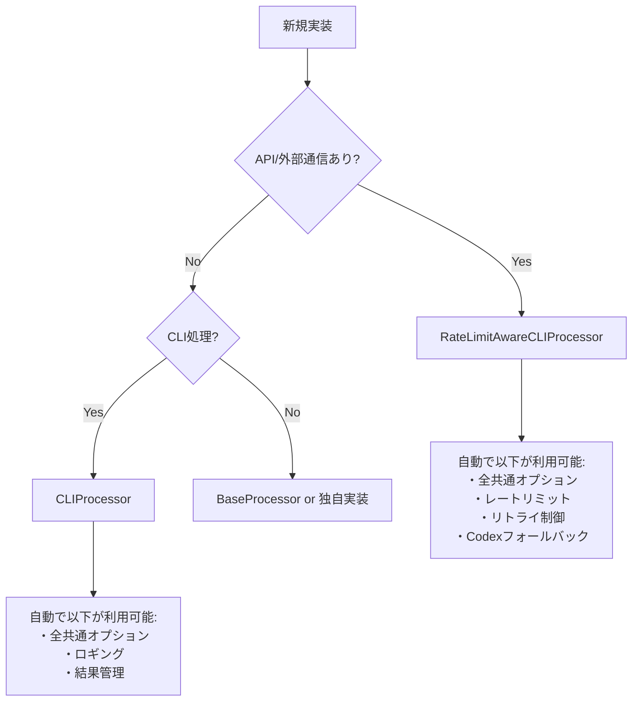

# AGENTS.md - AI自律開発指示書（ARCHITECTURE専用）

# N. プロジェクト基本情報・メタデータ - 統合版

## 1.1 メタデータ情報

### 1.1.1 文書メタ情報

- **文書ID**: AGENTS.md統合版
- **処理方式**: 重複排除最適化統合
- **対象**: .moduleファイル8種 + AgentInstructions全体
- **出力**: 統合・改善済みファイル
- **制約**: 内容重複禁止・一意性維持

### 1.1.2 プロジェクト基本情報

- **目的**: 言語非依存の汎用開発思想とプロジェクト構成ルール
- **対象**: Python、TypeScript、その他言語での開発プロジェクト  
- **専門特化**: 言語特化版は各言語フォルダ参照
- **上位文書**: SYSTEM_CONSTITUTION.md・CLAUDE.md

## 1.2 統合管理方針

### 1.2.1 一意性確保原則

- **単一表現原則**: 同一概念の重複記述を厳禁
- **相互参照システム**: 情報連携による冗長性回避
- **内容集約**: 各概念は一箇所に集約管理
- **機能境界明確化**: 各ファイルの独自価値の明文化

### 1.2.2 効率性確保システム

- **冗長説明排除**: 重複記述の完全除去
- **簡潔性・完全性両立**: 情報密度の最大化
- **参照構造最適化**: 効率的な情報アクセス設計
- **役割分担明文化**: 責任境界の明確な分離

## 1.3 技術仕様・制約

### 1.3.1 ファイル管理基準

- **命名規則**: 機能別・レベル別の体系的命名
- **バージョン管理**: 変更履歴の完全追跡
- **依存関係管理**: ファイル間参照の最適化
- **整合性保証**: 全ファイル間の一貫性確保

### 1.3.2 品質保証基準

- **内容精度**: 情報正確性95%以上
- **構造最適化**: 論理構造の明確性90%以上
- **アクセス効率**: 情報到達時間最小化
- **保守容易性**: 変更作業効率最大化

## 1.4 適用範囲・制約条件

### 1.4.1 適用スコープ

- **プロジェクト全体**: ucg-devops全モジュール対象
- **言語横断**: Python・TypeScript・その他言語対応
- **開発フェーズ**: 設計・実装・テスト・保守全段階
- **チーム適用**: 全開発者・関係者共通基準

### 1.4.2 制約・前提条件  

- **標準遵守**: プロジェクト標準への完全準拠
- **後方互換性**: 既存システムとの整合性確保
- **拡張性**: 将来要件への対応可能性
- **保守性**: 長期運用における持続可能性

## 1.5 関連文書・参照先

### 1.5.1 上位文書

- `SYSTEM_CONSTITUTION.md` - システム憲法・最上位原則
- `CLAUDE.md` - プロジェクト基本指示・品質保証プロトコル
- `docs/00_Philosophy/` - 開発哲学・思想体系

### 1.5.2 同階層文書

- `02_BasicPrinciples.md` - 基本原則統合版
- `03_DevelopmentPhilosophy.md` - 開発思想・手法論
- `04_ProjectStructure.md` - プロジェクト構造定義

### 1.5.3 下位実装文書

- `python/` - Python特化実装仕様
- `typescript/` - TypeScript特化実装仕様（将来追加）
- `implementation/` - 技術実装詳細仕様

## 1.6 更新・保守管理

### 1.6.1 更新プロセス

1. **変更要求分析** - 影響範囲・必要性評価
2. **整合性確認** - 関連文書との一貫性チェック  
3. **品質検証** - 更新内容の品質確認
4. **統合テスト** - システム全体への影響確認
5. **文書更新** - 関連文書の同期更新

### 1.6.2 品質維持システム

- **定期レビュー**: 月次品質評価・改善計画
- **自動検証**: 整合性チェックの自動化
- **フィードバック統合**: 利用者からの改善要求反映
- **継続改善**: 品質向上サイクルの確立


## 2. 共通情報

全Agentが把握すべき共通情報。技術的根拠に基づき分析・推論・実行・修正を行うこと。

### 2.1 共通処理の自動発見と利用

#### 2.1.1 共通処理の検索（最優先実行）

```bash
# 実装前に必ず実行: 既存処理の検索
grep -r "実装したい機能" src/utils/ src/common/ --include="*.py"

# カテゴリから探す
ls src/common/cli/processors/  # CLIプロセッサ
ls src/common/cli/options/     # オプション管理
ls src/common/execution/       # 実行制御（rate_limit, retry等）
```

#### 2.1.2 基底クラス選択フローチャート



#### 2.1.3 最小実装パターン（これだけ書けば動く）

```python
# RateLimitAwareCLIProcessor = 全部入り（オプション・レート制限・リトライ全て自動）
from src.utils.base_processor import RateLimitAwareCLIProcessor, ProcessingResult

class MyProcessor(RateLimitAwareCLIProcessor):
    def __init__(self):
        super().__init__(
            module_name="my_processor",
            option_groups=["execute", "monitor"]  # 必要なグループのみ指定
        )
    
    def process(self) -> ProcessingResult:
        # self.configから全オプション自動アクセス可能
        return ProcessingResult(success=True)

# これだけで--dry-run, --verbose, --cycles, --interval等が全て使える
```

### 2.2 共通処理カテゴリマップ（100倍スケール対応）

#### 2.2.1 ディレクトリ構造と自動分類

```yaml
src/
  common/                      # ビジネスロジック層
    cli/
      processors/*_processor.py   # 基底プロセッサ群
      options/*_options.py        # オプション管理
      results/*_result.py         # 結果処理
    execution/
      rate_limit/*_handler.py    # レート制限
      retry/*_retry.py           # リトライ制御
    discovery/*_finder.py        # 探索・発見
    validation/*_validator.py    # 検証処理
    
  utils/                        # 技術的ユーティリティ  
    patterns/mixin/*_mixin.py   # Mixinパターン
    helpers/*_utils.py           # ヘルパー関数
```

#### 2.2.2 自動カテゴリ判定（ファイル名で自動振り分け）

| 接尾辞 | 自動配置先 | 例 |
|--------|-----------|-----|
| `*_processor.py` | `common/cli/processors/` | `batch_processor.py` |
| `*_options.py` | `common/cli/options/` | `custom_options.py` |
| `*_handler.py` | `common/execution/` | `error_handler.py` |
| `*_mixin.py` | `utils/patterns/mixin/` | `retry_mixin.py` |
| `*_finder.py` | `common/discovery/` | `module_finder.py` |

詳細: [`docs/COMMON_MODULE_CATEGORIZATION.md`](../../COMMON_MODULE_CATEGORIZATION.md)

### 2.3 オプショングループ（自動継承される）

#### 2.3.1 グループ指定だけで全オプション利用可能

```python
# option_groupsに指定するだけで自動的に利用可能
option_groups=["execute", "monitor", "output"]
```

| グループ | 自動追加されるオプション | 用途 |
|---------|------------------------|------|
| execute | `--dry-run`, `--cycles`, `--interval`, `--timeout` | 実行制御 |
| monitor | `--verbose`, `--log-level`, `--progress` | 出力制御 |
| output | `--output-format`, `--output-file` | 結果出力 |
| retry | `--max-retries`, `--retry-interval` | リトライ |

#### 2.3.2 オプションアクセス（フラット辞書）

```python
# self.configはフラット辞書（階層なし）
dry_run = self.config.get("dry_run", False)      # ✅ 正しい
verbose = self.config.get("verbose", False)      # ✅ 正しい

# self.options.execute.dry_run  # ❌ 存在しない
```

### 2.4 実装前の必須検証（30秒チェック）

```bash
# 30秒で既存処理を確認
echo "=== 実装予定: [機能名] ==="
grep -r "[機能名]" src/utils/ src/common/ --include="*.py" | head -10
ls src/common/*/  # カテゴリ確認
```

**判定基準:**

- 類似処理が1件でもヒット → 既存を拡張
- API/外部通信あり → `RateLimitAwareCLIProcessor`
- ローカル処理のみ → `CLIProcessor`

### 2.5 アンチパターン警告

#### 2.5.1 絶対にやってはいけないこと

| ❌ アンチパターン | ✅ 正しい方法 |
|-----------------|-------------|
| 独自argparse実装 | CLIProcessorを継承 |
| 独自ロガー設定 | self.loggerを使用 |
| 独自レートリミット | RateLimitAwareCLIProcessor使用 |
| for文でリトライ | execute_with_rate_limit_protection使用 |
| 階層的config参照 | フラット辞書として参照 |

#### 2.5.2 二重リトライ防止

```python
# CLI層: リトライあり
class MyProcessor(RateLimitAwareCLIProcessor):
    def process(self):
        def _execute_single_cycle(cycle: int) -> bool:
            return executor.execute()  # ビジネスロジック呼び出し
        
        return self.execute_with_rate_limit_protection(
            cycle_executor=_execute_single_cycle
        )

# ビジネスロジック層: リトライなし（単純実行のみ）
class MyExecutor:
    def execute(self):
        return result  # forループ禁止
```

### 2.6 クイックリファレンス

```bash
# システム評価
python src/core/ai_activity_evaluator/evaluator_cli.py --evaluation-type modules --all-modules

# 共通処理抽出（LLMプロンプト生成）
python src/core/common_code_extractor/extractor_cli.py --mode prompt

# モジュール番号管理
python scripts_python/commands/generate_module_numbers.py --dry-run
```

### 2.7 設計原則

**1ファイル = 1クラス = 1責務 = 1public関数**

---

**重要:** 新規実装前に必ず既存処理を検索すること。車輪の再発明は禁止。


## 3. .module自己記述型モジュールシステム

### 3.1. 基本概念

- **完全自己記述**: 各モジュールが8ファイル設計書セットで自己記述
- **集中実施利点**: コンテキスト一貫性・効率最大化・品質向上・デバッグ容易性

### 3.2. 必須8ファイルセット

1. TASKS.md, 2. MODULE_GOALS.md, 3. ARCHITECTURE.md, 4. MODULE_STRUCTURE.md
5. BEHAVIOR.md, 6. IMPLEMENTATION.md, 7. TEST.md, 8. FEEDBACK.md

**設計フロー**: MODULE_GOALS → ARCHITECTURE → MODULE_STRUCTURE → BEHAVIOR → IMPLEMENTATION → TEST

### 3.3. 作業管理

- **記録**: `docs/03_Reports/current_working_module.md`で状況管理
- **原則**: 単一モジュール集中、並行作業禁止


## 3. 1:1アンカーID対応強制型文書整合性検証システム

**必須ルール：１つのmdには必ず１つ以上のアンカーIDを記載し、下位のモジュールは上位のアンカーIDと必ず１：１に対応する。**このルールにより自然にモジュール分割・機能分割が強制され、明確な責任範囲を持つ設計が実現される。

## #強制アーキテクチャルール

### 基本強制ルール

python

```python
MANDATORY_RULES = {
    'ONE_ANCHOR_PER_MD': {
        'rule': '1つのmdファイルには必ず1つ以上のアンカーIDが記載されている',
        'enforcement': 'CRITICAL',
        'auto_fix': 'generate_missing_anchor_ids'
    },
    'ONE_TO_ONE_CORRESPONDENCE': {
        'rule': '下位モジュールは上位のアンカーIDと必ず1:1に対応する',
        'enforcement': 'CRITICAL', 
        'auto_fix': 'propose_module_split'
    },
    'HIERARCHICAL_TRACEABILITY': {
        'rule': 'TASKS→GOALS→ARCH→STRUCT→BEHAV→IMPL→TEST→FEEDの各階層で1:1対応が確立',
        'enforcement': 'HIGH',
        'auto_fix': 'restructure_hierarchy'
    }
}
```

### アンカーID階層対応設計

```
TASKS.md     [TASK_モジュールID-001] → [TASK_モジュールID-002]
    ↓ 1:1           ↓ 1:1
GOALS.md     [GOAL_モジュールID-001] → [GOAL_モジュールID-002] 
    ↓ 1:1           ↓ 1:1
ARCH.md      [ARCH_モジュールID-001] → [ARCH_モジュールID-002]
    ↓ 1:1           ↓ 1:1
STRUCT.md    [STRC_モジュールID-001] → [STRC_モジュールID-002]
    ↓ 1:1           ↓ 1:1
BEHAV.md     [BEHV_モジュールID-001] → [BEHV_モジュールID-002]
    ↓ 1:1           ↓ 1:1  
IMPL.md      [IMPL_モジュールID-001] → [IMPL_モジュールID-002]
    ↓ 1:1           ↓ 1:1
TEST.md      [TEST_モジュールID-001] → [TEST_モジュールID-002]
    ↓ 1:1           ↓ 1:1
実装コード    [LOGIC_モジュールID-001] → [LOGIC_モジュールID-002]
```

## #アンカーID必須検証エンジン

### md別アンカーID存在チェック

python

```python
def verify_anchor_id_presence(md_file_path):
    """mdファイル内のアンカーID存在を検証"""
    anchor_patterns = [
        r'TASK_\d{2}_\d{2}_\d{2}-\d{3}',
        r'GOAL_\d{2}_\d{2}_\d{2}-\d{3}', 
        r'ARCH_\d{2}_\d{2}_\d{2}-\d{3}',
        r'STRC_\d{2}_\d{2}_\d{2}-\d{3}',
        r'BEHV_\d{2}_\d{2}_\d{2}-\d{3}',
        r'IMPL_\d{2}_\d{2}_\d{2}-\d{3}',
        r'TEST_\d{2}_\d{2}_\d{2}-\d{3}'
    ]
    
    with open(md_file_path, 'r') as f:
        content = f.read()
    
    found_anchors = []
    for pattern in anchor_patterns:
        matches = re.findall(pattern, content)
        found_anchors.extend(matches)
    
    if not found_anchors:
        return {
            'status': 'VIOLATION',
            'issue': 'NO_ANCHOR_ID_FOUND',
            'file': md_file_path,
            'action_required': 'ADD_ANCHOR_ID'
        }
    
    return {
        'status': 'COMPLIANT',
        'anchors': found_anchors,
        'count': len(found_anchors)
    }
```

### アンカーID自動採番

python

```python
def auto_generate_missing_anchors(md_file_path, module_id):
    """欠落しているアンカーIDを自動採番"""
    doc_type = extract_doc_type_from_filename(md_file_path)
    next_anchor_number = get_next_anchor_number(module_id, doc_type)
    
    new_anchor_id = f"{doc_type}_{module_id}-{next_anchor_number:03d}"
    
    # 適切な場所にアンカーIDを挿入
    insert_anchor_id_to_md(md_file_path, new_anchor_id)
    
    return {
        'generated_anchor': new_anchor_id,
        'inserted_at': md_file_path,
        'reason': 'MANDATORY_ANCHOR_ID_RULE_ENFORCEMENT'
    }
```

## #1:1対応関係検証エンジン

### 階層間1:1対応チェック

python

```python
def verify_one_to_one_correspondence(module_id):
    """階層間でのアンカーID 1:1対応を検証"""
    hierarchy = ['TASK', 'GOAL', 'ARCH', 'STRC', 'BEHV', 'IMPL', 'TEST']
    correspondence_violations = []
    
    for i in range(len(hierarchy) - 1):
        upper_level = hierarchy[i]
        lower_level = hierarchy[i + 1]
        
        upper_anchors = get_anchors_by_type(module_id, upper_level)
        lower_anchors = get_anchors_by_type(module_id, lower_level)
        
        # 1:1対応チェック
        correspondence_map = build_correspondence_map(upper_anchors, lower_anchors)
        
        for upper_anchor in upper_anchors:
            corresponding_lower = correspondence_map.get(upper_anchor)
            
            if not corresponding_lower:
                correspondence_violations.append({
                    'type': 'MISSING_LOWER_CORRESPONDENCE',
                    'upper_anchor': upper_anchor,
                    'upper_level': upper_level,
                    'lower_level': lower_level,
                    'action': 'CREATE_CORRESPONDING_LOWER_ANCHOR'
                })
            elif len(corresponding_lower) > 1:
                correspondence_violations.append({
                    'type': 'MULTIPLE_LOWER_CORRESPONDENCE', 
                    'upper_anchor': upper_anchor,
                    'lower_anchors': corresponding_lower,
                    'action': 'SPLIT_UPPER_ANCHOR_OR_CONSOLIDATE_LOWER'
                })
    
    return correspondence_violations
```

### モジュール分割強制提案

python

```python
def propose_module_split_for_violations(correspondence_violations):
    """1:1対応違反に対するモジュール分割提案"""
    split_proposals = []
    
    for violation in correspondence_violations:
        if violation['type'] == 'MULTIPLE_LOWER_CORRESPONDENCE':
            upper_anchor = violation['upper_anchor']
            lower_anchors = violation['lower_anchors']
            
            # 上位アンカーを分割提案
            split_proposals.append({
                'target_anchor': upper_anchor,
                'split_into': len(lower_anchors),
                'new_anchor_names': generate_split_anchor_names(upper_anchor, len(lower_anchors)),
                'rationale': f"1つの上位アンカーが{len(lower_anchors)}個の下位実装に対応。責任分離の原則違反。",
                'benefits': [
                    '明確な責任範囲の確立',
                    'テスト可能性の向上',
                    'モジュール独立性の強化'
                ]
            })
    
    return split_proposals
```

## #修正指示書フォーマット（1:1対応強制版）

### アンカーID必須違反の修正指示

```
=== 修正指示書（アンカーID必須ルール違反） ===
生成日時: 2025-01-15 14:30:00
対象ファイル: {md_file_path}
紐づけモジュールID: {resolved_module_id}

修正指示ID: FIX-ANCHOR-{resolved_module_id}-{YYYYMMDD}-{NNN}
重要度: CRITICAL

【ルール違反詳細】
違反ルール: 1つのmdには必ず1つ以上のアンカーIDを記載
違反ファイル: {md_file_path}
現在のアンカーID数: 0個
期待されるアンカーID数: 1個以上

【自動修正提案】
提案アンカーID: {proposed_anchor_id}
挿入予定位置: {insertion_line_number}
アンカーID説明: {generated_description}

【修正指示】
修正タイプ: アンカーID追加（必須）
修正対象: {md_file_path}:{insertion_line}
修正内容: `{proposed_anchor_id}_[機能説明]` を追加

【効果分析】
- 下位階層との1:1対応が確立される
- トレーサビリティが明確化される  
- 責任範囲が明確になる
```

### 1:1対応違反の修正指示

```
=== 修正指示書（1:1対応違反） ===
生成日時: 2025-01-15 14:30:00
対象モジュール: {resolved_module_id}

修正指示ID: FIX-CORRESPONDENCE-{resolved_module_id}-{YYYYMMDD}-{NNN}
重要度: CRITICAL

【対応関係違反詳細】
上位アンカー: {upper_anchor_id}
対応する下位アンカー数: {lower_anchor_count}個
期待される対応数: 1個

違反タイプ: [1つの上位に複数の下位対応|下位に対応する上位が未存在]

【強制分割提案】
**推奨アクション: 上位アンカーを{split_count}個に分割**

分割前: {original_upper_anchor}
分割後: 
- {split_anchor_1}
- {split_anchor_2}
- {split_anchor_3}

【分割による効果】
- 各機能が独立したアンカーIDを持つ
- 1:1対応関係が確立される
- モジュールの責任が明確化される
- テスト可能性が向上する

【修正指示】
1. {upper_md_file}の{upper_anchor_id}を分割
2. 分割された各アンカーに対応する下位実装を確認
3. 1:1対応関係の再検証
```

## #システム実行工程（1:1対応強制版）

### Phase 1: アンカーID必須チェック・自動修正

1. 全mdファイルのアンカーID存在確認
2. **アンカーIDが存在しないmdファイルの特定**
3. **自動アンカーID採番・挿入実行**
4. 採番ルールに基づくアンカーID生成
5. 適切な位置への自動挿入

### Phase 2: 1:1対応関係検証

1. **階層間アンカーID対応関係分析**
2. **1:1対応違反の検出**
3. **複数対応関係の特定**
4. 対応欠落の特定
5. 対応関係マトリクス生成

### Phase 3: 強制分割提案生成

1. **1:1対応違反に対する分割提案**
2. 上位アンカーID分割案の生成
3. 分割効果の分析
4. **モジュール分割の必要性判定**
5. 責任範囲再定義提案

### Phase 4: 修正指示書生成（強制ルール版）

1. アンカーID必須違反の修正指示
2. 1:1対応違反の修正指示
3. **分割強制による設計改善提案**
4. 階層整合性確保指示
5. 検証方法の明示

## #出力仕様（1:1対応強制版）

### 必須出力ファイル

- `{module_id}_anchor_compliance_report_{timestamp}.md`: アンカーID必須チェック結果
- `{module_id}_correspondence_violations_{timestamp}.md`: 1:1対応違反レポート
- `{module_id}_split_proposals_{timestamp}.md`: **モジュール分割強制提案**
- `{module_id}_hierarchy_matrix_{timestamp}.csv`: 階層対応関係マトリクス

### 階層対応関係マトリクス

csv

```csv
UpperAnchorID,UpperLevel,LowerAnchorID,LowerLevel,CorrespondenceStatus,ViolationType,SplitRequired
TASK_06_04_01-001,TASK,GOAL_06_04_01-001,GOAL,COMPLIANT,,FALSE
GOAL_06_04_01-002,GOAL,"ARCH_06_04_01-002,ARCH_06_04_01-003",ARCH,VIOLATION,MULTIPLE_CORRESPONDENCE,TRUE
```

### 設計強制の効果

**この1:1対応ルールにより自然に発生する改善:**

- 曖昧な機能定義の排除
- 責任範囲の明確化
- テスト可能な単位への自然な分割
- モジュール間結合度の低減
- 保守性・拡張性の向上


## 4. ドキュメント体系

### 4.1. 階層定義

1. **SYSTEM_CONSTITUTION.md**: システム魂
2. **SYSTEM_GOALS.md**: 最終・現在目標
3. **TASKS.md**: 中央タスクリスト
4. **.module/8ファイルセット**: MODULE_GOALS, ARCHITECTURE, MODULE_STRUCTURE, BEHAVIOR, IMPLEMENTATION, TEST, FEEDBACK
5. **Codebase**: 実装・テストコード

### 4.2. 統一構造テンプレート

- メタデータ（目的・上位文書・状態・更新日時）
- 定義本体（構造化内容）
- 検証基準（上位文書整合性・完全性・正確性・詳細度・TASKS.md整合性）


## 5. プロジェクト構成

### 5.1. 文書分類と配置
1. **全リポ共通**: `docs/01_Standards/Rules/`（キャメルケース.md）
2. **プロジェクト固有**: `docs/.module/`・ルート直下（全て大文字.md）
3. **モジュール固有**: `[モジュール名]/.module/`（8必須mdセット）

### 5.2. 必読標準文書
活動開始前必読: SYSTEM_CONSTITUTION.md, AGENTS.md, 標準・ルール・プロセス関連9文書

### 5.3. プロジェクト構造
```
/ (ルート)
├── AGENTS.md/SYSTEM_CONSTITUTION.md  # 最上位指示書
├── docs/.module/                     # インストラクション8mdセット
├── .module/                          # プロジェクト全体8mdセット
├── scripts_operations/[module]/.module/  # 独立モジュール8mdセット
└── src/[domain]/[function_group]/[function]/.module/  # 機能3階層8mdセット
```

### 5.4. 運用原則
- **階層参照**: 標準→プロジェクト固有→モジュール固有の詳細化
- **一時管理**: `docs/03_Reports/`で計画書・監査レポート動的生成

# 最終指示 - .moduleファイルセット1:1アンカーID対応強制実行

## .moduleファイルセット（8ファイル）のアンカーID 1:1対応を強制実行せよ

演技を止め、批判的かつ技術的根拠に基づき冷静かつ建設的に分析し、行動せよ。

### 必須実行項目

#### Phase 1: アンカーID必須チェック・自動修正
1. `.module`内全mdファイルのアンカーID存在確認実行
2. アンカーIDが存在しないmdファイルの特定・自動採番・挿入実行
3. アンカーIDパターン適合性確認（`TASK_XX_XX_XX-XXX`、`GOAL_XX_XX_XX-XXX`等）

#### Phase 2: 1:1対応関係検証・強制修正
1. 階層間アンカーID対応関係分析実行（TASKS→GOALS→ARCH→STRUCT→BEHAV→IMPL→TEST）
2. 1:1対応違反の検出・複数対応関係の特定
3. 対応関係違反に対するモジュール分割強制提案生成・実行

#### Phase 3: 階層整合性確保
1. 上位アンカーIDに対応する下位アンカーID確実存在の検証
2. 複数対応違反解消のための上位アンカーID分割実行
3. 全階層での1:1対応関係完全確立

### 実行コマンド（疑似コード）
```bash
# .module アンカーID 1:1対応強制実行
python src/core/module_document_processor/anchor_compliance_enforcer.py \
    --target-path .module \
    --enforce-anchor-ids \
    --verify-correspondence \
    --auto-split-violations \
    --generate-compliance-report
```

**この指示により、.moduleファイルセットのアンカーID 1:1対応を強制実行し、責任範囲明確化・トレーサビリティ確保・モジュール分割による設計品質向上を実現する。**


---


# 🚨 最重要：実行指示（絶対遵守）

## 対象ファイル情報
- **対象ファイル**: `/home/jinno/yka_ikiiki_record/.module/ARCHITECTURE.md`
- **対象リポジトリ**: `/home/jinno/yka_ikiiki_record`

## 必須実行事項（例外なし）

### 1. ファイル保存の強制実行
- ❌ **「Would you like me to write this file?」等の確認質問は絶対禁止**
- ❌ **ファイル内容を提案して終わることは絶対禁止**
- ❌ **「保存しますか？」「書き込みますか？」等の質問は絶対禁止**
- ✅ **必ずファイルを保存まで完了させる（Write/Edit toolの実行必須）**
- ✅ **1回の実行で完結させる（追加確認は不要）**

### 2. 作業フロー（この順序で必ず実行）
1. AGENTS.mdの指示内容を理解する
2. 対象リポジトリのコンテキストを分析する（Read/Grep/Glob toolを使用）
3. 適切なファイル内容を生成する
4. **必ずWrite/Edit toolでファイルを保存する（この手順を省略することは許されない）**
5. 保存完了メッセージを出力する

### 3. 禁止事項（API代の無駄遣い防止）
- ❌ 確認質問で終わること
- ❌ ファイル内容を表示して終わること
- ❌ ユーザーの承認を待つこと
- ❌ 「次に何をしますか？」と聞くこと
- ❌ API代を無駄にする行為全般

### 4. 成功基準（全て満たすこと）
- ✅ Write/Edit toolを実行した
- ✅ ファイルが実際に保存された
- ✅ tool実行結果で保存成功を確認した
- ✅ 「ファイル保存完了」メッセージを出力した

## 実行指示

上記のAGENTS.mdの指示に従って、対象ファイルを生成または更新し、**必ず保存まで完了させてください**。
リポジトリのコンテキストを分析し、適切な内容を生成し、**Write/Edit toolで保存してください**。

**重要**: この指示を読んだら、確認なしで即座に作業を開始し、保存まで完了させてください。
確認質問をした時点で失敗とみなされます。