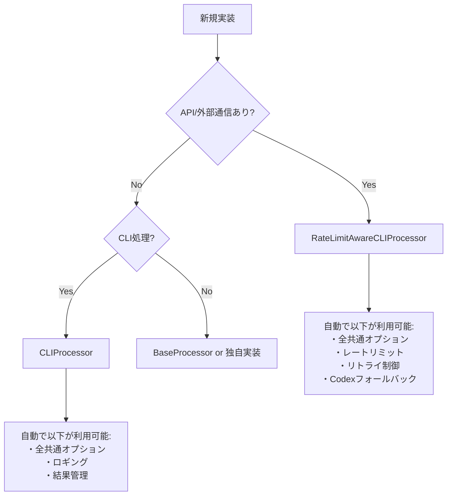

# AGENTS.md - AI自律開発指示書（FEEDBACK専用）

# エラー予防プロトコル - SDEC×2SCV×ACR統合版

## 1. SDEC×2SCV×ACR コアロジック

### 1.1 SDEC（Spec-Data-Eval-Change）サイクル

**すべての作業はこのループで実行する**

```txt
1. Spec（仕様理解）: 要求を原子的な主張（Claims）に分解
2. Data（証拠収集）: 各主張を裏付ける証拠を能動的に取得
3. Eval（双方向検証）: 2SCVで証拠と主張を相互検証
4. Change（変更実施）: 検証済みの変更のみ実行
```

### 1.2 2SCV（双方向コーパス検証）

**E→S（証拠から仕様）とS→E（仕様から証拠）の両方向で検証**

- 証拠が主張を支持するか
- 主張に対応する証拠が存在するか
- 矛盾する証拠がないか

### 1.3 ACR（自律的コンテキスト再構築）

**不足情報は質問せず、証拠に基づく仮説で補完**

- 既存コードから推測
- 使用パターンから推論
- 共通処理から類推

## 2. 実践指示（すべてSDEC×2SCV×ACRに従って実行）

### 2.1 コード修正時の必須プロセス

**SDEC×2SCV×ACRに従って検討して、以下を実行：**

1. **Spec**: 修正要求を具体的な主張に分解
   - 「AutonomousImprovementSystemを分割」→「各メソッドの責務を特定」

2. **Data**: 証拠を収集

   ```bash
   grep -r "AutonomousImprovementSystem" .  # 使用箇所
   grep -r "BaseProcessor" .  # 共通処理の存在
   ```

3. **Eval**: 2SCVで検証
   - 使用箇所の証拠は分割案を支持するか？
   - 共通処理の存在は車輪の再発明を否定するか？

4. **Change**: 検証済みの変更のみ実行

### 2.2 クラス分割の判断基準

**SDEC×2SCV×ACRに従って検討して、以下を判断：**

- **Spec**: クラスが論理的に単一機能か？
- **Data**: メソッド一覧と責務を証拠として収集
- **Eval**: 複数の独立した責務の証拠があるか？
- **Change**: 証拠がある場合のみ分割実行

**論理的な機能が1つでない証拠があれば即分割**（行数は無関係）

### 2.3 共通処理の活用（実装前の必須検証）

**SDEC×2SCV×ACRに従って検討して、共通処理を活用：**

1. **Spec**: 実装しようとしている機能を明確化
   - 機能名、入力、出力、処理内容を言語化

2. **Data**: 既存の共通処理を調査（必須コマンド実行）

   ```bash
   # 必ず実行してログに残すこと
   echo "=== 実装前検証: [機能名] ==="
   
   # 類似機能の検索
   grep -r "機能キーワード" src/utils/ src/common/ --include="*.py"
   
   # 既存プロセッサの確認
   grep -r "class.*Processor" src/ --include="*.py" | grep -E "キーワード"
   
   # 実行可能スクリプトの確認
   find scripts_python* -name "*.py" | xargs grep -l "キーワード"
   
   # 共通処理の一覧
   ls -la src/utils/*.py src/common/*.py | grep -v __pycache__
   ```

3. **Eval**: 既存処理で代替可能か検証
   - 検索結果が1件でもあれば、その処理を必ず確認
   - 類似度が50%以上なら拡張を検討
   - 完全に新規の場合のみ新規実装を許可

4. **Change**: 検証結果に基づいて実装
   - 既存処理がある → 必ず再利用または拡張
   - 既存処理がない → 検証ログをコメントに記載して新規実装
   - 基底クラス（CLIProcessor/RateLimitAwareCLIProcessor）を必ず使用

### 2.4 レイヤー分離の実施

**SDEC×2SCV×ACRに従って検討して、レイヤーを分離：**

- **Spec**: CLI層とビジネスロジック層の責務を定義
- **Data**: 現在の実装がどのレイヤーに属するか証拠収集
- **Eval**: 混在している証拠があるか検証
- **Change**: 混在の証拠があれば分離

### 2.5 エラー発生時の対処

**SDEC×2SCV×ACRに従って検討して、エラーを解決：**

1. **Spec**: エラーの本質的な原因を主張として定義
2. **Data**: スタックトレース、関連コード、使用例を収集
3. **Eval**: 収集した証拠が原因仮説を支持するか検証
4. **Change**: 検証済みの修正のみ適用

## 3. 重要な行動原則

### 3.1 証拠なしに行動しない

**すべての判断にSDEC×2SCV×ACRを適用：**

- 推測や憶測での実装禁止
- grep/ls/findで証拠を収集してから行動
- 証拠が矛盾する場合は追加調査

### 3.2 ACRによる自律的補完

**不明な情報はSDEC×2SCV×ACRで補完：**

- ユーザーに質問する前に既存コードから推論
- 類似パターンから仮説を立てる
- 仮説も証拠で検証してから使用

### 3.3 継続的な検証

**作業中もSDEC×2SCV×ACRを繰り返し適用：**

- 変更の影響を継続的に検証
- 新たな証拠が見つかったら再評価
- 矛盾が発生したら即座に停止・再検討

## 4. チェックリスト

**各項目をSDEC×2SCV×ACRで確認：**

- [ ] **Spec**: 要求を明確な主張に分解したか？
- [ ] **Data**: 十分な証拠を収集したか？
- [ ] **Eval**: 2SCVで双方向検証したか？
- [ ] **Change**: 検証済みの変更のみ実行したか？
- [ ] **ACR**: 不足情報を証拠ベースで補完したか？

## まとめ

**すべての行動をSDEC×2SCV×ACRフレームワークで実行する。**

証拠なしの推測禁止。検証なしの実装禁止。質問前の自律補完必須。


# N. プロジェクト基本情報・メタデータ - 統合版

## 2.1 メタデータ情報

### 2.1.1 文書メタ情報

- **文書ID**: AGENTS.md統合版
- **処理方式**: 重複排除最適化統合
- **対象**: .moduleファイル8種 + AgentInstructions全体
- **出力**: 統合・改善済みファイル
- **制約**: 内容重複禁止・一意性維持

### 2.1.2 プロジェクト基本情報

- **目的**: 言語非依存の汎用開発思想とプロジェクト構成ルール
- **対象**: Python、TypeScript、その他言語での開発プロジェクト  
- **専門特化**: 言語特化版は各言語フォルダ参照
- **上位文書**: SYSTEM_CONSTITUTION.md・CLAUDE.md

## 2.2 統合管理方針

### 2.2.1 一意性確保原則

- **単一表現原則**: 同一概念の重複記述を厳禁
- **相互参照システム**: 情報連携による冗長性回避
- **内容集約**: 各概念は一箇所に集約管理
- **機能境界明確化**: 各ファイルの独自価値の明文化

### 2.2.2 効率性確保システム

- **冗長説明排除**: 重複記述の完全除去
- **簡潔性・完全性両立**: 情報密度の最大化
- **参照構造最適化**: 効率的な情報アクセス設計
- **役割分担明文化**: 責任境界の明確な分離

## 2.3 技術仕様・制約

### 2.3.1 ファイル管理基準

- **命名規則**: 機能別・レベル別の体系的命名
- **バージョン管理**: 変更履歴の完全追跡
- **依存関係管理**: ファイル間参照の最適化
- **整合性保証**: 全ファイル間の一貫性確保

### 2.3.2 品質保証基準

- **内容精度**: 情報正確性95%以上
- **構造最適化**: 論理構造の明確性90%以上
- **アクセス効率**: 情報到達時間最小化
- **保守容易性**: 変更作業効率最大化

## 2.4 適用範囲・制約条件

### 2.4.1 適用スコープ

- **プロジェクト全体**: ucg-devops全モジュール対象
- **言語横断**: Python・TypeScript・その他言語対応
- **開発フェーズ**: 設計・実装・テスト・保守全段階
- **チーム適用**: 全開発者・関係者共通基準

### 2.4.2 制約・前提条件  

- **標準遵守**: プロジェクト標準への完全準拠
- **後方互換性**: 既存システムとの整合性確保
- **拡張性**: 将来要件への対応可能性
- **保守性**: 長期運用における持続可能性

## 2.5 関連文書・参照先

### 2.5.1 上位文書

- `SYSTEM_CONSTITUTION.md` - システム憲法・最上位原則
- `CLAUDE.md` - プロジェクト基本指示・品質保証プロトコル
- `docs/00_Philosophy/` - 開発哲学・思想体系

### 2.5.2 同階層文書

- `02_BasicPrinciples.md` - 基本原則統合版
- `03_DevelopmentPhilosophy.md` - 開発思想・手法論
- `04_ProjectStructure.md` - プロジェクト構造定義

### 2.5.3 下位実装文書

- `python/` - Python特化実装仕様
- `typescript/` - TypeScript特化実装仕様（将来追加）
- `implementation/` - 技術実装詳細仕様

## 2.6 更新・保守管理

### 2.6.1 更新プロセス

1. **変更要求分析** - 影響範囲・必要性評価
2. **整合性確認** - 関連文書との一貫性チェック  
3. **品質検証** - 更新内容の品質確認
4. **統合テスト** - システム全体への影響確認
5. **文書更新** - 関連文書の同期更新

### 2.6.2 品質維持システム

- **定期レビュー**: 月次品質評価・改善計画
- **自動検証**: 整合性チェックの自動化
- **フィードバック統合**: 利用者からの改善要求反映
- **継続改善**: 品質向上サイクルの確立


# 基本原則 - 実装強制版

## 0. 最重要：絶対遵守事項（違反は即刻修正）

### 🚨 ファイル生成の絶対原則

- ❌ **日付付きファイル名の生成を完全禁止**

  ```python
  # ❌ 絶対禁止
  filename = f"report_{datetime.now().strftime('%Y%m%d_%H%M%S')}.md"

  # ✅ 必須形式（固定パス、上書き）
  filename = "report.md"
  ```

- ❌ **レポート・ログ・指示書の複数バージョン作成禁止**
- ✅ **固定パスで上書きが絶対原則**

### 🚨 logging使用の絶対原則

- ❌ **`logging.getLogger()`の使用を完全禁止**

  ```python
  # ❌ 絶対禁止（重複ハンドラ・競合の原因）
  self.logger = logging.getLogger(__name__)

  # ✅ 必須形式
  self.logger = logging.Logger(self.module_name)
  ```

### 🚨 共通処理活用の絶対原則

- ❌ **独自実装前の既存処理確認を怠るのは禁止**
- ✅ **実装前に必ず実行せよ**：

  ```bash
  grep -r "実装予定の機能" src/utils/ src/common/ --include="*.py"
  ```

- ✅ **活用率95%以上を維持せよ**

### 🚨 オプションパラメータの参照ベース設計（deepcopy禁止）

**複数レイヤーを経由するオプションオブジェクト（UniversalExecutionOptionsなど）では、deepcopy()は絶対禁止**

- ❌ **deepcopy()でオプションをコピー - 変更が全レイヤーに伝播しない**
  - 各レイヤーが独立したコピーを持つと、上位層の変更が下位層に見えない
  - 参照ベース設計が崩れ、パラメータ伝播が失敗する

- ✅ **参照ベース設計 - オプションは全レイヤーで共有**
  - 複数レイヤーを経由するオプション → 必ず参照で渡す
  - レイヤー間での値設定 → instruction_data辞書を使用
  - オプション値の変更 → 全レイヤーで自動的に見える

**実装チェックリスト：**
- ❌ deepcopy(options) は禁止
- ❌ copy.deepcopy(options) は禁止
- ❌ オプションのコピー作成は禁止
- ✅ processor = ChildProcessor(options) で参照を渡す
- ✅ options.field = value で値を直接変更
- ✅ instruction_dataで層間通信を行う

**コード審査での指摘パターン：**
```python
# ❌ これを見つけたら必ず指摘（deepcopyパターン）
processor_options = deepcopy(options)
child_options = copy.deepcopy(parent_options)

# ✅ 正しいパターン（参照ベース）
processor = ChildProcessor(options)
options.targeting.target_file = "file.md"
```

## 1. 核心原則（全作業で強制適用）

### 1.1 実装前検証の義務化

**新規実装の前に以下を必ず実行せよ（例外なし）**

```bash
# 1. 既存処理の強制確認（30秒で実行）
echo "=== 実装予定: [機能名] ==="
grep -r "[機能キーワード]" src/utils/ src/common/ --include="*.py"
ls src/common/*/  # カテゴリ確認
```

**判定基準（厳格適用）：**

- 類似処理1件でもヒット → **既存を必ず拡張**
- API/外部通信あり → **RateLimitAwareCLIProcessor必須**
- ローカル処理のみ → **CLIProcessor必須**

### 1.2 品質検証の自動化

**実装後に以下を必ず実行せよ**

```bash
# logging.getLoggerの残存確認（0件必須）
grep -r "logging.getLogger" src/ --include="*.py" | wc -l

# 共通処理活用率確認（95%以上必須）
grep -r "CLIProcessor\|RateLimitAwareCLIProcessor" src/ --include="*.py" | wc -l

# 日付付きファイル確認（0件必須）
find . -name "*_20[0-9][0-9]*" -o -name "*_[0-9][0-9][0-9][0-9][0-9][0-9][0-9][0-9]*"
```

### 1.3 単一目標原則・効率性確保・重複排除原則

- **単一目標原則（P1）**: 1クラス1責務（300行超過は即分割）
- **効率性確保（P2）**: DRY原則（重複コード発見時は即統合）
- **重複排除原則（P3）**: 完了=検証済み（テスト・lint・実行確認全通過）

## 2. 技術実装強制基準

### 2.1 基底クラス使用義務

**CLI処理の場合（例外なし適用）**

```python
# 外部通信・API呼び出しありの場合
class MyProcessor(RateLimitAwareCLIProcessor):
    def __init__(self):
        super().__init__(
            module_name="my_processor",
            option_groups=["execute", "monitor"]
        )

# ローカル処理のみの場合
class MyProcessor(CLIProcessor):
    # 同様の実装
```

### 2.2 エラーハンドリング統一義務

```python
# 必須インポート
from src.utils.base_processor import ProcessingResult

# 必須戻り値形式
def process(self) -> ProcessingResult:
    return ProcessingResult(success=True, message="完了")
```

## 3. 禁止事項（違反は即修正）

### 3.1 実装パターン禁止

| ❌ 絶対禁止 | ✅ 強制使用 |
|------------|------------|
| `logging.getLogger(__name__)` | `logging.Logger(module_name)` |
| `filename_{timestamp}` | 固定ファイル名 |
| 独自argparse実装 | CLIProcessor継承 |
| 独自ループ（for/while） | execute_with_rate_limit_protection |
| 車輪の再発明 | 既存処理拡張 |
| `deepcopy(options)` | 参照ベース設計（reference passing） |

### 3.2 レポート作成禁止(日付NG、新規md種別NG: .moduleの8個のmdのみ許可)

- ❌ IMPROVEMENT_20241225.md
- ❌ FEEDBACK_2024-12-25.md
- ❌ REPORT.md
- ✅ IMPROVEMENT.md（固定、上書き）
- ✅ FEEDBACK.md（固定、上書き）

## 4. 完了基準（全条件必須）

### 4.1 必須検証項目

以下**全て**が条件を満たさない限り未完了：

- [ ] `grep -r "logging.getLogger" src/ | wc -l` = 0
- [ ] 共通処理活用率 ≥ 95%
- [ ] 日付付きファイル数 = 0
- [ ] 300行超えクラス数 = 0
- [ ] テスト通過率 = 100%
- [ ] 静的解析警告数 = 0

### 4.2 数値品質目標（下回ったら不合格）

- **機能性**: 要求仕様適合度 ≥ 95%
- **可読性**: コード理解性評価 ≥ 90%
- **保守性**: 変更容易性評価 ≥ 90%
- **共通処理活用**: 基底クラス使用率 ≥ 95%

## 5. 実行管理・監視

### 5.1 違反監視の自動化

**毎回実行せよ（自動化推奨）：**

```bash
#!/bin/bash
# quality_check.sh - 品質強制確認スクリプト

echo "🔍 品質違反チェック開始"

# logging.getLoggerチェック
violations=$(grep -r "logging.getLogger" src/ --include="*.py" | wc -l)
if [ $violations -gt 0 ]; then
    echo "❌ logging.getLogger違反: $violations 件"
    exit 1
fi

# 日付付きファイルチェック
date_files=$(find . -name "*_20[0-9][0-9]*" | wc -l)
if [ $date_files -gt 0 ]; then
    echo "❌ 日付付きファイル違反: $date_files 件"
    exit 1
fi

echo "✅ 品質チェック合格"
```

### 5.2 継続改善義務

- **毎週**: 品質指標の測定・改善
- **毎月**: アンチパターン撲滅進捗確認
- **リリース前**: 全品質基準100%遵守確認

## 6. エラー時の対応義務

### 6.1 発見時の即時対応

1. **違反発見** → 即座に修正（他作業停止）
2. **品質低下発見** → 原因分析・根本解決
3. **アンチパターン発見** → 全箇所一括修正

### 6.2 再発防止義務

- 同種違反の全件修正
- 自動チェックスクリプト作成
- 設計書・原則への反映

---

**重要**: この原則は「推奨」「検討」「できれば」ではない。**絶対遵守**である。
違反した実装は不合格とみなし、修正完了まで次の作業に移ってはならない。


## 4. 適応的開発モデル

トップダウンの設計原則とボトムアップのフィードバックループを融合した適応的開発を実行する。

### 4.1. システム構造

- **階層**: Philosophy → 標準 → プロセス → 実装
- **管理**: `TASKS.md`による中央タスク管理
- **モジュール**: `.module/`による8ファイル自己記述型構造

### 4.2. 自律的改善サイクル

**トリガー**: `TASKS.md`にタスクがない場合

**実行手順**:

1. `docs/DOCUMENT_EVALUATION_MATRIX.md`から最重要課題を特定
2. 改善タスクを定義し`TASKS.md`に記録
3. 指定活動フローを開始


# N. 統一アクティビティモデル - 統合版

## 5.1 活動定義

### 5.1.1 基本アクティビティ（RAIV）

**R**=Read→**A**=Analyze→**I**=Improve→**V**=Verify

- **R（Read）**: 対象特定+内容把握+課題抽出
- **A（Analyze）**: 問題分類+優先度設定+解決策検討
- **I（Improve）**: 変更実行+品質確保+一貫性維持
- **V（Verify）**: 動作確認+基準適合+完了判定

### 5.1.2 重複削除アクティビティ（拡張版）

- **READ**: 情報取得（説明済み概念の再記述禁止）
- **ANALYZE**: 分析実行（冗長な手順説明回避）  
- **IMPROVE**: 改善実行（既出の品質基準参照活用）
- **VERIFY**: 検証実行（重複チェック・一意性確認含む）

## 5.2 役割・責務定義

### 5.2.1 中央管理システム

- **TASKS.md**: 中央タスクリスト（全活動の起点・統括管理）
- **作業計画書**: 各活動の実行手順書（一時ファイル・プロセス管理）
- **統合文書**: 重複排除・一元化された成果物

### 5.2.2 品質管理体系

- **事前分析**: 構造・最適化機会の体系的特定
- **統合実行**: 追記ではなく統合による品質向上
- **品質保証**: 自動フォーマット・基準適合の確認

## 5.3 実行フェーズ・プロトコル

### 5.3.1 標準活動フェーズ

1. **監査と計画**: 上位文書基準による下位文書監査・実行計画作成
2. **実行**: 作業計画書に従った文書生成・更新・改善
3. **検証と監査**: 上位文書要求への適合性検証・必要修正

### 5.3.2 重複削除フェーズ（特化）

1. **重複パターン分析**: 既存内容との重複パターン特定
2. **統合・最適化**: 冗長表現削除・情報密度最大化
3. **一意性検証**: 各要素の独自価値・機能境界確認

## 5.4 ファイルアクセス・操作プロトコル

### 5.4.1 確実アクセス手順

`.gitignore`でファイル除外される場合の対応：

1. **glob**: パターン探索による初期検索
2. **LS**: 失敗時の物理ディレクトリリスト取得  
3. **手動フィルタ**: 除外ファイル推定・対象パス特定
4. **Read**: 確実な読み込み実行・内容確認

### 5.4.2 重要文書更新プロトコル

**適用対象**: システム中核・設計文書・品質管理文書

**実行原則**:

- **事前分析必須**: 構造理解・最適化機会特定
- **統合実行優先**: 追記より統合による品質向上
- **品質保証確実**: 自動フォーマット・基準適合確認

**絶対禁止**:

- ❌ 思考停止的末尾追記
- ❌ 分析なしでの変更実行
- ❌ 既存品質水準の低下

## 5.5 品質基準・制約条件

### 5.5.1 実行制約（重複削除特化）

- **前述原則完全適用**: 既定義原則の厳格遵守
- **説明簡潔性維持**: 冗長性排除・情報密度最大化
- **内容一意性確保**: 同一概念の単一表現徹底

### 5.5.2 品質評価基準

- **機能性**: 要求された活動の完全実行
- **効率性**: 最小労力での最大成果達成
- **一貫性**: 全活動での品質基準統一
- **保守性**: 将来変更・拡張への対応可能性

## 5.6 エラー処理・例外対応

### 5.6.1 アクセス失敗時対応

- **多段階リトライ**: glob→LS→手動特定の段階的実行
- **代替手法適用**: 一つの手法失敗時の自動切り替え
- **状況報告**: 失敗原因・対応手法の明確な記録

### 5.6.2 品質基準未達時対応

- **段階的改善**: 部分的改善の積み重ねによる品質向上
- **根本原因分析**: 品質問題の根本的原因特定・対策
- **予防策実装**: 同種問題の再発防止策確立

## 5.7 継続改善・最適化

### 5.7.1 活動パターン学習

- **成功パターン抽出**: 効果的活動パターンの体系化
- **自動化推進**: 定型的活動の自動化・効率化
- **品質向上サイクル**: 継続的な活動品質の向上

### 5.7.2 プロトコル進化

- **プロトコル評価**: 現行プロトコルの有効性評価
- **改善提案**: より効率的・効果的なプロトコル設計
- **段階的導入**: 新プロトコルの安全な導入・検証


## 6. 共通情報

全Agentが把握すべき共通情報。技術的根拠に基づき分析・推論・実行・修正を行うこと。

### 6.1 共通処理の自動発見と利用

#### 6.1.1 共通処理の検索（最優先実行）

```bash
# 実装前に必ず実行: 既存処理の検索
grep -r "実装したい機能" src/utils/ src/common/ --include="*.py"

# カテゴリから探す
ls src/common/cli/processors/  # CLIプロセッサ
ls src/common/cli/options/     # オプション管理
ls src/common/execution/       # 実行制御（rate_limit, retry等）
```

#### 6.1.2 基底クラス選択フローチャート



#### 6.1.3 最小実装パターン（これだけ書けば動く）

```python
# RateLimitAwareCLIProcessor = 全部入り（オプション・レート制限・リトライ全て自動）
from src.utils.base_processor import RateLimitAwareCLIProcessor, ProcessingResult

class MyProcessor(RateLimitAwareCLIProcessor):
    def __init__(self):
        super().__init__(
            module_name="my_processor",
            option_groups=["execute", "monitor"]  # 必要なグループのみ指定
        )
    
    def process(self) -> ProcessingResult:
        # self.configから全オプション自動アクセス可能
        return ProcessingResult(success=True)

# これだけで--dry-run, --verbose, --cycles, --interval等が全て使える
```

### 6.2 共通処理カテゴリマップ（100倍スケール対応）

#### 6.2.1 ディレクトリ構造と自動分類

```yaml
src/
  common/                      # ビジネスロジック層
    cli/
      processors/*_processor.py   # 基底プロセッサ群
      options/*_options.py        # オプション管理
      results/*_result.py         # 結果処理
    execution/
      rate_limit/*_handler.py    # レート制限
      retry/*_retry.py           # リトライ制御
    discovery/*_finder.py        # 探索・発見
    validation/*_validator.py    # 検証処理
    
  utils/                        # 技術的ユーティリティ  
    patterns/mixin/*_mixin.py   # Mixinパターン
    helpers/*_utils.py           # ヘルパー関数
```

#### 6.2.2 自動カテゴリ判定（ファイル名で自動振り分け）

| 接尾辞 | 自動配置先 | 例 |
|--------|-----------|-----|
| `*_processor.py` | `common/cli/processors/` | `batch_processor.py` |
| `*_options.py` | `common/cli/options/` | `custom_options.py` |
| `*_handler.py` | `common/execution/` | `error_handler.py` |
| `*_mixin.py` | `utils/patterns/mixin/` | `retry_mixin.py` |
| `*_finder.py` | `common/discovery/` | `module_finder.py` |

詳細: [`docs/COMMON_MODULE_CATEGORIZATION.md`](../../COMMON_MODULE_CATEGORIZATION.md)

### 6.3 オプショングループ（自動継承される）

#### 6.3.1 グループ指定だけで全オプション利用可能

```python
# option_groupsに指定するだけで自動的に利用可能
option_groups=["execute", "monitor", "output"]
```

| グループ | 自動追加されるオプション | 用途 |
|---------|------------------------|------|
| execute | `--dry-run`, `--cycles`, `--interval`, `--timeout` | 実行制御 |
| monitor | `--verbose`, `--log-level`, `--progress` | 出力制御 |
| output | `--output-format`, `--output-file` | 結果出力 |
| retry | `--max-retries`, `--retry-interval` | リトライ |

#### 6.3.2 オプションアクセス（フラット辞書）

```python
# self.configはフラット辞書（階層なし）
dry_run = self.config.get("dry_run", False)      # ✅ 正しい
verbose = self.config.get("verbose", False)      # ✅ 正しい

# self.options.execute.dry_run  # ❌ 存在しない
```

### 6.4 実装前の必須検証（30秒チェック）

```bash
# 30秒で既存処理を確認
echo "=== 実装予定: [機能名] ==="
grep -r "[機能名]" src/utils/ src/common/ --include="*.py" | head -10
ls src/common/*/  # カテゴリ確認
```

**判定基準:**

- 類似処理が1件でもヒット → 既存を拡張
- API/外部通信あり → `RateLimitAwareCLIProcessor`
- ローカル処理のみ → `CLIProcessor`

### 6.5 アンチパターン警告

#### 6.5.1 絶対にやってはいけないこと

| ❌ アンチパターン | ✅ 正しい方法 |
|-----------------|-------------|
| 独自argparse実装 | CLIProcessorを継承 |
| 独自ロガー設定 | self.loggerを使用 |
| 独自レートリミット | RateLimitAwareCLIProcessor使用 |
| for文でリトライ | execute_with_rate_limit_protection使用 |
| 階層的config参照 | フラット辞書として参照 |

#### 6.5.2 二重リトライ防止

```python
# CLI層: リトライあり
class MyProcessor(RateLimitAwareCLIProcessor):
    def process(self):
        def _execute_single_cycle(cycle: int) -> bool:
            return executor.execute()  # ビジネスロジック呼び出し
        
        return self.execute_with_rate_limit_protection(
            cycle_executor=_execute_single_cycle
        )

# ビジネスロジック層: リトライなし（単純実行のみ）
class MyExecutor:
    def execute(self):
        return result  # forループ禁止
```

### 6.6 クイックリファレンス

```bash
# システム評価
python src/core/ai_activity_evaluator/evaluator_cli.py --evaluation-type modules --all-modules

# 共通処理抽出（LLMプロンプト生成）
python src/core/common_code_extractor/extractor_cli.py --mode prompt

# モジュール番号管理
python scripts_python/commands/generate_module_numbers.py --dry-run
```

### 6.7 設計原則

**1ファイル = 1クラス = 1責務 = 1public関数**

---

**重要:** 新規実装前に必ず既存処理を検索すること。車輪の再発明は禁止。


## 7. .module自己記述型モジュールシステム

### 7.1. 基本概念

- **完全自己記述**: 各モジュールが8ファイル設計書セットで自己記述
- **集中実施利点**: コンテキスト一貫性・効率最大化・品質向上・デバッグ容易性

### 7.2. 必須8ファイルセット

1. TASKS.md, 2. MODULE_GOALS.md, 3. ARCHITECTURE.md, 4. MODULE_STRUCTURE.md
5. BEHAVIOR.md, 6. IMPLEMENTATION.md, 7. TEST.md, 8. FEEDBACK.md

**設計フロー**: MODULE_GOALS → ARCHITECTURE → MODULE_STRUCTURE → BEHAVIOR → IMPLEMENTATION → TEST

### 7.3. 作業管理

- **記録**: `docs/03_Reports/current_working_module.md`で状況管理
- **原則**: 単一モジュール集中、並行作業禁止


## 7. 1:1アンカーID対応強制型文書整合性検証システム

**必須ルール：１つのmdには必ず１つ以上のアンカーIDを記載し、下位のモジュールは上位のアンカーIDと必ず１：１に対応する。**このルールにより自然にモジュール分割・機能分割が強制され、明確な責任範囲を持つ設計が実現される。

## #強制アーキテクチャルール

### 基本強制ルール

python

```python
MANDATORY_RULES = {
    'ONE_ANCHOR_PER_MD': {
        'rule': '1つのmdファイルには必ず1つ以上のアンカーIDが記載されている',
        'enforcement': 'CRITICAL',
        'auto_fix': 'generate_missing_anchor_ids'
    },
    'ONE_TO_ONE_CORRESPONDENCE': {
        'rule': '下位モジュールは上位のアンカーIDと必ず1:1に対応する',
        'enforcement': 'CRITICAL', 
        'auto_fix': 'propose_module_split'
    },
    'HIERARCHICAL_TRACEABILITY': {
        'rule': 'TASKS→GOALS→ARCH→STRUCT→BEHAV→IMPL→TEST→FEEDの各階層で1:1対応が確立',
        'enforcement': 'HIGH',
        'auto_fix': 'restructure_hierarchy'
    }
}
```

### アンカーID階層対応設計

```
TASKS.md     [TASK_モジュールID-001] → [TASK_モジュールID-002]
    ↓ 1:1           ↓ 1:1
GOALS.md     [GOAL_モジュールID-001] → [GOAL_モジュールID-002] 
    ↓ 1:1           ↓ 1:1
ARCH.md      [ARCH_モジュールID-001] → [ARCH_モジュールID-002]
    ↓ 1:1           ↓ 1:1
STRUCT.md    [STRC_モジュールID-001] → [STRC_モジュールID-002]
    ↓ 1:1           ↓ 1:1
BEHAV.md     [BEHV_モジュールID-001] → [BEHV_モジュールID-002]
    ↓ 1:1           ↓ 1:1  
IMPL.md      [IMPL_モジュールID-001] → [IMPL_モジュールID-002]
    ↓ 1:1           ↓ 1:1
TEST.md      [TEST_モジュールID-001] → [TEST_モジュールID-002]
    ↓ 1:1           ↓ 1:1
実装コード    [LOGIC_モジュールID-001] → [LOGIC_モジュールID-002]
```

## #アンカーID必須検証エンジン

### md別アンカーID存在チェック

python

```python
def verify_anchor_id_presence(md_file_path):
    """mdファイル内のアンカーID存在を検証"""
    anchor_patterns = [
        r'TASK_\d{2}_\d{2}_\d{2}-\d{3}',
        r'GOAL_\d{2}_\d{2}_\d{2}-\d{3}', 
        r'ARCH_\d{2}_\d{2}_\d{2}-\d{3}',
        r'STRC_\d{2}_\d{2}_\d{2}-\d{3}',
        r'BEHV_\d{2}_\d{2}_\d{2}-\d{3}',
        r'IMPL_\d{2}_\d{2}_\d{2}-\d{3}',
        r'TEST_\d{2}_\d{2}_\d{2}-\d{3}'
    ]
    
    with open(md_file_path, 'r') as f:
        content = f.read()
    
    found_anchors = []
    for pattern in anchor_patterns:
        matches = re.findall(pattern, content)
        found_anchors.extend(matches)
    
    if not found_anchors:
        return {
            'status': 'VIOLATION',
            'issue': 'NO_ANCHOR_ID_FOUND',
            'file': md_file_path,
            'action_required': 'ADD_ANCHOR_ID'
        }
    
    return {
        'status': 'COMPLIANT',
        'anchors': found_anchors,
        'count': len(found_anchors)
    }
```

### アンカーID自動採番

python

```python
def auto_generate_missing_anchors(md_file_path, module_id):
    """欠落しているアンカーIDを自動採番"""
    doc_type = extract_doc_type_from_filename(md_file_path)
    next_anchor_number = get_next_anchor_number(module_id, doc_type)
    
    new_anchor_id = f"{doc_type}_{module_id}-{next_anchor_number:03d}"
    
    # 適切な場所にアンカーIDを挿入
    insert_anchor_id_to_md(md_file_path, new_anchor_id)
    
    return {
        'generated_anchor': new_anchor_id,
        'inserted_at': md_file_path,
        'reason': 'MANDATORY_ANCHOR_ID_RULE_ENFORCEMENT'
    }
```

## #1:1対応関係検証エンジン

### 階層間1:1対応チェック

python

```python
def verify_one_to_one_correspondence(module_id):
    """階層間でのアンカーID 1:1対応を検証"""
    hierarchy = ['TASK', 'GOAL', 'ARCH', 'STRC', 'BEHV', 'IMPL', 'TEST']
    correspondence_violations = []
    
    for i in range(len(hierarchy) - 1):
        upper_level = hierarchy[i]
        lower_level = hierarchy[i + 1]
        
        upper_anchors = get_anchors_by_type(module_id, upper_level)
        lower_anchors = get_anchors_by_type(module_id, lower_level)
        
        # 1:1対応チェック
        correspondence_map = build_correspondence_map(upper_anchors, lower_anchors)
        
        for upper_anchor in upper_anchors:
            corresponding_lower = correspondence_map.get(upper_anchor)
            
            if not corresponding_lower:
                correspondence_violations.append({
                    'type': 'MISSING_LOWER_CORRESPONDENCE',
                    'upper_anchor': upper_anchor,
                    'upper_level': upper_level,
                    'lower_level': lower_level,
                    'action': 'CREATE_CORRESPONDING_LOWER_ANCHOR'
                })
            elif len(corresponding_lower) > 1:
                correspondence_violations.append({
                    'type': 'MULTIPLE_LOWER_CORRESPONDENCE', 
                    'upper_anchor': upper_anchor,
                    'lower_anchors': corresponding_lower,
                    'action': 'SPLIT_UPPER_ANCHOR_OR_CONSOLIDATE_LOWER'
                })
    
    return correspondence_violations
```

### モジュール分割強制提案

python

```python
def propose_module_split_for_violations(correspondence_violations):
    """1:1対応違反に対するモジュール分割提案"""
    split_proposals = []
    
    for violation in correspondence_violations:
        if violation['type'] == 'MULTIPLE_LOWER_CORRESPONDENCE':
            upper_anchor = violation['upper_anchor']
            lower_anchors = violation['lower_anchors']
            
            # 上位アンカーを分割提案
            split_proposals.append({
                'target_anchor': upper_anchor,
                'split_into': len(lower_anchors),
                'new_anchor_names': generate_split_anchor_names(upper_anchor, len(lower_anchors)),
                'rationale': f"1つの上位アンカーが{len(lower_anchors)}個の下位実装に対応。責任分離の原則違反。",
                'benefits': [
                    '明確な責任範囲の確立',
                    'テスト可能性の向上',
                    'モジュール独立性の強化'
                ]
            })
    
    return split_proposals
```

## #修正指示書フォーマット（1:1対応強制版）

### アンカーID必須違反の修正指示

```
=== 修正指示書（アンカーID必須ルール違反） ===
生成日時: 2025-01-15 14:30:00
対象ファイル: {md_file_path}
紐づけモジュールID: {resolved_module_id}

修正指示ID: FIX-ANCHOR-{resolved_module_id}-{YYYYMMDD}-{NNN}
重要度: CRITICAL

【ルール違反詳細】
違反ルール: 1つのmdには必ず1つ以上のアンカーIDを記載
違反ファイル: {md_file_path}
現在のアンカーID数: 0個
期待されるアンカーID数: 1個以上

【自動修正提案】
提案アンカーID: {proposed_anchor_id}
挿入予定位置: {insertion_line_number}
アンカーID説明: {generated_description}

【修正指示】
修正タイプ: アンカーID追加（必須）
修正対象: {md_file_path}:{insertion_line}
修正内容: `{proposed_anchor_id}_[機能説明]` を追加

【効果分析】
- 下位階層との1:1対応が確立される
- トレーサビリティが明確化される  
- 責任範囲が明確になる
```

### 1:1対応違反の修正指示

```
=== 修正指示書（1:1対応違反） ===
生成日時: 2025-01-15 14:30:00
対象モジュール: {resolved_module_id}

修正指示ID: FIX-CORRESPONDENCE-{resolved_module_id}-{YYYYMMDD}-{NNN}
重要度: CRITICAL

【対応関係違反詳細】
上位アンカー: {upper_anchor_id}
対応する下位アンカー数: {lower_anchor_count}個
期待される対応数: 1個

違反タイプ: [1つの上位に複数の下位対応|下位に対応する上位が未存在]

【強制分割提案】
**推奨アクション: 上位アンカーを{split_count}個に分割**

分割前: {original_upper_anchor}
分割後: 
- {split_anchor_1}
- {split_anchor_2}
- {split_anchor_3}

【分割による効果】
- 各機能が独立したアンカーIDを持つ
- 1:1対応関係が確立される
- モジュールの責任が明確化される
- テスト可能性が向上する

【修正指示】
1. {upper_md_file}の{upper_anchor_id}を分割
2. 分割された各アンカーに対応する下位実装を確認
3. 1:1対応関係の再検証
```

## #システム実行工程（1:1対応強制版）

### Phase 1: アンカーID必須チェック・自動修正

1. 全mdファイルのアンカーID存在確認
2. **アンカーIDが存在しないmdファイルの特定**
3. **自動アンカーID採番・挿入実行**
4. 採番ルールに基づくアンカーID生成
5. 適切な位置への自動挿入

### Phase 2: 1:1対応関係検証

1. **階層間アンカーID対応関係分析**
2. **1:1対応違反の検出**
3. **複数対応関係の特定**
4. 対応欠落の特定
5. 対応関係マトリクス生成

### Phase 3: 強制分割提案生成

1. **1:1対応違反に対する分割提案**
2. 上位アンカーID分割案の生成
3. 分割効果の分析
4. **モジュール分割の必要性判定**
5. 責任範囲再定義提案

### Phase 4: 修正指示書生成（強制ルール版）

1. アンカーID必須違反の修正指示
2. 1:1対応違反の修正指示
3. **分割強制による設計改善提案**
4. 階層整合性確保指示
5. 検証方法の明示

## #出力仕様（1:1対応強制版）

### 必須出力ファイル

- `{module_id}_anchor_compliance_report_{timestamp}.md`: アンカーID必須チェック結果
- `{module_id}_correspondence_violations_{timestamp}.md`: 1:1対応違反レポート
- `{module_id}_split_proposals_{timestamp}.md`: **モジュール分割強制提案**
- `{module_id}_hierarchy_matrix_{timestamp}.csv`: 階層対応関係マトリクス

### 階層対応関係マトリクス

csv

```csv
UpperAnchorID,UpperLevel,LowerAnchorID,LowerLevel,CorrespondenceStatus,ViolationType,SplitRequired
TASK_06_04_01-001,TASK,GOAL_06_04_01-001,GOAL,COMPLIANT,,FALSE
GOAL_06_04_01-002,GOAL,"ARCH_06_04_01-002,ARCH_06_04_01-003",ARCH,VIOLATION,MULTIPLE_CORRESPONDENCE,TRUE
```

### 設計強制の効果

**この1:1対応ルールにより自然に発生する改善:**

- 曖昧な機能定義の排除
- 責任範囲の明確化
- テスト可能な単位への自然な分割
- モジュール間結合度の低減
- 保守性・拡張性の向上


# 改善方法論 (Improvement Methodology)

## 1. 継続的改善の原則

### 1.1. PDCA サイクル
- **Plan (計画)**: 改善目標と実行計画の策定
- **Do (実行)**: 改善活動の実施
- **Check (評価)**: 結果の測定と分析
- **Act (改善)**: 標準化と次サイクルへの反映

### 1.2. カイゼンの基本思想
- **小さな改善の積み重ね**: 大きな変化よりも継続的な小改善
- **現場主導**: 実際の作業者による改善提案
- **データに基づく判断**: 感覚ではなくデータに基づく改善

## 2. 改善プロセス

### 2.1. 問題の特定
- **現状分析**: 現在の状況とパフォーマンスの把握
- **ギャップ分析**: 理想状態との差異の特定
- **根本原因分析**: なぜなぜ分析による真因究明

### 2.2. 改善策の立案
- **解決策の立案**: 複数の改善案の検討
- **効果予測**: 改善効果の定量的予測
- **実施計画**: 具体的な実行スケジュールと担当者

### 2.3. 実施と評価
- **パイロット実施**: 小規模での試行実施
- **効果測定**: 定量的・定性的な効果の測定
- **フィードバック収集**: 関係者からの意見収集

## 3. 改善手法

### 3.1. 5S活動
- **整理 (Seiri)**: 必要・不要の区分
- **整頓 (Seiton)**: 適切な配置と標識
- **清掃 (Seiso)**: 清潔な状態の維持
- **清潔 (Seiketsu)**: 標準化とルール化
- **躾 (Shitsuke)**: 習慣化と継続

### 3.2. ムダの排除
- **7つのムダ**: 過剰生産、在庫、運搬、加工、手待ち、動作、不良品
- **価値流分析**: プロセス全体の価値とムダの可視化
- **リードタイム短縮**: 工程時間の最適化

## 4. 組織的改善

### 4.1. 改善文化の醸成
- **改善提案制度**: 全員参加の改善活動
- **成功事例の共有**: ベストプラクティスの水平展開
- **学習する組織**: 失敗から学ぶ文化の構築

### 4.2. スキル向上
- **改善スキルの教育**: 分析手法と改善技法の習得
- **ファシリテーション**: 改善活動の効果的な進行
- **データ分析**: 客観的な分析能力の向上


# メトリクス収集 (Metrics Collection)

## 1. メトリクス収集の基本方針

### 1.1. 収集目的
- **パフォーマンス測定**: システムと組織の性能評価
- **問題の早期発見**: 異常値やトレンドの検出
- **改善効果の検証**: 施策の効果測定
- **意思決定支援**: データに基づく判断材料の提供

### 1.2. SMART指標
- **Specific (具体的)**: 明確で具体的な指標
- **Measurable (測定可能)**: 定量的に測定できる
- **Achievable (達成可能)**: 現実的に達成可能
- **Relevant (関連性)**: ビジネス目標に関連
- **Time-bound (期限付き)**: 明確な期限設定

## 2. メトリクスの分類

### 2.1. 技術メトリクス
```
パフォーマンス:
- 応答時間 (Response Time)
- スループット (Throughput)
- CPU使用率 (CPU Utilization)
- メモリ使用率 (Memory Usage)

品質:
- バグ密度 (Bug Density)
- コードカバレッジ (Code Coverage)
- 技術的負債 (Technical Debt)
- コード複雑度 (Cyclomatic Complexity)
```

### 2.2. ビジネスメトリクス
```
生産性:
- 機能完成率 (Feature Completion Rate)
- デプロイ頻度 (Deployment Frequency)
- リードタイム (Lead Time)
- MTTR (Mean Time To Recovery)

顧客満足度:
- NPS (Net Promoter Score)
- ユーザー満足度 (User Satisfaction)
- 機能利用率 (Feature Usage Rate)
- 離脱率 (Churn Rate)
```

## 3. 収集システムの設計

### 3.1. データソース
- **アプリケーションログ**: 業務処理の記録
- **システムログ**: インフラとミドルウェアの状態
- **ユーザー行動データ**: UI操作とページビュー
- **外部システム**: API呼び出しと連携データ

### 3.2. 収集アーキテクチャ
```
Data Sources → Data Collectors → Data Storage → Analytics → Visualization
     ↓              ↓              ↓            ↓           ↓
  Applications   Fluentd       InfluxDB    Grafana     Dashboard
  Servers        Logstash      Prometheus  ElasticSearch  Alerts
  APIs           Beats         MongoDB     Splunk      Reports
```

## 4. 分析と活用

### 4.1. リアルタイム監視
- **ダッシュボード**: 主要指標の一覧表示
- **アラート**: 閾値超過時の自動通知
- **トレンド分析**: 時系列での変化パターン

### 4.2. 定期レポート
- **週次レポート**: 短期的なパフォーマンス評価
- **月次レポート**: 中期的なトレンド分析
- **四半期レポート**: 戦略的な意思決定支援

# 継続的改善 (Continuous Improvement)

## 1. 継続的改善の基盤

### 1.1. 改善文化の構築
- **改善マインドセット**: 現状に満足せず常に改善を求める姿勢
- **全員参加**: 全チームメンバーが改善活動に参加
- **実験的アプローチ**: 小さな実験を通じた学習と改善
- **失敗を学習機会として捉える**: 失敗から価値ある教訓を抽出

### 1.2. 改善の仕組み化
- **定期的な振り返り**: スプリントレトロスペクティブ
- **改善提案制度**: 日常的な改善アイデアの収集
- **成功事例の共有**: ベストプラクティスの水平展開
- **KPI と改善の連動**: 測定指標と改善活動の整合

## 2. 改善プロセスの標準化

### 2.1. 改善サイクル
```
1. 問題・機会の特定
   ↓
2. 現状分析とデータ収集
   ↓
3. 根本原因の特定
   ↓
4. 改善策の立案
   ↓
5. 実験・試行実施
   ↓
6. 効果測定と評価
   ↓
7. 標準化と定着
   ↓
8. 次の改善機会の特定
```

### 2.2. 改善手法の選択
- **カイゼンイベント**: 集中的な改善活動
- **日常改善**: 継続的な小さな改善
- **プロセス改善**: ワークフローの最適化
- **技術改善**: ツールと技術の向上

## 3. データ駆動改善

### 3.1. 測定と分析
- **ベースライン確立**: 改善前の現状値の記録
- **定量的効果測定**: 数値による改善効果の確認
- **定性的評価**: チーム満足度や作業負荷の評価
- **トレンド分析**: 長期的な変化パターンの把握

### 3.2. 仮説検証アプローチ
- **仮説設定**: 改善案に対する仮説の明確化
- **実験設計**: 仮説を検証する実験の設計
- **A/Bテスト**: 比較による効果の検証
- **学習と調整**: 結果に基づく改善案の調整

## 4. 組織レベルの改善

### 4.1. 学習する組織
- **知識の蓄積**: 改善経験の組織的な蓄積
- **スキルの向上**: 改善能力の継続的な強化
- **ナレッジシェア**: 部門を超えた知識共有
- **イノベーション**: 創造的な改善アプローチ

### 4.2. 改善の持続可能性
- **リーダーシップ**: 改善を推進するリーダーの育成
- **インセンティブ**: 改善活動への適切な動機付け
- **リソース確保**: 改善活動のための時間と予算
- **長期視点**: 短期的成果と長期的価値のバランス

# フィードバックループ (Feedback Loop)

## 1. フィードバックループの設計

### 1.1. 基本原則
- **迅速性**: 行動と結果の間の時間を最小化
- **明確性**: フィードバックの内容が具体的で理解しやすい
- **実行可能性**: フィードバックに基づいて具体的な改善行動が取れる
- **継続性**: 一度限りではなく継続的なフィードバック

### 1.2. フィードバックの種類
- **即座のフィードバック**: リアルタイムでの結果表示
- **定期フィードバック**: 週次・月次での総合評価
- **イベント駆動**: 特定の条件や閾値での通知
- **要求時フィードバック**: 必要時に取得できる詳細情報

## 2. 技術的フィードバックループ

### 2.1. 開発プロセス
```
コード作成 → 静的解析 → ユニットテスト → 統合テスト → デプロイ
     ↑                                                        ↓
     ←←←←←← フィードバック（結果・メトリクス） ←←←←←←
```

### 2.2. 監視とアラート
- **システム監視**: CPU、メモリ、ディスク使用率
- **アプリケーション監視**: 応答時間、エラー率
- **ビジネス監視**: KPI、ユーザー行動指標
- **セキュリティ監視**: 不正アクセス、脆弱性

## 3. 組織的フィードバックループ

### 3.1. チーム内フィードバック
- **日次スタンドアップ**: 短期的な課題と進捗の共有
- **コードレビュー**: 技術的品質と知識共有
- **ペアプログラミング**: リアルタイムでの相互学習
- **レトロスペクティブ**: プロセスの振り返りと改善

### 3.2. ステークホルダーフィードバック
- **顧客フィードバック**: ユーザビリティテストと満足度調査
- **プロダクトオーナー**: 機能要件と優先順位の調整
- **運用チーム**: システムの安定性と運用性の評価
- **セキュリティチーム**: セキュリティ要件の確認

## 4. フィードバックの最適化

### 4.1. 効果的なフィードバック
- **タイムリーさ**: 適切なタイミングでの提供
- **関連性**: 受け手の状況や課題に関連した内容
- **建設的**: 批判的ではなく改善に向けた内容
- **具体性**: 抽象的ではなく具体的なアクション

### 4.2. フィードバック品質の向上
- **フィードバックのフィードバック**: フィードバック自体の改善
- **多様な視点**: 異なる立場からの多角的な評価
- **データの活用**: 客観的なデータに基づく評価
- **継続的改善**: フィードバックプロセスの継続的な改善

# 品質監視 (Quality Monitoring)

## 1. 品質監視の目的と範囲

### 1.1. 監視目的
- **品質劣化の早期発見**: 問題が大きくなる前の検出
- **継続的品質確保**: 開発プロセス全体での品質維持
- **改善機会の特定**: データに基づく改善ポイントの発見
- **コンプライアンス確保**: 品質基準の遵守状況確認

### 1.2. 監視範囲
- **コード品質**: 静的解析、複雑度、重複率
- **テスト品質**: カバレッジ、テスト結果、実行時間
- **プロダクト品質**: パフォーマンス、信頼性、使いやすさ
- **プロセス品質**: 開発速度、バグ修正時間、レビュー効率

## 2. 品質メトリクスと KPI

### 2.1. コード品質メトリクス
```
静的品質指標:
- サイクロマティック複雑度 < 10
- コード重複率 < 3%
- 技術的負債指数 < 5%
- コーディング規約違反 = 0

動的品質指標:
- ユニットテストカバレッジ > 80%
- 統合テストカバレッジ > 60%
- バグ密度 < 1件/KLOC
- 性能要件達成率 > 95%
```

### 2.2. プロセス品質メトリクス
```
開発効率:
- リードタイム < 5日
- デプロイ頻度 > 週1回
- 変更失敗率 < 15%
- MTTR < 1時間

品質プロセス:
- コードレビュー実施率 = 100%
- 自動テスト実行率 = 100%
- セキュリティスキャン実施率 = 100%
- ドキュメント更新率 > 90%
```

## 3. 監視システムの構築

### 3.1. 自動化ツール統合
```
静的解析ツール:
- SonarQube: 包括的なコード品質分析
- ESLint/Prettier: JavaScript品質確保
- SpotBugs: Java静的解析
- RuboCop: Ruby品質チェック

監視・アラートツール:
- Grafana: メトリクス可視化
- Prometheus: メトリクス収集
- DataDog: APM統合監視
- New Relic: アプリケーション監視
```

### 3.2. ダッシュボード設計
- **リアルタイムビュー**: 現在の品質状況の即座の把握
- **トレンドビュー**: 時系列での品質変化の追跡
- **詳細ビュー**: 問題の深堀り分析用の詳細データ
- **アラートビュー**: 緊急対応が必要な品質問題

## 4. 品質改善アクション

### 4.1. 閾値管理と アラート
- **警告レベル**: 改善が推奨される状態
- **注意レベル**: 監視強化が必要な状態
- **危険レベル**: 即座の対応が必要な状態
- **自動対応**: 可能な場合の自動修復機能

### 4.2. 継続的改善プロセス
- **週次品質レビュー**: 短期的な品質トレンドの確認
- **月次品質評価**: 品質目標達成度の評価
- **四半期改善計画**: 中長期的な品質向上施策
- **年次品質戦略**: 品質管理戦略の見直しと策定

## 13. ドキュメント体系

### 13.1. 階層定義

1. **SYSTEM_CONSTITUTION.md**: システム魂
2. **SYSTEM_GOALS.md**: 最終・現在目標
3. **TASKS.md**: 中央タスクリスト
4. **.module/8ファイルセット**: MODULE_GOALS, ARCHITECTURE, MODULE_STRUCTURE, BEHAVIOR, IMPLEMENTATION, TEST, FEEDBACK
5. **Codebase**: 実装・テストコード

### 13.2. 統一構造テンプレート

- メタデータ（目的・上位文書・状態・更新日時）
- 定義本体（構造化内容）
- 検証基準（上位文書整合性・完全性・正確性・詳細度・TASKS.md整合性）


## 14. プロジェクト構成

### 14.1. 文書分類と配置
1. **全リポ共通**: `docs/01_Standards/Rules/`（キャメルケース.md）
2. **プロジェクト固有**: `docs/.module/`・ルート直下（全て大文字.md）
3. **モジュール固有**: `[モジュール名]/.module/`（8必須mdセット）

### 14.2. 必読標準文書
活動開始前必読: SYSTEM_CONSTITUTION.md, AGENTS.md, 標準・ルール・プロセス関連9文書

### 14.3. プロジェクト構造
```
/ (ルート)
├── AGENTS.md/SYSTEM_CONSTITUTION.md  # 最上位指示書
├── docs/.module/                     # インストラクション8mdセット
├── .module/                          # プロジェクト全体8mdセット
├── scripts_operations/[module]/.module/  # 独立モジュール8mdセット
└── src/[domain]/[function_group]/[function]/.module/  # 機能3階層8mdセット
```

### 14.4. 運用原則
- **階層参照**: 標準→プロジェクト固有→モジュール固有の詳細化
- **一時管理**: `docs/03_Reports/`で計画書・監査レポート動的生成

# 最終指示 - .moduleファイルセット1:1アンカーID対応強制実行

## .moduleファイルセット（8ファイル）のアンカーID 1:1対応を強制実行せよ

演技を止め、批判的かつ技術的根拠に基づき冷静かつ建設的に分析し、行動せよ。

### 必須実行項目

#### Phase 1: アンカーID必須チェック・自動修正
1. `.module`内全mdファイルのアンカーID存在確認実行
2. アンカーIDが存在しないmdファイルの特定・自動採番・挿入実行
3. アンカーIDパターン適合性確認（`TASK_XX_XX_XX-XXX`、`GOAL_XX_XX_XX-XXX`等）

#### Phase 2: 1:1対応関係検証・強制修正
1. 階層間アンカーID対応関係分析実行（TASKS→GOALS→ARCH→STRUCT→BEHAV→IMPL→TEST）
2. 1:1対応違反の検出・複数対応関係の特定
3. 対応関係違反に対するモジュール分割強制提案生成・実行

#### Phase 3: 階層整合性確保
1. 上位アンカーIDに対応する下位アンカーID確実存在の検証
2. 複数対応違反解消のための上位アンカーID分割実行
3. 全階層での1:1対応関係完全確立

### 実行コマンド（疑似コード）
```bash
# .module アンカーID 1:1対応強制実行
python src/core/module_document_processor/anchor_compliance_enforcer.py \
    --target-path .module \
    --enforce-anchor-ids \
    --verify-correspondence \
    --auto-split-violations \
    --generate-compliance-report
```

**この指示により、.moduleファイルセットのアンカーID 1:1対応を強制実行し、責任範囲明確化・トレーサビリティ確保・モジュール分割による設計品質向上を実現する。**
