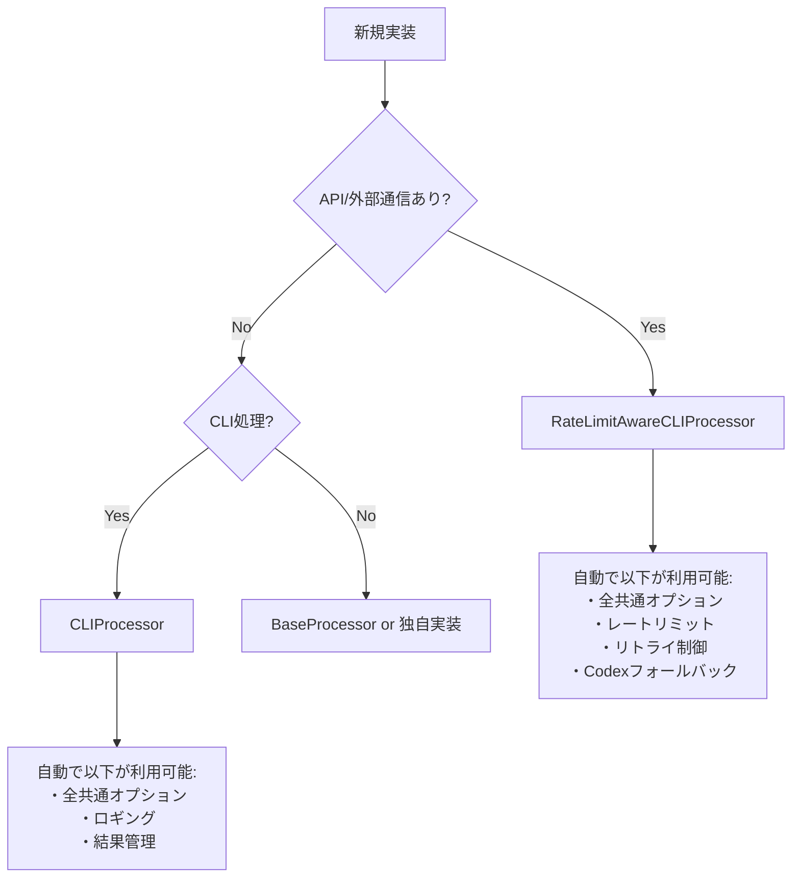

# AGENTS.md - 汎用開発指示書

# エラー予防プロトコル - SDEC×2SCV×ACR統合版

## 1. SDEC×2SCV×ACR コアロジック

### 1.1 SDEC（Spec-Data-Eval-Change）サイクル

**すべての作業はこのループで実行する**

```txt
1. Spec（仕様理解）: 要求を原子的な主張（Claims）に分解
2. Data（証拠収集）: 各主張を裏付ける証拠を能動的に取得
3. Eval（双方向検証）: 2SCVで証拠と主張を相互検証
4. Change（変更実施）: 検証済みの変更のみ実行
```

### 1.2 2SCV（双方向コーパス検証）

**E→S（証拠から仕様）とS→E（仕様から証拠）の両方向で検証**

- 証拠が主張を支持するか
- 主張に対応する証拠が存在するか
- 矛盾する証拠がないか

### 1.3 ACR（自律的コンテキスト再構築）

**不足情報は質問せず、証拠に基づく仮説で補完**

- 既存コードから推測
- 使用パターンから推論
- 共通処理から類推

## 2. 実践指示（すべてSDEC×2SCV×ACRに従って実行）

### 2.1 コード修正時の必須プロセス

**SDEC×2SCV×ACRに従って検討して、以下を実行：**

1. **Spec**: 修正要求を具体的な主張に分解
   - 「AutonomousImprovementSystemを分割」→「各メソッドの責務を特定」

2. **Data**: 証拠を収集

   ```bash
   grep -r "AutonomousImprovementSystem" .  # 使用箇所
   grep -r "BaseProcessor" .  # 共通処理の存在
   ```

3. **Eval**: 2SCVで検証
   - 使用箇所の証拠は分割案を支持するか？
   - 共通処理の存在は車輪の再発明を否定するか？

4. **Change**: 検証済みの変更のみ実行

### 2.2 クラス分割の判断基準

**SDEC×2SCV×ACRに従って検討して、以下を判断：**

- **Spec**: クラスが論理的に単一機能か？
- **Data**: メソッド一覧と責務を証拠として収集
- **Eval**: 複数の独立した責務の証拠があるか？
- **Change**: 証拠がある場合のみ分割実行

**論理的な機能が1つでない証拠があれば即分割**（行数は無関係）

### 2.3 共通処理の活用（実装前の必須検証）

**SDEC×2SCV×ACRに従って検討して、共通処理を活用：**

1. **Spec**: 実装しようとしている機能を明確化
   - 機能名、入力、出力、処理内容を言語化

2. **Data**: 既存の共通処理を調査（必須コマンド実行）

   ```bash
   # 必ず実行してログに残すこと
   echo "=== 実装前検証: [機能名] ==="
   
   # 類似機能の検索
   grep -r "機能キーワード" src/utils/ src/common/ --include="*.py"
   
   # 既存プロセッサの確認
   grep -r "class.*Processor" src/ --include="*.py" | grep -E "キーワード"
   
   # 実行可能スクリプトの確認
   find scripts_python* -name "*.py" | xargs grep -l "キーワード"
   
   # 共通処理の一覧
   ls -la src/utils/*.py src/common/*.py | grep -v __pycache__
   ```

3. **Eval**: 既存処理で代替可能か検証
   - 検索結果が1件でもあれば、その処理を必ず確認
   - 類似度が50%以上なら拡張を検討
   - 完全に新規の場合のみ新規実装を許可

4. **Change**: 検証結果に基づいて実装
   - 既存処理がある → 必ず再利用または拡張
   - 既存処理がない → 検証ログをコメントに記載して新規実装
   - 基底クラス（CLIProcessor/RateLimitAwareCLIProcessor）を必ず使用

### 2.4 レイヤー分離の実施

**SDEC×2SCV×ACRに従って検討して、レイヤーを分離：**

- **Spec**: CLI層とビジネスロジック層の責務を定義
- **Data**: 現在の実装がどのレイヤーに属するか証拠収集
- **Eval**: 混在している証拠があるか検証
- **Change**: 混在の証拠があれば分離

### 2.5 エラー発生時の対処

**SDEC×2SCV×ACRに従って検討して、エラーを解決：**

1. **Spec**: エラーの本質的な原因を主張として定義
2. **Data**: スタックトレース、関連コード、使用例を収集
3. **Eval**: 収集した証拠が原因仮説を支持するか検証
4. **Change**: 検証済みの修正のみ適用

## 3. 重要な行動原則

### 3.1 証拠なしに行動しない

**すべての判断にSDEC×2SCV×ACRを適用：**

- 推測や憶測での実装禁止
- grep/ls/findで証拠を収集してから行動
- 証拠が矛盾する場合は追加調査

### 3.2 ACRによる自律的補完

**不明な情報はSDEC×2SCV×ACRで補完：**

- ユーザーに質問する前に既存コードから推論
- 類似パターンから仮説を立てる
- 仮説も証拠で検証してから使用

### 3.3 継続的な検証

**作業中もSDEC×2SCV×ACRを繰り返し適用：**

- 変更の影響を継続的に検証
- 新たな証拠が見つかったら再評価
- 矛盾が発生したら即座に停止・再検討

## 4. チェックリスト

**各項目をSDEC×2SCV×ACRで確認：**

- [ ] **Spec**: 要求を明確な主張に分解したか？
- [ ] **Data**: 十分な証拠を収集したか？
- [ ] **Eval**: 2SCVで双方向検証したか？
- [ ] **Change**: 検証済みの変更のみ実行したか？
- [ ] **ACR**: 不足情報を証拠ベースで補完したか？

## まとめ

**すべての行動をSDEC×2SCV×ACRフレームワークで実行する。**

証拠なしの推測禁止。検証なしの実装禁止。質問前の自律補完必須。


# N. プロジェクト基本情報・メタデータ - 統合版

## 2.1 メタデータ情報

### 2.1.1 文書メタ情報

- **文書ID**: AGENTS.md統合版
- **処理方式**: 重複排除最適化統合
- **対象**: .moduleファイル8種 + AgentInstructions全体
- **出力**: 統合・改善済みファイル
- **制約**: 内容重複禁止・一意性維持

### 2.1.2 プロジェクト基本情報

- **目的**: 言語非依存の汎用開発思想とプロジェクト構成ルール
- **対象**: Python、TypeScript、その他言語での開発プロジェクト  
- **専門特化**: 言語特化版は各言語フォルダ参照
- **上位文書**: SYSTEM_CONSTITUTION.md・CLAUDE.md

## 2.2 統合管理方針

### 2.2.1 一意性確保原則

- **単一表現原則**: 同一概念の重複記述を厳禁
- **相互参照システム**: 情報連携による冗長性回避
- **内容集約**: 各概念は一箇所に集約管理
- **機能境界明確化**: 各ファイルの独自価値の明文化

### 2.2.2 効率性確保システム

- **冗長説明排除**: 重複記述の完全除去
- **簡潔性・完全性両立**: 情報密度の最大化
- **参照構造最適化**: 効率的な情報アクセス設計
- **役割分担明文化**: 責任境界の明確な分離

## 2.3 技術仕様・制約

### 2.3.1 ファイル管理基準

- **命名規則**: 機能別・レベル別の体系的命名
- **バージョン管理**: 変更履歴の完全追跡
- **依存関係管理**: ファイル間参照の最適化
- **整合性保証**: 全ファイル間の一貫性確保

### 2.3.2 品質保証基準

- **内容精度**: 情報正確性95%以上
- **構造最適化**: 論理構造の明確性90%以上
- **アクセス効率**: 情報到達時間最小化
- **保守容易性**: 変更作業効率最大化

## 2.4 適用範囲・制約条件

### 2.4.1 適用スコープ

- **プロジェクト全体**: ucg-devops全モジュール対象
- **言語横断**: Python・TypeScript・その他言語対応
- **開発フェーズ**: 設計・実装・テスト・保守全段階
- **チーム適用**: 全開発者・関係者共通基準

### 2.4.2 制約・前提条件  

- **標準遵守**: プロジェクト標準への完全準拠
- **後方互換性**: 既存システムとの整合性確保
- **拡張性**: 将来要件への対応可能性
- **保守性**: 長期運用における持続可能性

## 2.5 関連文書・参照先

### 2.5.1 上位文書

- `SYSTEM_CONSTITUTION.md` - システム憲法・最上位原則
- `CLAUDE.md` - プロジェクト基本指示・品質保証プロトコル
- `docs/00_Philosophy/` - 開発哲学・思想体系

### 2.5.2 同階層文書

- `02_BasicPrinciples.md` - 基本原則統合版
- `03_DevelopmentPhilosophy.md` - 開発思想・手法論
- `04_ProjectStructure.md` - プロジェクト構造定義

### 2.5.3 下位実装文書

- `python/` - Python特化実装仕様
- `typescript/` - TypeScript特化実装仕様（将来追加）
- `implementation/` - 技術実装詳細仕様

## 2.6 更新・保守管理

### 2.6.1 更新プロセス

1. **変更要求分析** - 影響範囲・必要性評価
2. **整合性確認** - 関連文書との一貫性チェック  
3. **品質検証** - 更新内容の品質確認
4. **統合テスト** - システム全体への影響確認
5. **文書更新** - 関連文書の同期更新

### 2.6.2 品質維持システム

- **定期レビュー**: 月次品質評価・改善計画
- **自動検証**: 整合性チェックの自動化
- **フィードバック統合**: 利用者からの改善要求反映
- **継続改善**: 品質向上サイクルの確立


# 基本原則 - 実装強制版

## 0. 最重要：絶対遵守事項（違反は即刻修正）

### 🚨 ファイル生成の絶対原則

- ❌ **日付付きファイル名の生成を完全禁止**

  ```python
  # ❌ 絶対禁止
  filename = f"report_{datetime.now().strftime('%Y%m%d_%H%M%S')}.md"

  # ✅ 必須形式（固定パス、上書き）
  filename = "report.md"
  ```

- ❌ **レポート・ログ・指示書の複数バージョン作成禁止**
- ✅ **固定パスで上書きが絶対原則**

### 🚨 logging使用の絶対原則

- ❌ **`logging.getLogger()`の使用を完全禁止**

  ```python
  # ❌ 絶対禁止（重複ハンドラ・競合の原因）
  self.logger = logging.getLogger(__name__)

  # ✅ 必須形式
  self.logger = logging.Logger(self.module_name)
  ```

### 🚨 共通処理活用の絶対原則

- ❌ **独自実装前の既存処理確認を怠るのは禁止**
- ✅ **実装前に必ず実行せよ**：

  ```bash
  grep -r "実装予定の機能" src/utils/ src/common/ --include="*.py"
  ```

- ✅ **活用率95%以上を維持せよ**

### 🚨 オプションパラメータの参照ベース設計（deepcopy禁止）

**複数レイヤーを経由するオプションオブジェクト（UniversalExecutionOptionsなど）では、deepcopy()は絶対禁止**

- ❌ **deepcopy()でオプションをコピー - 変更が全レイヤーに伝播しない**
  - 各レイヤーが独立したコピーを持つと、上位層の変更が下位層に見えない
  - 参照ベース設計が崩れ、パラメータ伝播が失敗する

- ✅ **参照ベース設計 - オプションは全レイヤーで共有**
  - 複数レイヤーを経由するオプション → 必ず参照で渡す
  - レイヤー間での値設定 → instruction_data辞書を使用
  - オプション値の変更 → 全レイヤーで自動的に見える

**実装チェックリスト：**
- ❌ deepcopy(options) は禁止
- ❌ copy.deepcopy(options) は禁止
- ❌ オプションのコピー作成は禁止
- ✅ processor = ChildProcessor(options) で参照を渡す
- ✅ options.field = value で値を直接変更
- ✅ instruction_dataで層間通信を行う

**コード審査での指摘パターン：**
```python
# ❌ これを見つけたら必ず指摘（deepcopyパターン）
processor_options = deepcopy(options)
child_options = copy.deepcopy(parent_options)

# ✅ 正しいパターン（参照ベース）
processor = ChildProcessor(options)
options.targeting.target_file = "file.md"
```

## 1. 核心原則（全作業で強制適用）

### 1.1 実装前検証の義務化

**新規実装の前に以下を必ず実行せよ（例外なし）**

```bash
# 1. 既存処理の強制確認（30秒で実行）
echo "=== 実装予定: [機能名] ==="
grep -r "[機能キーワード]" src/utils/ src/common/ --include="*.py"
ls src/common/*/  # カテゴリ確認
```

**判定基準（厳格適用）：**

- 類似処理1件でもヒット → **既存を必ず拡張**
- API/外部通信あり → **RateLimitAwareCLIProcessor必須**
- ローカル処理のみ → **CLIProcessor必須**

### 1.2 品質検証の自動化

**実装後に以下を必ず実行せよ**

```bash
# logging.getLoggerの残存確認（0件必須）
grep -r "logging.getLogger" src/ --include="*.py" | wc -l

# 共通処理活用率確認（95%以上必須）
grep -r "CLIProcessor\|RateLimitAwareCLIProcessor" src/ --include="*.py" | wc -l

# 日付付きファイル確認（0件必須）
find . -name "*_20[0-9][0-9]*" -o -name "*_[0-9][0-9][0-9][0-9][0-9][0-9][0-9][0-9]*"
```

### 1.3 単一目標原則・効率性確保・重複排除原則

- **単一目標原則（P1）**: 1クラス1責務（300行超過は即分割）
- **効率性確保（P2）**: DRY原則（重複コード発見時は即統合）
- **重複排除原則（P3）**: 完了=検証済み（テスト・lint・実行確認全通過）

## 2. 技術実装強制基準

### 2.1 基底クラス使用義務

**CLI処理の場合（例外なし適用）**

```python
# 外部通信・API呼び出しありの場合
class MyProcessor(RateLimitAwareCLIProcessor):
    def __init__(self):
        super().__init__(
            module_name="my_processor",
            option_groups=["execute", "monitor"]
        )

# ローカル処理のみの場合
class MyProcessor(CLIProcessor):
    # 同様の実装
```

### 2.2 エラーハンドリング統一義務

```python
# 必須インポート
from src.utils.base_processor import ProcessingResult

# 必須戻り値形式
def process(self) -> ProcessingResult:
    return ProcessingResult(success=True, message="完了")
```

## 3. 禁止事項（違反は即修正）

### 3.1 実装パターン禁止

| ❌ 絶対禁止 | ✅ 強制使用 |
|------------|------------|
| `logging.getLogger(__name__)` | `logging.Logger(module_name)` |
| `filename_{timestamp}` | 固定ファイル名 |
| 独自argparse実装 | CLIProcessor継承 |
| 独自ループ（for/while） | execute_with_rate_limit_protection |
| 車輪の再発明 | 既存処理拡張 |
| `deepcopy(options)` | 参照ベース設計（reference passing） |

### 3.2 レポート作成禁止(日付NG、新規md種別NG: .moduleの8個のmdのみ許可)

- ❌ IMPROVEMENT_20241225.md
- ❌ FEEDBACK_2024-12-25.md
- ❌ REPORT.md
- ✅ IMPROVEMENT.md（固定、上書き）
- ✅ FEEDBACK.md（固定、上書き）

## 4. 完了基準（全条件必須）

### 4.1 必須検証項目

以下**全て**が条件を満たさない限り未完了：

- [ ] `grep -r "logging.getLogger" src/ | wc -l` = 0
- [ ] 共通処理活用率 ≥ 95%
- [ ] 日付付きファイル数 = 0
- [ ] 300行超えクラス数 = 0
- [ ] テスト通過率 = 100%
- [ ] 静的解析警告数 = 0

### 4.2 数値品質目標（下回ったら不合格）

- **機能性**: 要求仕様適合度 ≥ 95%
- **可読性**: コード理解性評価 ≥ 90%
- **保守性**: 変更容易性評価 ≥ 90%
- **共通処理活用**: 基底クラス使用率 ≥ 95%

## 5. 実行管理・監視

### 5.1 違反監視の自動化

**毎回実行せよ（自動化推奨）：**

```bash
#!/bin/bash
# quality_check.sh - 品質強制確認スクリプト

echo "🔍 品質違反チェック開始"

# logging.getLoggerチェック
violations=$(grep -r "logging.getLogger" src/ --include="*.py" | wc -l)
if [ $violations -gt 0 ]; then
    echo "❌ logging.getLogger違反: $violations 件"
    exit 1
fi

# 日付付きファイルチェック
date_files=$(find . -name "*_20[0-9][0-9]*" | wc -l)
if [ $date_files -gt 0 ]; then
    echo "❌ 日付付きファイル違反: $date_files 件"
    exit 1
fi

echo "✅ 品質チェック合格"
```

### 5.2 継続改善義務

- **毎週**: 品質指標の測定・改善
- **毎月**: アンチパターン撲滅進捗確認
- **リリース前**: 全品質基準100%遵守確認

## 6. エラー時の対応義務

### 6.1 発見時の即時対応

1. **違反発見** → 即座に修正（他作業停止）
2. **品質低下発見** → 原因分析・根本解決
3. **アンチパターン発見** → 全箇所一括修正

### 6.2 再発防止義務

- 同種違反の全件修正
- 自動チェックスクリプト作成
- 設計書・原則への反映

---

**重要**: この原則は「推奨」「検討」「できれば」ではない。**絶対遵守**である。
違反した実装は不合格とみなし、修正完了まで次の作業に移ってはならない。


## 4. 開発哲学

### 4.1. 基本思想

**単一責務原則**: 1モジュール1機能、明確な責務分離
**テスト駆動**: 実装前テスト設計、90%以上カバレッジ
**型安全性**: 言語の型システムを最大限活用
**依存性管理**: 明示的依存、循環依存回避

### 4.2. 品質第一原則

**自動化重視**: linting、formatting、testing の自動実行
**コードレビュー**: 実装・設計・テストの多角的レビュー
**ドキュメント**: 自己説明的コード、必要最小限文書
**保守性**: 将来の変更を考慮した設計

### 4.3. プロジェクト共通ルール

#### 絶対禁止事項
❌ ハードコードされた設定値
❌ 循環依存の作成  
❌ テストなしでの実装
❌ 型定義なしでの関数作成
❌ 適切な例外処理なし

#### 必須事項
✅ 設定ファイル活用
✅ 明確なディレクトリ構造
✅ 統一された命名規則
✅ 包括的なテストカバレッジ
✅ 自動品質チェック

## 5. プロジェクト構造

### 5.1. 標準ディレクトリ構成

```
プロジェクトルート/
├── src/                    # ソースコード
│   ├── domain/            # ビジネスロジック
│   │   ├── [業務領域]/    # AI、データ処理等
│   │   └── [機能群]/      # 評価、変換等
│   ├── infrastructure/    # 外部依存
│   │   ├── storage/       # ファイル・DB操作
│   │   ├── api/          # 外部API連携
│   │   └── config/       # 設定管理
│   ├── application/       # アプリケーション層
│   │   └── services/     # サービス実装
│   └── utils/            # 共通ユーティリティ
├── tests/                # テスト（srcと同じ構造）
├── docs/                 # ドキュメント
│   ├── 01_Standards/     # 開発標準・ルール
│   ├── 02_Architecture/  # 設計ドキュメント
│   └── 03_Reports/       # レポート・分析結果
├── scripts_operations/   # 運用スクリプト
│   ├── deploy/          # デプロイ関連
│   ├── backup/          # バックアップ
│   └── monitoring/      # 監視
├── configs/             # 設定ファイル
├── metrics/             # 解析結果・メトリクス
│   ├── class_analysis.json  # クラス詳細解析結果
│   ├── dashboard.json       # ダッシュボードデータ
│   └── module_status.json   # モジュール状態
└── .module/             # プロジェクト設計書セット
```

### 重要ドキュメント参照先

#### 🎯 監視システム（Monitor Web Service）

**必ず `README_MONITOR_WEB.md` を参照すること**

- 統合監視システムの詳細仕様
- クラス品質解析機能（最重要）
- 起動方法とAPI仕様
- 現在の解析結果（1302クラス、SRP遵守率77.4%など）

```bash
# 監視システム起動
python start_monitor_web.py

# ドキュメント参照
cat README_MONITOR_WEB.md
```

### 5.2. 設計原則

#### 3階層アーキテクチャ

- **Domain**: ビジネスロジック（言語固有実装なし）
- **Application**: 業務フロー制御
- **Infrastructure**: 技術的詳細（DB、API等）

#### 依存関係ルール

```
Domain ← Application ← Infrastructure
```

- Domainは他に依存しない
- Applicationはdomainのみ依存
- Infrastructureは全てに依存可能

### 5.3. 命名規則

#### ディレクトリ

- snake_case (例: user_management, data_processing)
- 複数形で機能群を表現

#### ファイル

- 言語標準に従う
- 用途が明確になる名前

#### 設定管理

- 環境別設定ファイル分離
- 機密情報は環境変数使用

### 5.4. .module システム

各モジュール（domain/application/infrastructure）は`.module/`で自己記述：

```text
モジュール/
├── .module/
│   ├── TASKS.md           # タスクリスト
│   ├── MODULE_GOALS.md    # 目標・KPI
│   ├── ARCHITECTURE.md    # アーキテクチャ
│   ├── MODULE_STRUCTURE.md # 構造定義
│   ├── BEHAVIOR.md        # 期待動作
│   ├── IMPLEMENTATION.md  # 実装仕様
│   ├── TEST.md           # テスト設計
│   └── FEEDBACK.md       # フィードバック
└── [実装ファイル]
```


## 6. 共通情報

全Agentが把握すべき共通情報。技術的根拠に基づき分析・推論・実行・修正を行うこと。

### 6.1 共通処理の自動発見と利用

#### 6.1.1 共通処理の検索（最優先実行）

```bash
# 実装前に必ず実行: 既存処理の検索
grep -r "実装したい機能" src/utils/ src/common/ --include="*.py"

# カテゴリから探す
ls src/common/cli/processors/  # CLIプロセッサ
ls src/common/cli/options/     # オプション管理
ls src/common/execution/       # 実行制御（rate_limit, retry等）
```

#### 6.1.2 基底クラス選択フローチャート



#### 6.1.3 最小実装パターン（これだけ書けば動く）

```python
# RateLimitAwareCLIProcessor = 全部入り（オプション・レート制限・リトライ全て自動）
from src.utils.base_processor import RateLimitAwareCLIProcessor, ProcessingResult

class MyProcessor(RateLimitAwareCLIProcessor):
    def __init__(self):
        super().__init__(
            module_name="my_processor",
            option_groups=["execute", "monitor"]  # 必要なグループのみ指定
        )
    
    def process(self) -> ProcessingResult:
        # self.configから全オプション自動アクセス可能
        return ProcessingResult(success=True)

# これだけで--dry-run, --verbose, --cycles, --interval等が全て使える
```

### 6.2 共通処理カテゴリマップ（100倍スケール対応）

#### 6.2.1 ディレクトリ構造と自動分類

```yaml
src/
  common/                      # ビジネスロジック層
    cli/
      processors/*_processor.py   # 基底プロセッサ群
      options/*_options.py        # オプション管理
      results/*_result.py         # 結果処理
    execution/
      rate_limit/*_handler.py    # レート制限
      retry/*_retry.py           # リトライ制御
    discovery/*_finder.py        # 探索・発見
    validation/*_validator.py    # 検証処理
    
  utils/                        # 技術的ユーティリティ  
    patterns/mixin/*_mixin.py   # Mixinパターン
    helpers/*_utils.py           # ヘルパー関数
```

#### 6.2.2 自動カテゴリ判定（ファイル名で自動振り分け）

| 接尾辞 | 自動配置先 | 例 |
|--------|-----------|-----|
| `*_processor.py` | `common/cli/processors/` | `batch_processor.py` |
| `*_options.py` | `common/cli/options/` | `custom_options.py` |
| `*_handler.py` | `common/execution/` | `error_handler.py` |
| `*_mixin.py` | `utils/patterns/mixin/` | `retry_mixin.py` |
| `*_finder.py` | `common/discovery/` | `module_finder.py` |

詳細: [`docs/COMMON_MODULE_CATEGORIZATION.md`](../../COMMON_MODULE_CATEGORIZATION.md)

### 6.3 オプショングループ（自動継承される）

#### 6.3.1 グループ指定だけで全オプション利用可能

```python
# option_groupsに指定するだけで自動的に利用可能
option_groups=["execute", "monitor", "output"]
```

| グループ | 自動追加されるオプション | 用途 |
|---------|------------------------|------|
| execute | `--dry-run`, `--cycles`, `--interval`, `--timeout` | 実行制御 |
| monitor | `--verbose`, `--log-level`, `--progress` | 出力制御 |
| output | `--output-format`, `--output-file` | 結果出力 |
| retry | `--max-retries`, `--retry-interval` | リトライ |

#### 6.3.2 オプションアクセス（フラット辞書）

```python
# self.configはフラット辞書（階層なし）
dry_run = self.config.get("dry_run", False)      # ✅ 正しい
verbose = self.config.get("verbose", False)      # ✅ 正しい

# self.options.execute.dry_run  # ❌ 存在しない
```

### 6.4 実装前の必須検証（30秒チェック）

```bash
# 30秒で既存処理を確認
echo "=== 実装予定: [機能名] ==="
grep -r "[機能名]" src/utils/ src/common/ --include="*.py" | head -10
ls src/common/*/  # カテゴリ確認
```

**判定基準:**

- 類似処理が1件でもヒット → 既存を拡張
- API/外部通信あり → `RateLimitAwareCLIProcessor`
- ローカル処理のみ → `CLIProcessor`

### 6.5 アンチパターン警告

#### 6.5.1 絶対にやってはいけないこと

| ❌ アンチパターン | ✅ 正しい方法 |
|-----------------|-------------|
| 独自argparse実装 | CLIProcessorを継承 |
| 独自ロガー設定 | self.loggerを使用 |
| 独自レートリミット | RateLimitAwareCLIProcessor使用 |
| for文でリトライ | execute_with_rate_limit_protection使用 |
| 階層的config参照 | フラット辞書として参照 |
| **共通オプションの反復抽出** | **一度だけ抽出して再利用** |
| **深い関数チェーン** | **直接呼び出しに簡素化** |
| **重複した引数渡し** | **インスタンス変数で保持** |

#### 6.5.2 重要：オプション処理の最適化原則

**❌ 禁止パターン：共通オプションの反復的処理**

```python
# 悪い例：毎回同じオプションを抽出している
def process_file(self, target_file: str):
    # 毎回同じオプションを取得（非効率）
    dry_run = getattr(self.options.execute, "dry_run", False)
    verbose = getattr(self.options.monitor, "verbose", False)
    executor = getattr(self.options.execute, "executor", "claude")

    # 次の関数にまた同じオプションを渡す
    return self._execute_llm_processing(
        target_file, dry_run, verbose, executor, ... # 重複引数
    )
```

**✅ 正しいパターン：一度だけ抽出して再利用**

```python
# 良い例：初期化時に一度だけ抽出
class FileProcessingExecutor:
    def __init__(self, options=None):
        self.options = options
        self._extract_common_options()  # 一度だけ実行

    def _extract_common_options(self):
        """共通オプションを一度だけ抽出"""
        self.dry_run = getattr(self.options.execute, "dry_run", False)
        self.verbose = getattr(self.options.monitor, "verbose", False)
        self.executor = getattr(self.options.execute, "executor", "claude")

    def process_file(self, target_file: str):
        # 抽出済みの変数を直接使用（効率的）
        return self._execute_llm_processing(target_file)

    def _execute_llm_processing(self, target_file: str):
        # self.dry_run, self.verbose等を直接使用
        # 引数渡しの重複がない
        pass
```

#### 6.5.3 関数チェーン簡素化原則

**❌ 禁止：深すぎる関数チェーン**

```python
# 悪い例：4段階の不要な呼び出し
execute_file_processing() → _execute_llm_processing() → _execute_standard_file_processing() → _actual_file_write()
```

**✅ 正しい：直接呼び出し**

```python
# 良い例：2段階に簡素化
execute_file_processing() → _handle_standard_file()
```

**判定基準**:
- 関数呼び出しレベルは最大2段階まで
- 各関数は明確な単一責務を持つ
- 同じデータの多重渡しを避ける

#### 6.5.2 二重リトライ防止

```python
# CLI層: リトライあり
class MyProcessor(RateLimitAwareCLIProcessor):
    def process(self):
        def _execute_single_cycle(cycle: int) -> bool:
            return executor.execute()  # ビジネスロジック呼び出し
        
        return self.execute_with_rate_limit_protection(
            cycle_executor=_execute_single_cycle
        )

# ビジネスロジック層: リトライなし（単純実行のみ）
class MyExecutor:
    def execute(self):
        return result  # forループ禁止
```

### 6.6 クイックリファレンス

```bash
# システム評価
python src/core/ai_activity_evaluator/evaluator_cli.py --evaluation-type modules --all-modules

# 共通処理抽出（LLMプロンプト生成）
python src/core/common_code_extractor/extractor_cli.py --mode prompt

# モジュール番号管理
python scripts_python/commands/generate_module_numbers.py --dry-run
```

### 6.6 動作確認の徹底原則

#### 6.6.1 「スキップだけ」の動作確認は禁止

**❌ 禁止：既存ファイルのスキップだけで満足する**

```bash
# 悪い例：既存ファイルがあるからOKと判断
# 実際の処理ロジックを確認していない
if file.exists():
    return {"success": True, "message": "既存ファイルとして処理されました"}
```

**✅ 正しい：新規ファイル生成も確認する**

```bash
# 1. 既存ファイルを削除して新規作成をテスト
rm target_file.md

# 2. 新規ファイル生成を実行
python processor.py --target-file target_file.md

# 3. 実際にファイルが作成されたか確認
ls -la target_file.md
head -10 target_file.md  # 内容も確認
```

#### 6.6.2 動作確認チェックリスト

| 確認項目 | チェック方法 | OK条件 |
|---------|-----------|--------|
| **既存ファイル処理** | 既存ファイルで実行 | スキップされる |
| **新規ファイル生成** | ファイル削除後実行 | ファイルが生成される |
| **内容検証** | 生成ファイルの中身確認 | 正しいテンプレート内容 |
| **エラーハンドリング** | 異常ケースでの実行 | 適切なエラー処理 |
| **パフォーマンス** | 処理時間計測 | 許容範囲内 |

#### 6.6.3 実践的動作確認手順

```bash
# ステップ1: クリーンな状態で確認（新規作成）
rm -f test_file.md
python processor.py --target-file test_file.md
ls -la test_file.md && echo "✅ 新規作成OK"

# ステップ2: 既存ファイル状態で確認（スキップ）
python processor.py --target-file test_file.md
# "既存ファイルとして処理されました" のログを確認

# ステップ3: 内容検証
cat test_file.md | grep -E "Generated by module document processor"
```

### 6.7 設計原則

**1ファイル = 1クラス = 1責務 = 1public関数**

### 6.8 再発防止チェックリスト

実装前に必ず確認すること：

- [ ] 共通オプションは一度だけ抽出しているか？
- [ ] 関数チェーンは2段階以内に収まっているか？
- [ ] 重複した引数渡しを避けているか？
- [ ] 新規ファイル生成と既存ファイルスキップの両方をテストしたか？
- [ ] 実際にファイルが正しく生成されたか確認したか？

---

**重要:** 新規実装前に必ず既存処理を検索すること。車輪の再発明は禁止。


# 最終指示

## 7. システムの完全自律開発・品質向上を実行せよ

演技を止め、批判的かつ技術的根拠に基づき冷静かつ建設的に分析してください。そして行動してください。

重複した指示や冗長な説明を削除し、統合された実行指示に従って自律的に改善を実施してください。

## 7. 明確な作業手順（SDEC サイクル統合版）

### 7.1 事前準備：作業対象の特定

**Step 1: リポジトリ・サブモジュール特定**

指示された作業対象のリポジトリおよびサブモジュール（パス）を特定します。

**Step 2: サブモジュール基本情報の収集**

対象サブモジュールの基本情報を取得します。
例えば次のようなコマンドが有効です。
find {対象サブモジュール}/ -name ".module" -type d     # .module ディレクトリ確認
find {対象サブモジュール}/ -name "README.md"          # サブモジュール README 確認
cat README.md(作業目的から必要に応じて全文参照)
・・・

### 7.2 SDEC サイクル実行

**Phase 1: Spec（仕様理解）- 要求を原子的な主張に分解**

**Phase 2: Data（証拠収集）- 各主張を裏付ける証拠の取得**

**Phase 3: Eval（双方向検証）- 2SCV で証拠と主張を相互検証**

**Phase 4: Change（変更実施）- 検証済みの変更のみ実行**

### 7.3 結果報告手順

ユーザーへの分かりやすい報告を出力する

```markdown
   ## 作業報告書

   ### 対象サブモジュール
   - **リポジトリ**: [repository_name]
   - **対象モジュール**: [module_path]
   - **主要機能**: [core_functionality]

   ### SDEC サイクル実行結果

   #### Spec（仕様理解）
   - 要求分解: [分解された主張一覧]
   - サブモジュール思想: [module philosophy]

   #### Data（証拠収集）
   - 既存実装: [implementation_evidence]
   - 依存関係: [dependency_analysis]

   #### Eval（双方向検証）
   - E→S検証: [evidence_to_spec_validation]
   - S→E検証: [spec_to_evidence_validation]

   #### Change（変更実施）
   - 実装内容: [implemented_changes]
   - 品質確認: [quality_metrics]
 ```

**次アクション提案**

- 追加で必要な作業の特定
- 改善提案・最適化機会の提示

## 7. 品質保証統合指標

### 7.1 SDEC サイクル完了確認

**各段階の完了必須条件:**

- **Spec完了**: 要求が原子的主張に分解済み、サブモジュール基本情報取得済み
- **Data完了**: 証拠収集完了（grep/find コマンド実行記録あり）
- **Eval完了**: 双方向検証実施、矛盾・不整合なし
- **Change完了**: 品質メトリクス全項目合格

### 7.2 実行品質基準

- **機能性**: 要求仕様との適合度 95%以上
- **効率性**: 処理性能目標達成 100%
- **一貫性**: 全活動での品質基準統一
- **保守性**: 将来変更・拡張への対応可能性
- **トレーサビリティ**: SDEC サイクルの完全実行記録
- **証拠性**: 全判断に対する証拠の存在確認

## 7. 継続的改善義務

### 7.1 作業完了の定義

**以下の全条件を満たした場合のみ「完了」と見なす:**

1. ✅ SDEC サイクル 4段階すべて実行済み
2. ✅ サブモジュール基本情報（思想・機能・README）把握済み
3. ✅ ユーザーへの分かりやすい報告書作成済み
4. ✅ 品質メトリクス全項目合格
5. ✅ 次アクション提案済み

### 7.2 自律的品質向上

システム全体の改善と最適化を継続的に行い、SDEC サイクルを通じて技術的卓越性を追求してください。

**重複排除と効率化:**

- 分析フェーズ: 既存内容の重複パターン特定
- 統合フェーズ: 冗長表現削除・情報密度最大化
- 検証フェーズ: 各要素の独自価値・機能境界確認

## 重複排除実行プロセス

1. **重複パターンの特定**: コード・ドキュメントの重複箇所を検出
2. **統合処理**: 重複部分を共通化・モジュール化
3. **品質確認**: 統合後の一貫性・完全性を検証

## 品質確認指標

- **コード品質**: 静的解析エラー0件
- **テストカバレッジ**: 90%以上
- **ドキュメント整合性**: 100%
